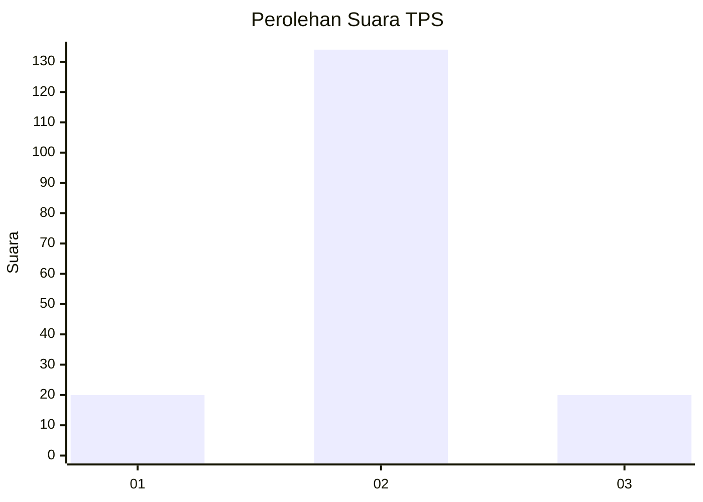
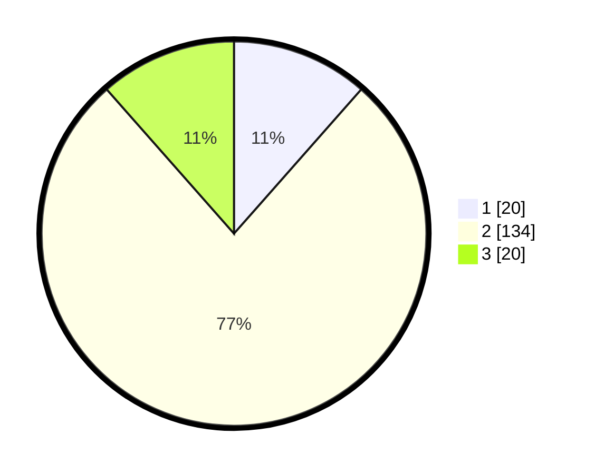

# Hasil

## Grafik

## Tabel

| No. | Nama Paslon    | Suara | Suara (raw) | Persentase |
|:--- |:-------------- | -----:| -----------:| ----------:|
| 1   | ANIES MUHAIMIN | 20    | [20][p-1]   | 11,49      |
| 2   | PRABOWO GIBRAN | 134   | [134][p-2]  | 77,01      |
| 3   | GANJAR MAHFUD  | 20    | [20][p-3]   | 11,49      |

[p-1]: https://github.com/gigit-pemilu/pemilu-2024/blob/main/pilpres/hitung-suara/sub/35-jawa-timur/sub/09-jember/sub/13-rambipuji/sub/2004-kaliwining/sub/024-tps/sub/paslon-1.txt
[p-2]: https://github.com/gigit-pemilu/pemilu-2024/blob/main/pilpres/hitung-suara/sub/35-jawa-timur/sub/09-jember/sub/13-rambipuji/sub/2004-kaliwining/sub/024-tps/sub/paslon-2.txt
[p-3]: https://github.com/gigit-pemilu/pemilu-2024/blob/main/pilpres/hitung-suara/sub/35-jawa-timur/sub/09-jember/sub/13-rambipuji/sub/2004-kaliwining/sub/024-tps/sub/paslon-3.txt

## Foto C Plano

https://sirekap-obj-formc.kpu.go.id/fdb6/pemilu/ppwp/35/09/13/20/04/3509132004024-20240220-130136--6a32a4d7-04ea-4bed-afe3-36645c1d6f74.jpg

https://sirekap-obj-formc.kpu.go.id/fdb6/pemilu/ppwp/35/09/13/20/04/3509132004024-20240220-130217--e26b5cdc-1d63-4628-8a58-386fb02fb3b5.jpg

https://sirekap-obj-formc.kpu.go.id/fdb6/pemilu/ppwp/35/09/13/20/04/3509132004024-20240220-130332--20ffe225-1e50-4e5b-9b8a-f3fce9a9ff1b.jpg

## Metadata

| Key        | Value               |
| ---------- | ------------------- |
| Time Stamp | 2024-02-24 22:31:28 |

