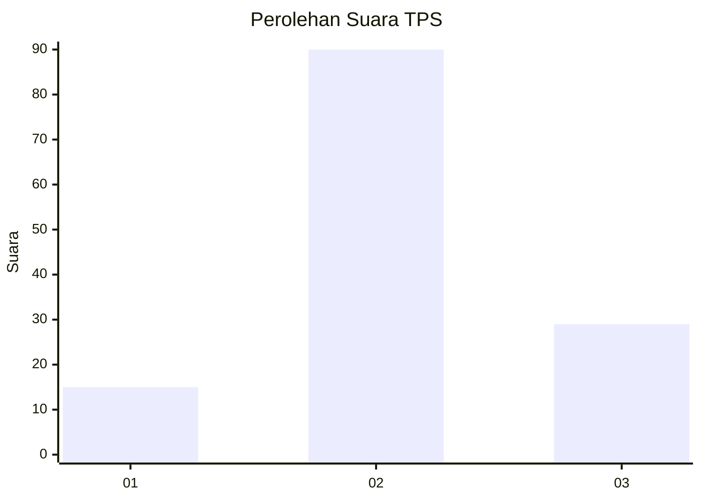
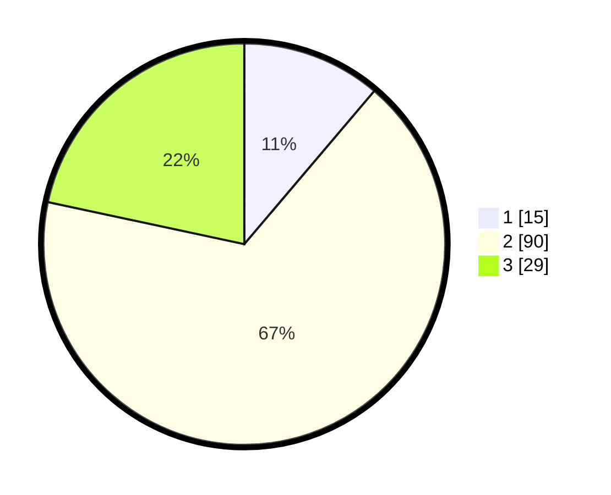

# Hasil

## Grafik

## Tabel

| No. | Nama Paslon    | Suara | Suara (raw) | Persentase |
|:--- |:-------------- | -----:| -----------:| ----------:|
| 1   | ANIES MUHAIMIN | 15    | [15][p-1]   | 11,19      |
| 2   | PRABOWO GIBRAN | 90    | [90][p-2]   | 67,16      |
| 3   | GANJAR MAHFUD  | 29    | [29][p-3]   | 21,64      |

[p-1]: https://github.com/gigit-pemilu/pemilu-2024-35-jawa-timur/blob/main/pilpres/hitung-suara/sub/35-jawa-timur/sub/09-jember/sub/13-rambipuji/sub/2004-kaliwining/sub/029-tps/sub/paslon-1.txt
[p-2]: https://github.com/gigit-pemilu/pemilu-2024-35-jawa-timur/blob/main/pilpres/hitung-suara/sub/35-jawa-timur/sub/09-jember/sub/13-rambipuji/sub/2004-kaliwining/sub/029-tps/sub/paslon-2.txt
[p-3]: https://github.com/gigit-pemilu/pemilu-2024-35-jawa-timur/blob/main/pilpres/hitung-suara/sub/35-jawa-timur/sub/09-jember/sub/13-rambipuji/sub/2004-kaliwining/sub/029-tps/sub/paslon-3.txt

## Foto C Plano

https://sirekap-obj-formc.kpu.go.id/cca4/pemilu/ppwp/35/09/13/20/04/3509132004029-20240217-213515--aa56a5ad-2647-4050-8958-7036c3ae0512.jpg

https://sirekap-obj-formc.kpu.go.id/cca4/pemilu/ppwp/35/09/13/20/04/3509132004029-20240217-212821--e7cc20a2-247a-4bda-9de4-e485f8b9861c.jpg

https://sirekap-obj-formc.kpu.go.id/cca4/pemilu/ppwp/35/09/13/20/04/3509132004029-20240217-172242--1a7e633a-1177-414e-8c54-bed3b85d5c17.jpg

## Metadata

| Key        | Value               |
| ---------- | ------------------- |
| Time Stamp | 2024-02-24 22:31:28 |

