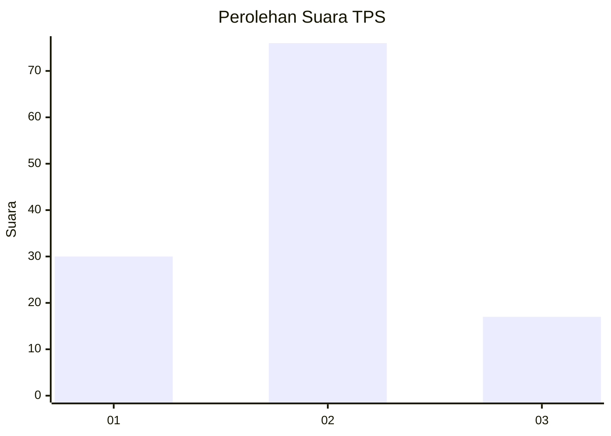
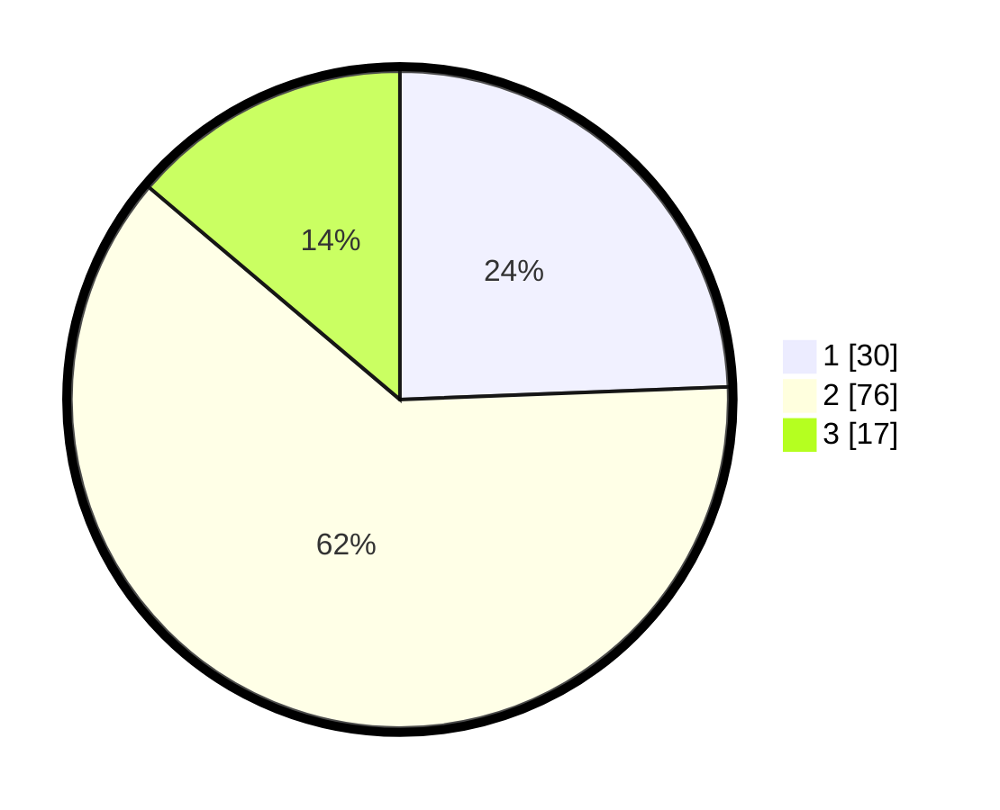

# Hasil

## Grafik

## Tabel

| No. | Nama Paslon    | Suara | Suara (raw) | Persentase |
|:--- |:-------------- | -----:| -----------:| ----------:|
| 1   | ANIES MUHAIMIN | 30    | [30][p-1]   | 24,39      |
| 2   | PRABOWO GIBRAN | 76    | [76][p-2]   | 61,79      |
| 3   | GANJAR MAHFUD  | 17    | [17][p-3]   | 13,82      |

[p-1]: https://github.com/gigit-pemilu/pemilu-2024-35-jawa-timur/blob/main/pilpres/hitung-suara/sub/35-jawa-timur/sub/09-jember/sub/13-rambipuji/sub/2004-kaliwining/sub/054-tps/sub/paslon-1.txt
[p-2]: https://github.com/gigit-pemilu/pemilu-2024-35-jawa-timur/blob/main/pilpres/hitung-suara/sub/35-jawa-timur/sub/09-jember/sub/13-rambipuji/sub/2004-kaliwining/sub/054-tps/sub/paslon-2.txt
[p-3]: https://github.com/gigit-pemilu/pemilu-2024-35-jawa-timur/blob/main/pilpres/hitung-suara/sub/35-jawa-timur/sub/09-jember/sub/13-rambipuji/sub/2004-kaliwining/sub/054-tps/sub/paslon-3.txt

## Foto C Plano

https://sirekap-obj-formc.kpu.go.id/40e8/pemilu/ppwp/35/09/13/20/04/3509132004054-20240220-211443--4b883697-4697-4d4c-bb40-f3a96aef428e.jpg

https://sirekap-obj-formc.kpu.go.id/40e8/pemilu/ppwp/35/09/13/20/04/3509132004054-20240220-211607--3e6d43aa-7c84-4916-8ada-a4e1b69f6e8f.jpg

https://sirekap-obj-formc.kpu.go.id/40e8/pemilu/ppwp/35/09/13/20/04/3509132004054-20240220-211710--864a3bed-da1d-4108-9c07-4e42971782a7.jpg

## Metadata

| Key        | Value               |
| ---------- | ------------------- |
| Time Stamp | 2024-02-25 15:00:00 |

