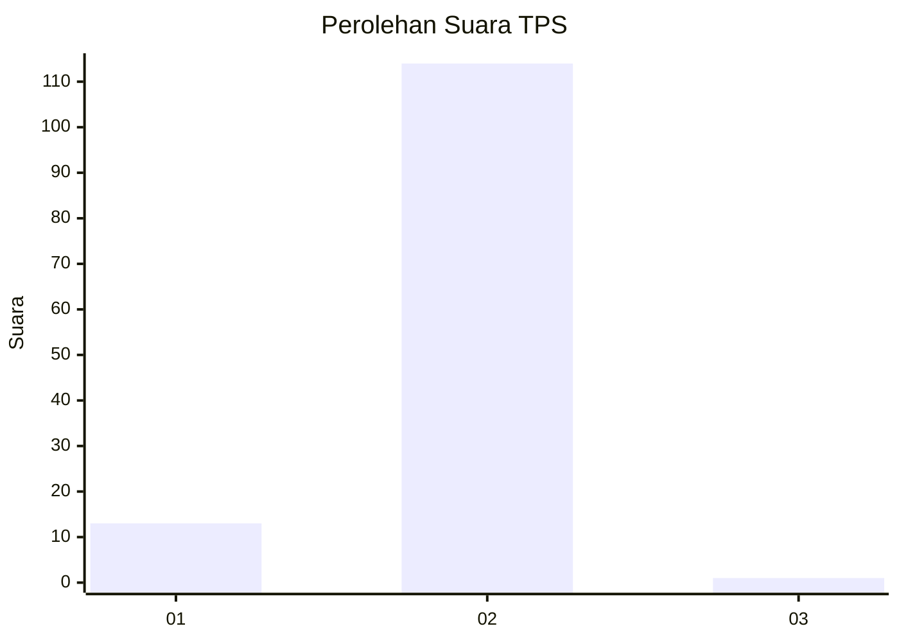
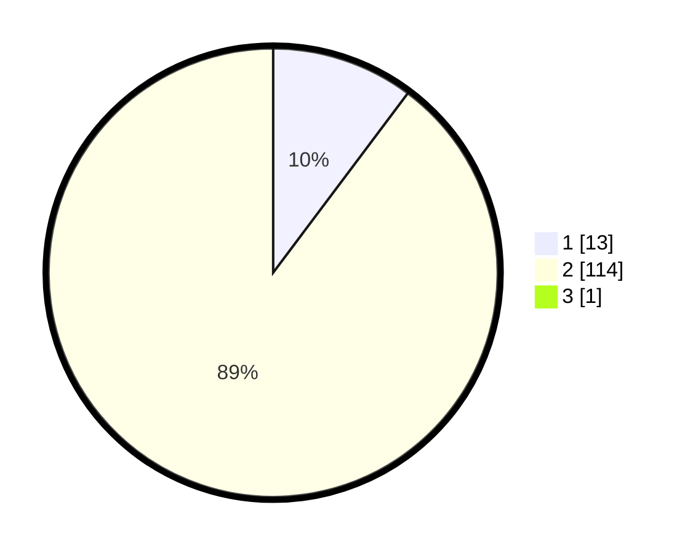

# Hasil

## Grafik

## Tabel

| No. | Nama Paslon    | Suara | Suara (raw) | Persentase |
|:--- |:-------------- | -----:| -----------:| ----------:|
| 1   | ANIES MUHAIMIN | 13    | [13][p-1]   | 10,16      |
| 2   | PRABOWO GIBRAN | 114   | [114][p-2]  | 89,06      |
| 3   | GANJAR MAHFUD  | 1     | [1][p-3]    | 0,78       |

[p-1]: https://github.com/gigit-pemilu/pemilu-2024/blob/main/pilpres/hitung-suara/sub/35-jawa-timur/sub/09-jember/sub/13-rambipuji/sub/2005-pecoro/sub/004-tps/sub/paslon-1.txt
[p-2]: https://github.com/gigit-pemilu/pemilu-2024/blob/main/pilpres/hitung-suara/sub/35-jawa-timur/sub/09-jember/sub/13-rambipuji/sub/2005-pecoro/sub/004-tps/sub/paslon-2.txt
[p-3]: https://github.com/gigit-pemilu/pemilu-2024/blob/main/pilpres/hitung-suara/sub/35-jawa-timur/sub/09-jember/sub/13-rambipuji/sub/2005-pecoro/sub/004-tps/sub/paslon-3.txt

## Foto C Plano

https://sirekap-obj-formc.kpu.go.id/97b8/pemilu/ppwp/35/09/13/20/05/3509132005004-20240219-090723--67f44343-a0c6-40cb-bf45-d408cb324938.jpg

https://sirekap-obj-formc.kpu.go.id/97b8/pemilu/ppwp/35/09/13/20/05/3509132005004-20240219-090729--6b5f82a2-446a-4145-b524-36d6366e26cd.jpg

https://sirekap-obj-formc.kpu.go.id/97b8/pemilu/ppwp/35/09/13/20/05/3509132005004-20240219-090736--d5b30962-be6a-46ad-b40a-e7b169ff047f.jpg

## Metadata

| Key        | Value               |
| ---------- | ------------------- |
| Time Stamp | 2024-02-25 17:00:00 |

