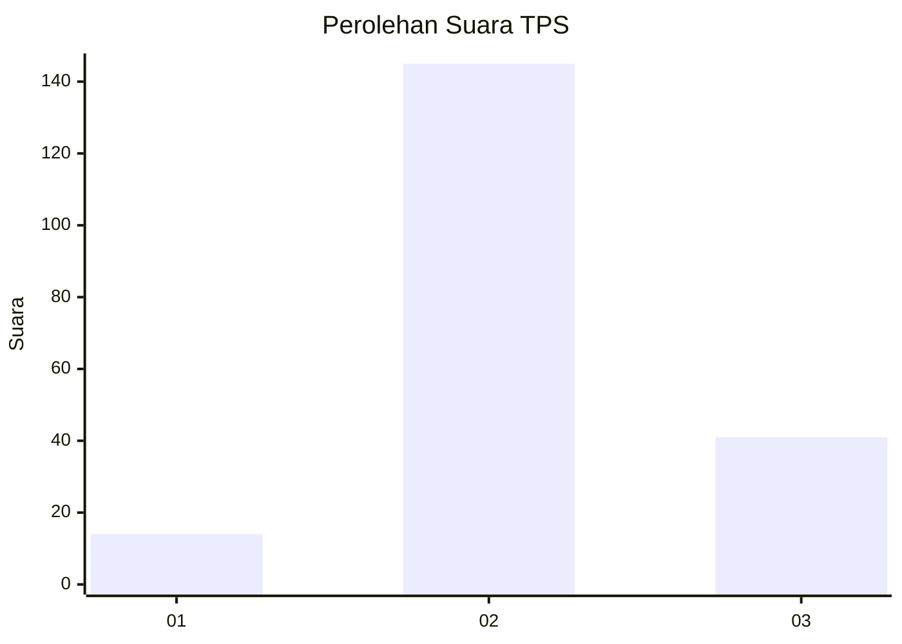

# Hasil

## Grafik

## Tabel

| No. | Nama Paslon    | Suara | Suara (raw) | Persentase |
|:--- |:-------------- | -----:| -----------:| ----------:|
| 1   | ANIES MUHAIMIN | 14    | [14][p-1]   | 7,00       |
| 2   | PRABOWO GIBRAN | 145   | [145][p-2]  | 72,50      |
| 3   | GANJAR MAHFUD  | 41    | [41][p-3]   | 20,50      |

[p-1]: https://github.com/gigit-pemilu/pemilu-2024/blob/main/pilpres/hitung-suara/sub/35-jawa-timur/sub/09-jember/sub/13-rambipuji/sub/2006-rambipuji/sub/004-tps/sub/paslon-1.txt
[p-2]: https://github.com/gigit-pemilu/pemilu-2024/blob/main/pilpres/hitung-suara/sub/35-jawa-timur/sub/09-jember/sub/13-rambipuji/sub/2006-rambipuji/sub/004-tps/sub/paslon-2.txt
[p-3]: https://github.com/gigit-pemilu/pemilu-2024/blob/main/pilpres/hitung-suara/sub/35-jawa-timur/sub/09-jember/sub/13-rambipuji/sub/2006-rambipuji/sub/004-tps/sub/paslon-3.txt

## Foto C Plano

https://sirekap-obj-formc.kpu.go.id/6edd/pemilu/ppwp/35/09/13/20/06/3509132006004-20240215-035925--c28a58e6-cddc-4e18-8d53-e8421ddbc773.jpg

https://sirekap-obj-formc.kpu.go.id/6edd/pemilu/ppwp/35/09/13/20/06/3509132006004-20240215-040313--0e23ea94-1003-4553-9b23-a154ad83eb79.jpg

https://sirekap-obj-formc.kpu.go.id/6edd/pemilu/ppwp/35/09/13/20/06/3509132006004-20240215-040352--e0dfb4da-b777-4a94-b2a4-dea306652e03.jpg

## Metadata

| Key        | Value               |
| ---------- | ------------------- |
| Time Stamp | 2024-02-19 16:00:00 |

