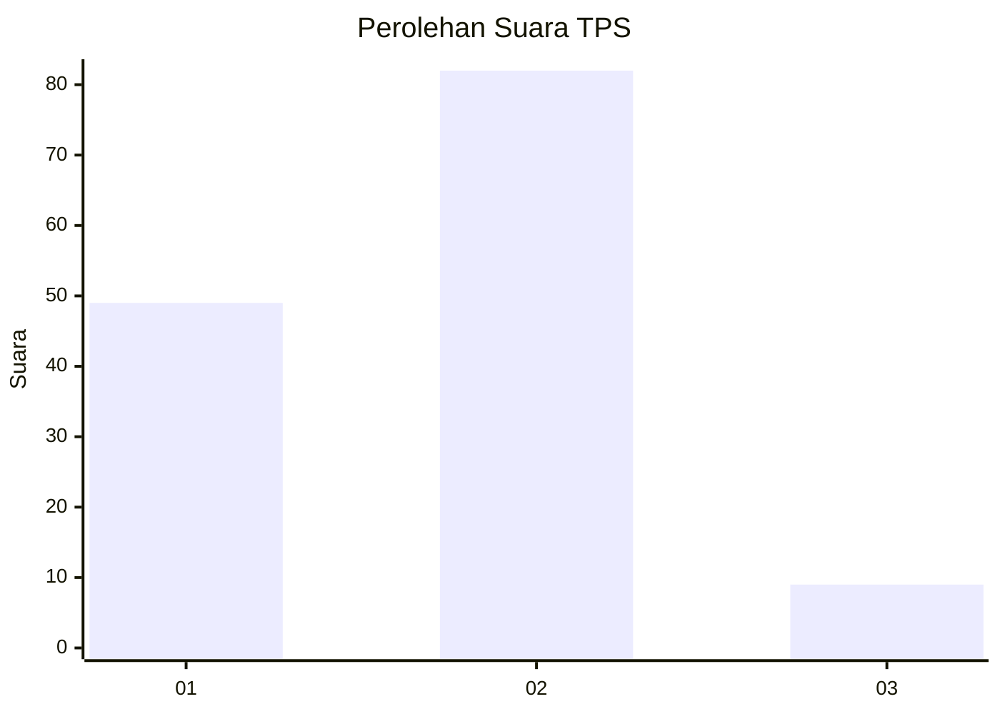
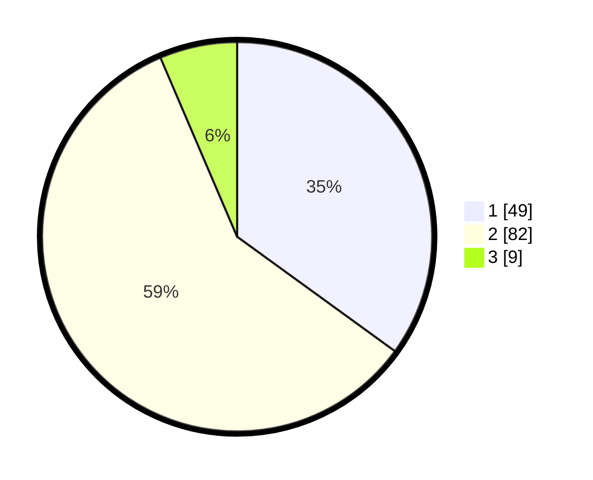

# Hasil

## Grafik

## Tabel

| No. | Nama Paslon    | Suara | Suara (raw) | Persentase |
|:--- |:-------------- | -----:| -----------:| ----------:|
| 1   | ANIES MUHAIMIN | 49    | [49][p-1]   | 35,00      |
| 2   | PRABOWO GIBRAN | 82    | [82][p-2]   | 58,57      |
| 3   | GANJAR MAHFUD  | 9     | [9][p-3]    | 6,43       |

[p-1]: https://github.com/gigit-pemilu/pemilu-2024-35-jawa-timur/blob/main/pilpres/hitung-suara/sub/35-jawa-timur/sub/09-jember/sub/13-rambipuji/sub/2006-rambipuji/sub/009-tps/sub/paslon-1.txt
[p-2]: https://github.com/gigit-pemilu/pemilu-2024-35-jawa-timur/blob/main/pilpres/hitung-suara/sub/35-jawa-timur/sub/09-jember/sub/13-rambipuji/sub/2006-rambipuji/sub/009-tps/sub/paslon-2.txt
[p-3]: https://github.com/gigit-pemilu/pemilu-2024-35-jawa-timur/blob/main/pilpres/hitung-suara/sub/35-jawa-timur/sub/09-jember/sub/13-rambipuji/sub/2006-rambipuji/sub/009-tps/sub/paslon-3.txt

## Foto C Plano

https://sirekap-obj-formc.kpu.go.id/1053/pemilu/ppwp/35/09/13/20/06/3509132006009-20240216-094819--cbd233be-5c6b-4567-b229-6d249af0d05b.jpg

https://sirekap-obj-formc.kpu.go.id/1053/pemilu/ppwp/35/09/13/20/06/3509132006009-20240216-094906--fa66b380-180f-4e07-b312-6508e3134a5e.jpg

https://sirekap-obj-formc.kpu.go.id/1053/pemilu/ppwp/35/09/13/20/06/3509132006009-20240216-094650--3186b0d3-5b28-402e-a0d8-19aaf889fa15.jpg

## Metadata

| Key        | Value               |
| ---------- | ------------------- |
| Time Stamp | 2024-02-16 11:00:29 |

