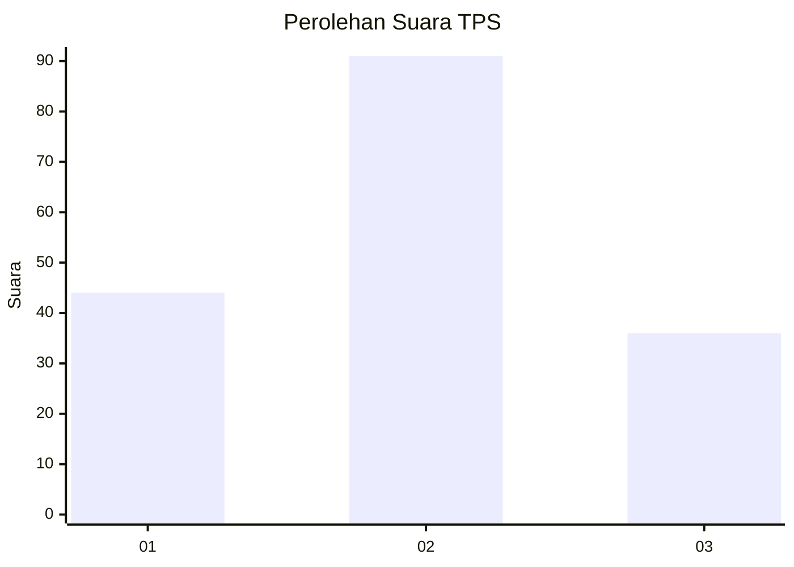
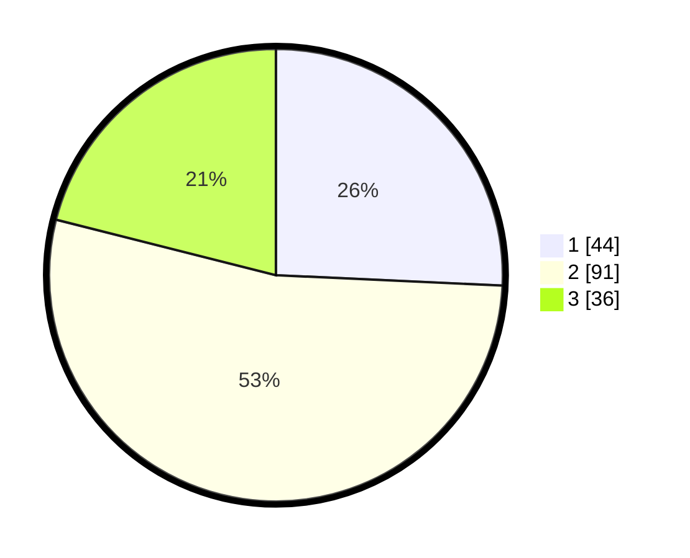

# Hasil

## Grafik

## Tabel

| No. | Nama Paslon    | Suara | Suara (raw) | Persentase |
|:--- |:-------------- | -----:| -----------:| ----------:|
| 1   | ANIES MUHAIMIN | 44    | [44][p-1]   | 25,73      |
| 2   | PRABOWO GIBRAN | 91    | [91][p-2]   | 53,22      |
| 3   | GANJAR MAHFUD  | 36    | [36][p-3]   | 21,05      |

[p-1]: https://github.com/gigit-pemilu/pemilu-2024/blob/main/pilpres/hitung-suara/sub/35-jawa-timur/sub/09-jember/sub/13-rambipuji/sub/2006-rambipuji/sub/016-tps/sub/paslon-1.txt
[p-2]: https://github.com/gigit-pemilu/pemilu-2024/blob/main/pilpres/hitung-suara/sub/35-jawa-timur/sub/09-jember/sub/13-rambipuji/sub/2006-rambipuji/sub/016-tps/sub/paslon-2.txt
[p-3]: https://github.com/gigit-pemilu/pemilu-2024/blob/main/pilpres/hitung-suara/sub/35-jawa-timur/sub/09-jember/sub/13-rambipuji/sub/2006-rambipuji/sub/016-tps/sub/paslon-3.txt

## Foto C Plano

https://sirekap-obj-formc.kpu.go.id/715d/pemilu/ppwp/35/09/13/20/06/3509132006016-20240221-203434--e1eb48d9-d0d6-4e17-9130-6004c29d031d.jpg

https://sirekap-obj-formc.kpu.go.id/715d/pemilu/ppwp/35/09/13/20/06/3509132006016-20240221-204131--f3d8e199-566b-492b-ab9c-a0a73355462b.jpg

https://sirekap-obj-formc.kpu.go.id/715d/pemilu/ppwp/35/09/13/20/06/3509132006016-20240221-204246--d24490fd-3f4d-433b-bca5-3c24c7ae44f1.jpg

## Metadata

| Key        | Value               |
| ---------- | ------------------- |
| Time Stamp | 2024-02-24 22:31:28 |

