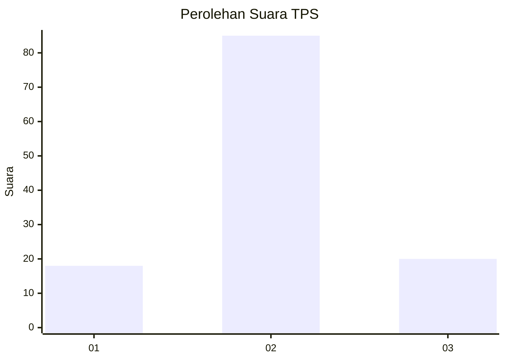
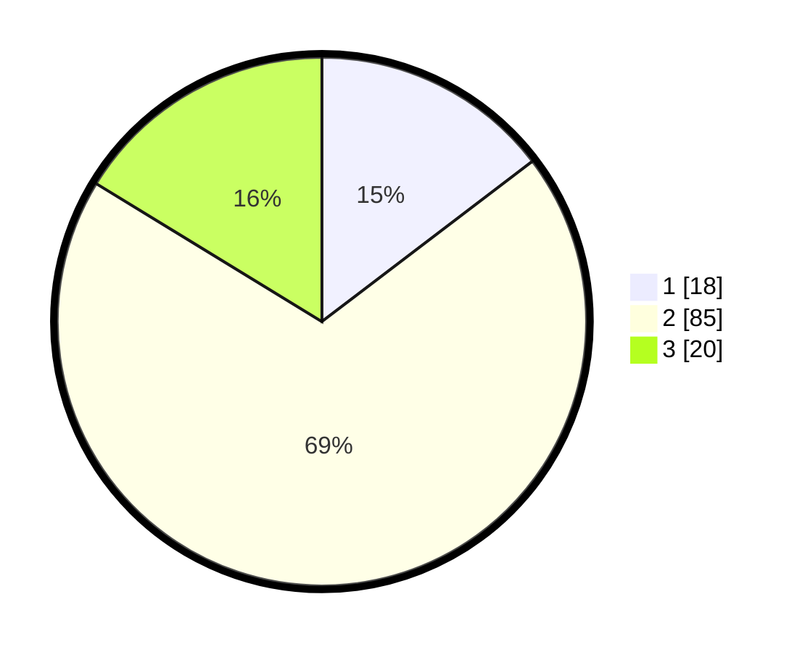

# Hasil

## Grafik

## Tabel

| No. | Nama Paslon    | Suara | Suara (raw) | Persentase |
|:--- |:-------------- | -----:| -----------:| ----------:|
| 1   | ANIES MUHAIMIN | 18    | [18][p-1]   | 14,63      |
| 2   | PRABOWO GIBRAN | 85    | [85][p-2]   | 69,11      |
| 3   | GANJAR MAHFUD  | 20    | [20][p-3]   | 16,26      |

[p-1]: https://github.com/gigit-pemilu/pemilu-2024/blob/main/pilpres/hitung-suara/sub/35-jawa-timur/sub/09-jember/sub/13-rambipuji/sub/2006-rambipuji/sub/020-tps/sub/paslon-1.txt
[p-2]: https://github.com/gigit-pemilu/pemilu-2024/blob/main/pilpres/hitung-suara/sub/35-jawa-timur/sub/09-jember/sub/13-rambipuji/sub/2006-rambipuji/sub/020-tps/sub/paslon-2.txt
[p-3]: https://github.com/gigit-pemilu/pemilu-2024/blob/main/pilpres/hitung-suara/sub/35-jawa-timur/sub/09-jember/sub/13-rambipuji/sub/2006-rambipuji/sub/020-tps/sub/paslon-3.txt

## Foto C Plano

https://sirekap-obj-formc.kpu.go.id/1d7d/pemilu/ppwp/35/09/13/20/06/3509132006020-20240219-211908--32bcf483-4124-4738-b5c0-06ffee67c5d6.jpg

https://sirekap-obj-formc.kpu.go.id/1d7d/pemilu/ppwp/35/09/13/20/06/3509132006020-20240219-211700--e79827d4-f706-4b0a-a761-cde9c87cba10.jpg

https://sirekap-obj-formc.kpu.go.id/1d7d/pemilu/ppwp/35/09/13/20/06/3509132006020-20240215-172951--0970f56d-c8eb-417f-8bd1-e098b7314b96.jpg

## Metadata

| Key        | Value               |
| ---------- | ------------------- |
| Time Stamp | 2024-02-19 22:00:00 |

