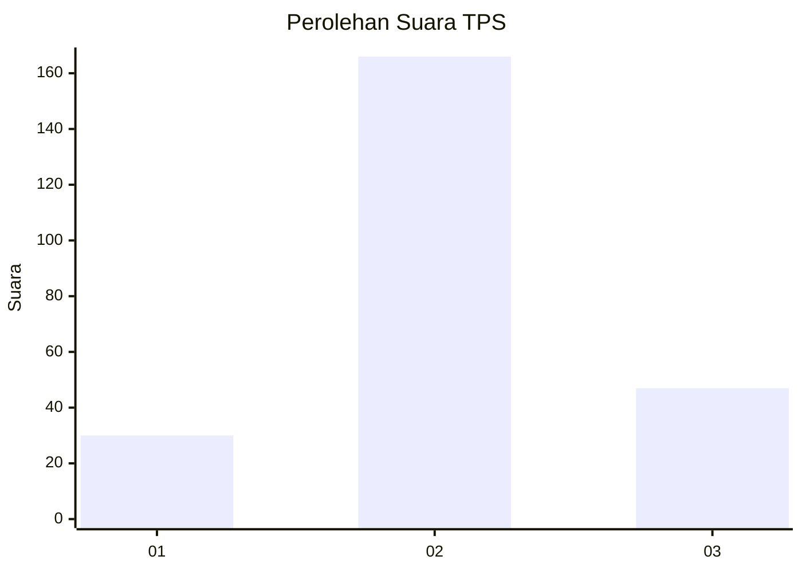
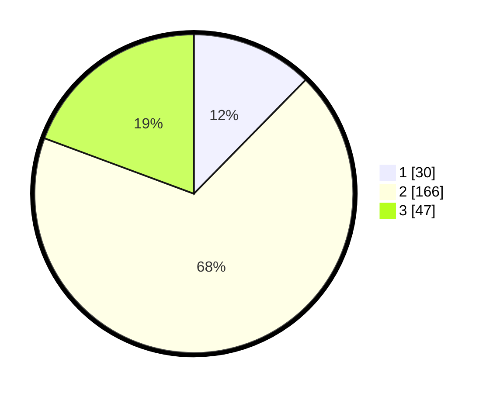

# Hasil

## Grafik

## Tabel

| No. | Nama Paslon    | Suara | Suara (raw) | Persentase |
|:--- |:-------------- | -----:| -----------:| ----------:|
| 1   | ANIES MUHAIMIN | 30    | [30][p-1]   | 12,35      |
| 2   | PRABOWO GIBRAN | 166   | [166][p-2]  | 68,31      |
| 3   | GANJAR MAHFUD  | 47    | [47][p-3]   | 19,34      |

[p-1]: https://github.com/gigit-pemilu/pemilu-2024-35-jawa-timur/blob/main/pilpres/hitung-suara/sub/35-jawa-timur/sub/09-jember/sub/13-rambipuji/sub/2006-rambipuji/sub/033-tps/sub/paslon-1.txt
[p-2]: https://github.com/gigit-pemilu/pemilu-2024-35-jawa-timur/blob/main/pilpres/hitung-suara/sub/35-jawa-timur/sub/09-jember/sub/13-rambipuji/sub/2006-rambipuji/sub/033-tps/sub/paslon-2.txt
[p-3]: https://github.com/gigit-pemilu/pemilu-2024-35-jawa-timur/blob/main/pilpres/hitung-suara/sub/35-jawa-timur/sub/09-jember/sub/13-rambipuji/sub/2006-rambipuji/sub/033-tps/sub/paslon-3.txt

## Foto C Plano

https://sirekap-obj-formc.kpu.go.id/9318/pemilu/ppwp/35/09/13/20/06/3509132006033-20240216-221254--a5fa6de6-93d7-4350-9b80-e63ff9fa369e.jpg

https://sirekap-obj-formc.kpu.go.id/9318/pemilu/ppwp/35/09/13/20/06/3509132006033-20240216-221424--2bb4500d-8eef-4cef-8e79-c0f268a70d2a.jpg

https://sirekap-obj-formc.kpu.go.id/9318/pemilu/ppwp/35/09/13/20/06/3509132006033-20240216-221448--e4224c92-6b4e-49cf-8eb1-101cb0c69359.jpg

## Metadata

| Key        | Value               |
| ---------- | ------------------- |
| Time Stamp | 2024-02-25 21:00:00 |

