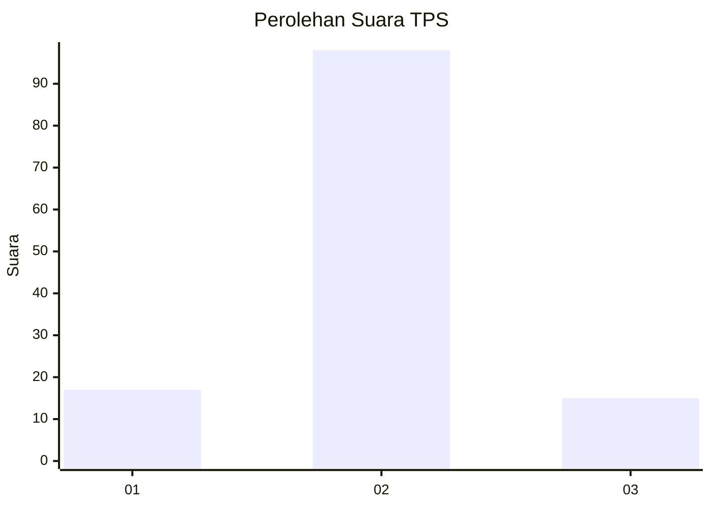
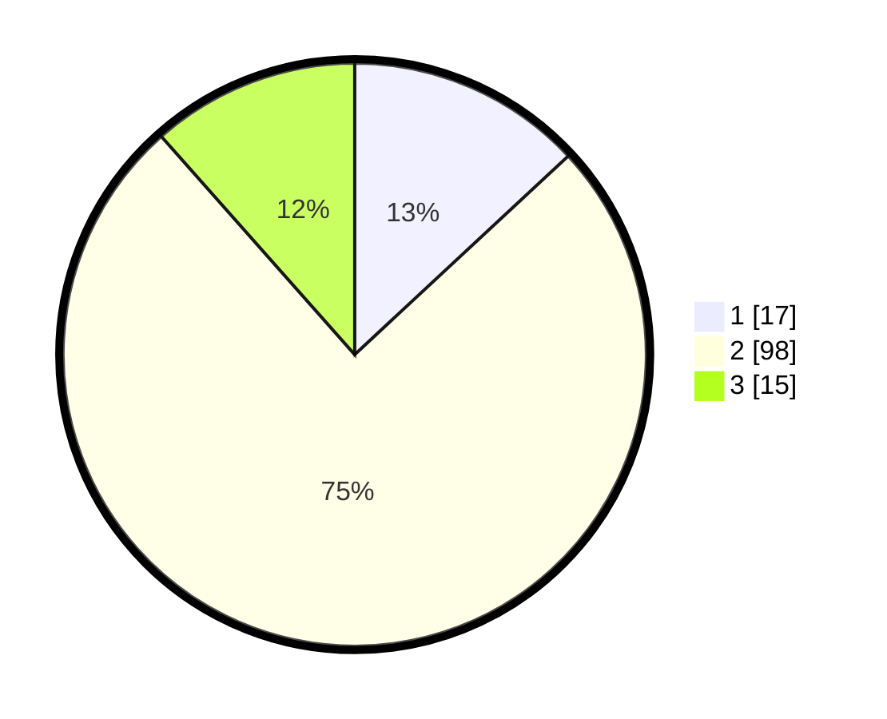

# Hasil

## Grafik

## Tabel

| No. | Nama Paslon    | Suara | Suara (raw) | Persentase |
|:--- |:-------------- | -----:| -----------:| ----------:|
| 1   | ANIES MUHAIMIN | 17    | [17][p-1]   | 13,08      |
| 2   | PRABOWO GIBRAN | 98    | [98][p-2]   | 75,38      |
| 3   | GANJAR MAHFUD  | 15    | [15][p-3]   | 11,54      |

[p-1]: https://github.com/gigit-pemilu/pemilu-2024/blob/main/pilpres/hitung-suara/sub/35-jawa-timur/sub/09-jember/sub/13-rambipuji/sub/2006-rambipuji/sub/034-tps/sub/paslon-1.txt
[p-2]: https://github.com/gigit-pemilu/pemilu-2024/blob/main/pilpres/hitung-suara/sub/35-jawa-timur/sub/09-jember/sub/13-rambipuji/sub/2006-rambipuji/sub/034-tps/sub/paslon-2.txt
[p-3]: https://github.com/gigit-pemilu/pemilu-2024/blob/main/pilpres/hitung-suara/sub/35-jawa-timur/sub/09-jember/sub/13-rambipuji/sub/2006-rambipuji/sub/034-tps/sub/paslon-3.txt

## Foto C Plano

https://sirekap-obj-formc.kpu.go.id/28d5/pemilu/ppwp/35/09/13/20/06/3509132006034-20240222-101626--8eac2550-45f9-4179-acc4-09527118d8b7.jpg

https://sirekap-obj-formc.kpu.go.id/28d5/pemilu/ppwp/35/09/13/20/06/3509132006034-20240222-102200--71c934c3-f9ab-4484-b5c2-efbb4f0d148e.jpg

https://sirekap-obj-formc.kpu.go.id/28d5/pemilu/ppwp/35/09/13/20/06/3509132006034-20240222-102246--686af1de-f8e3-4e9f-adf6-d476cc1b97c6.jpg

## Metadata

| Key        | Value               |
| ---------- | ------------------- |
| Time Stamp | 2024-02-25 11:00:00 |

