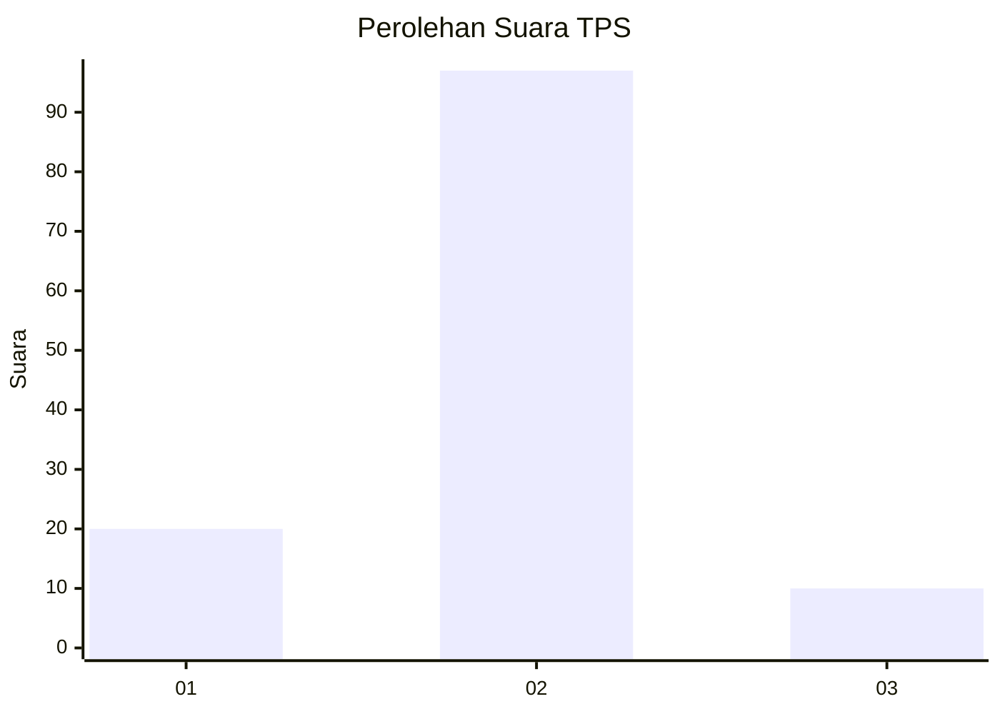
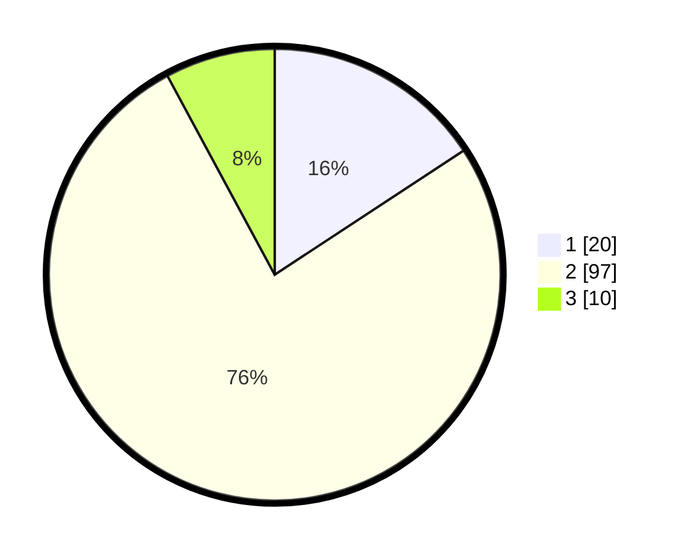

# Hasil

## Grafik

## Tabel

| No. | Nama Paslon    | Suara | Suara (raw) | Persentase |
|:--- |:-------------- | -----:| -----------:| ----------:|
| 1   | ANIES MUHAIMIN | 20    | [20][p-1]   | 15,75      |
| 2   | PRABOWO GIBRAN | 97    | [97][p-2]   | 76,38      |
| 3   | GANJAR MAHFUD  | 10    | [10][p-3]   | 7,87       |

[p-1]: https://github.com/gigit-pemilu/pemilu-2024-35-jawa-timur/blob/main/pilpres/hitung-suara/sub/35-jawa-timur/sub/09-jember/sub/13-rambipuji/sub/2007-gugut/sub/016-tps/sub/paslon-1.txt
[p-2]: https://github.com/gigit-pemilu/pemilu-2024-35-jawa-timur/blob/main/pilpres/hitung-suara/sub/35-jawa-timur/sub/09-jember/sub/13-rambipuji/sub/2007-gugut/sub/016-tps/sub/paslon-2.txt
[p-3]: https://github.com/gigit-pemilu/pemilu-2024-35-jawa-timur/blob/main/pilpres/hitung-suara/sub/35-jawa-timur/sub/09-jember/sub/13-rambipuji/sub/2007-gugut/sub/016-tps/sub/paslon-3.txt

## Foto C Plano

https://sirekap-obj-formc.kpu.go.id/771f/pemilu/ppwp/35/09/13/20/07/3509132007016-20240214-225317--e686cb15-0438-4d4f-9a8d-c32b23ce1616.jpg

https://sirekap-obj-formc.kpu.go.id/771f/pemilu/ppwp/35/09/13/20/07/3509132007016-20240214-225428--973ae6aa-5d05-444a-a19c-8151c7074957.jpg

https://sirekap-obj-formc.kpu.go.id/771f/pemilu/ppwp/35/09/13/20/07/3509132007016-20240214-225528--43b3a17f-0c6b-4bd7-a92f-e2fd13fbe6e3.jpg

## Metadata

| Key        | Value               |
| ---------- | ------------------- |
| Time Stamp | 2024-02-20 10:00:00 |

