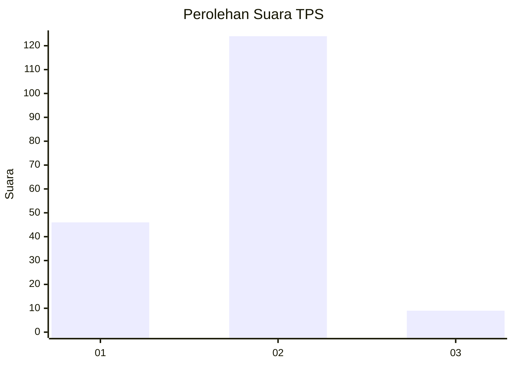
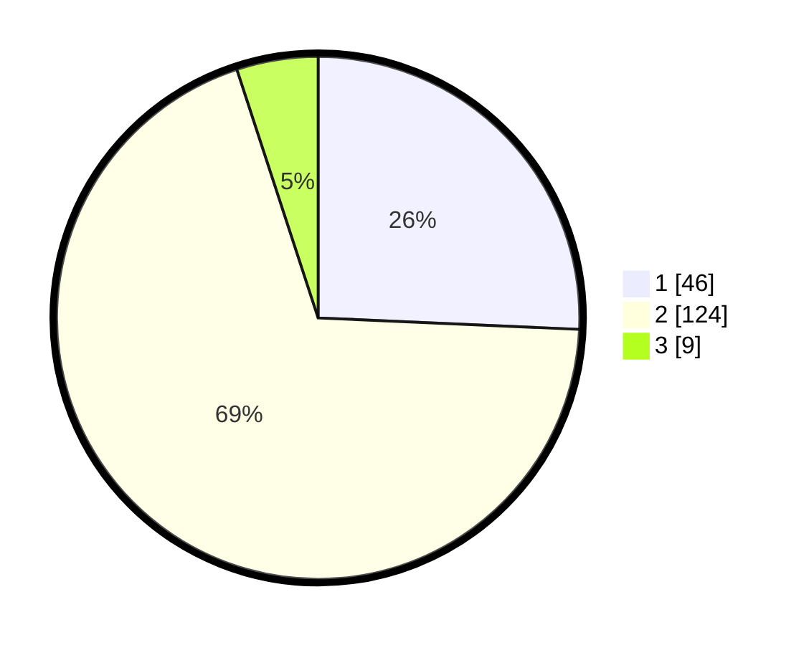

# Hasil

## Grafik

## Tabel

| No. | Nama Paslon    | Suara | Suara (raw) | Persentase |
|:--- |:-------------- | -----:| -----------:| ----------:|
| 1   | ANIES MUHAIMIN | 46    | [46][p-1]   | 25,70      |
| 2   | PRABOWO GIBRAN | 124   | [124][p-2]  | 69,27      |
| 3   | GANJAR MAHFUD  | 9     | [9][p-3]    | 5,03       |

[p-1]: https://github.com/gigit-pemilu/pemilu-2024-35-jawa-timur/blob/main/pilpres/hitung-suara/sub/35-jawa-timur/sub/09-jember/sub/13-rambipuji/sub/2008-rambigundam/sub/004-tps/sub/paslon-1.txt
[p-2]: https://github.com/gigit-pemilu/pemilu-2024-35-jawa-timur/blob/main/pilpres/hitung-suara/sub/35-jawa-timur/sub/09-jember/sub/13-rambipuji/sub/2008-rambigundam/sub/004-tps/sub/paslon-2.txt
[p-3]: https://github.com/gigit-pemilu/pemilu-2024-35-jawa-timur/blob/main/pilpres/hitung-suara/sub/35-jawa-timur/sub/09-jember/sub/13-rambipuji/sub/2008-rambigundam/sub/004-tps/sub/paslon-3.txt

## Foto C Plano

https://sirekap-obj-formc.kpu.go.id/c42a/pemilu/ppwp/35/09/13/20/08/3509132008004-20240214-141520--f8258e10-5016-45fe-b4e6-9e24e55dedfb.jpg

https://sirekap-obj-formc.kpu.go.id/c42a/pemilu/ppwp/35/09/13/20/08/3509132008004-20240214-141800--c06c9dce-ce85-4037-9ecd-3828df82904d.jpg

https://sirekap-obj-formc.kpu.go.id/c42a/pemilu/ppwp/35/09/13/20/08/3509132008004-20240214-141852--f20b5e4f-dcac-4aab-9dfd-c06edf337cdb.jpg

## Metadata

| Key        | Value               |
| ---------- | ------------------- |
| Time Stamp | 2024-02-24 22:31:28 |

