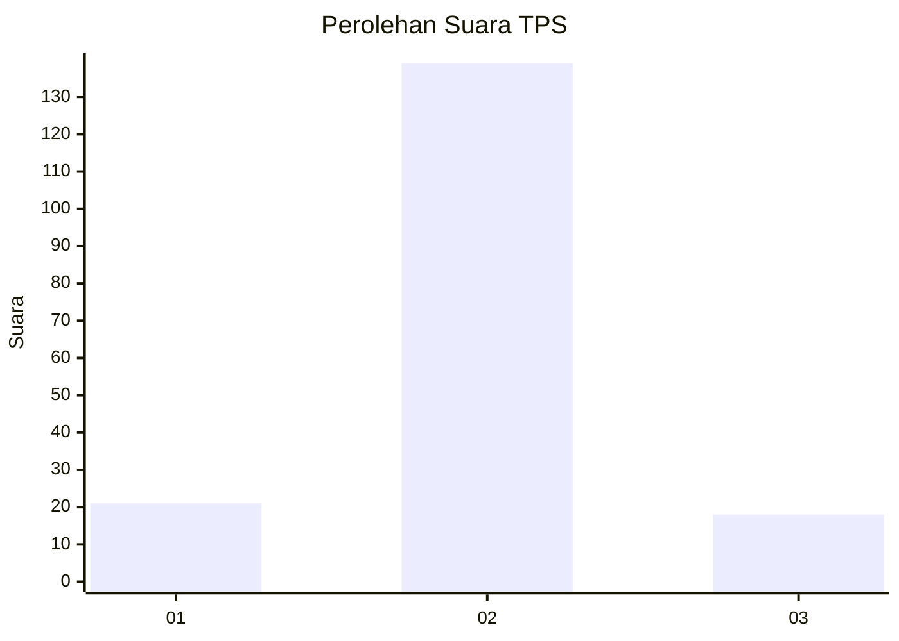
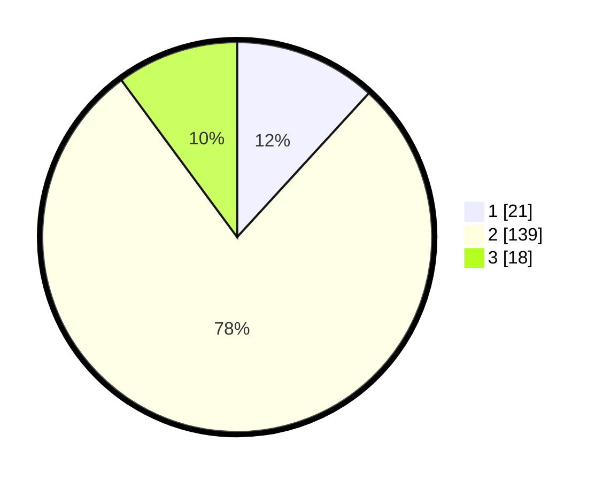

# Hasil

## Grafik

## Tabel

| No. | Nama Paslon    | Suara | Suara (raw) | Persentase |
|:--- |:-------------- | -----:| -----------:| ----------:|
| 1   | ANIES MUHAIMIN | 21    | [21][p-1]   | 11,80      |
| 2   | PRABOWO GIBRAN | 139   | [139][p-2]  | 78,09      |
| 3   | GANJAR MAHFUD  | 18    | [18][p-3]   | 10,11      |

[p-1]: https://github.com/gigit-pemilu/pemilu-2024-35-jawa-timur/blob/main/pilpres/hitung-suara/sub/35-jawa-timur/sub/09-jember/sub/13-rambipuji/sub/2008-rambigundam/sub/012-tps/sub/paslon-1.txt
[p-2]: https://github.com/gigit-pemilu/pemilu-2024-35-jawa-timur/blob/main/pilpres/hitung-suara/sub/35-jawa-timur/sub/09-jember/sub/13-rambipuji/sub/2008-rambigundam/sub/012-tps/sub/paslon-2.txt
[p-3]: https://github.com/gigit-pemilu/pemilu-2024-35-jawa-timur/blob/main/pilpres/hitung-suara/sub/35-jawa-timur/sub/09-jember/sub/13-rambipuji/sub/2008-rambigundam/sub/012-tps/sub/paslon-3.txt

## Foto C Plano

https://sirekap-obj-formc.kpu.go.id/0888/pemilu/ppwp/35/09/13/20/08/3509132008012-20240214-203037--de4fdfe1-cce7-4ca1-97e7-456e1390cef4.jpg

https://sirekap-obj-formc.kpu.go.id/0888/pemilu/ppwp/35/09/13/20/08/3509132008012-20240214-203216--876b28a5-e79f-4939-8f7e-6a11644324f6.jpg

https://sirekap-obj-formc.kpu.go.id/0888/pemilu/ppwp/35/09/13/20/08/3509132008012-20240214-203251--8d149f35-c5e1-45fa-83d2-e6a628b50644.jpg

## Metadata

| Key        | Value               |
| ---------- | ------------------- |
| Time Stamp | 2024-02-15 12:00:28 |

