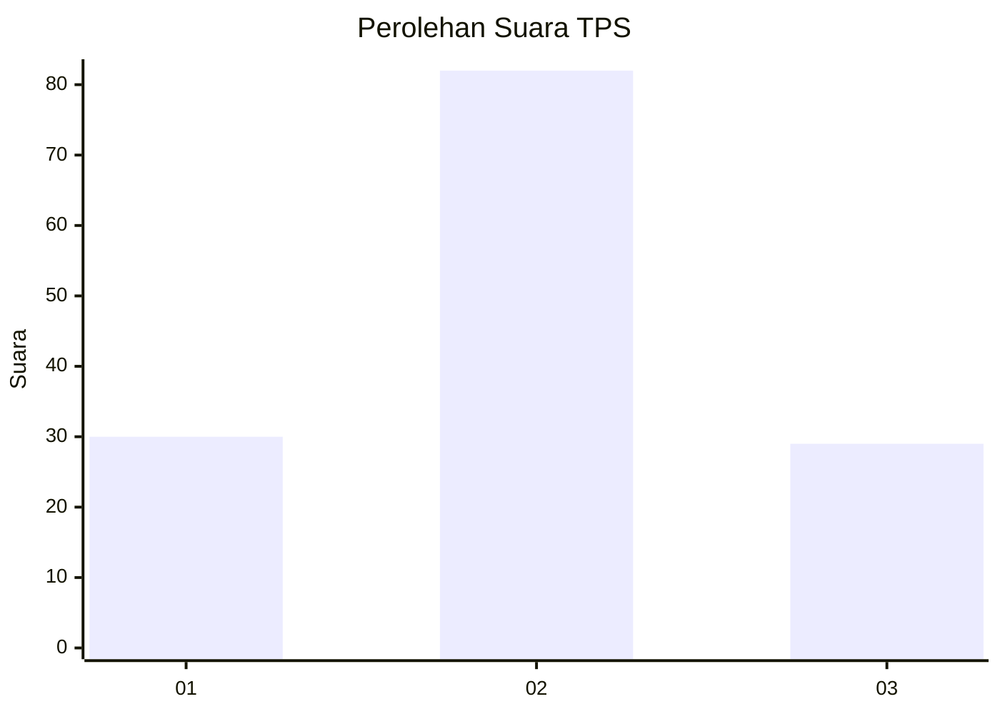
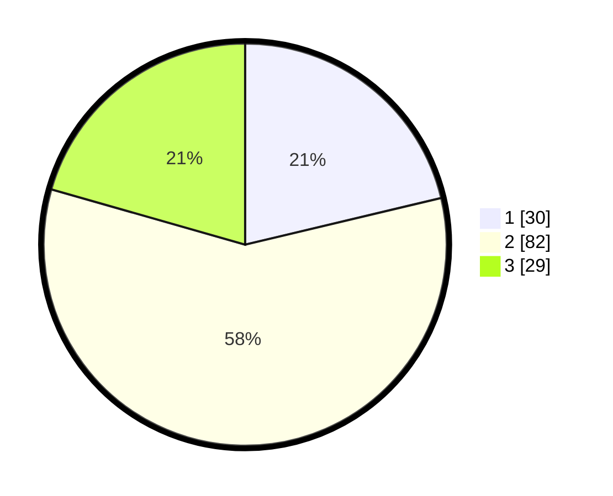

# Hasil

## Grafik

## Tabel

| No. | Nama Paslon    | Suara | Suara (raw) | Persentase |
|:--- |:-------------- | -----:| -----------:| ----------:|
| 1   | ANIES MUHAIMIN | 30    | [30][p-1]   | 21,28      |
| 2   | PRABOWO GIBRAN | 82    | [82][p-2]   | 58,16      |
| 3   | GANJAR MAHFUD  | 29    | [29][p-3]   | 20,57      |

[p-1]: https://github.com/gigit-pemilu/pemilu-2024/blob/main/pilpres/hitung-suara/sub/35-jawa-timur/sub/09-jember/sub/13-rambipuji/sub/2008-rambigundam/sub/023-tps/sub/paslon-1.txt
[p-2]: https://github.com/gigit-pemilu/pemilu-2024/blob/main/pilpres/hitung-suara/sub/35-jawa-timur/sub/09-jember/sub/13-rambipuji/sub/2008-rambigundam/sub/023-tps/sub/paslon-2.txt
[p-3]: https://github.com/gigit-pemilu/pemilu-2024/blob/main/pilpres/hitung-suara/sub/35-jawa-timur/sub/09-jember/sub/13-rambipuji/sub/2008-rambigundam/sub/023-tps/sub/paslon-3.txt

## Foto C Plano

https://sirekap-obj-formc.kpu.go.id/cef2/pemilu/ppwp/35/09/13/20/08/3509132008023-20240215-000833--bc440054-28ee-47cc-a861-6e551fb79493.jpg

https://sirekap-obj-formc.kpu.go.id/cef2/pemilu/ppwp/35/09/13/20/08/3509132008023-20240215-000931--35b6cf29-119f-4f5a-a428-c0ab7cf9495d.jpg

https://sirekap-obj-formc.kpu.go.id/cef2/pemilu/ppwp/35/09/13/20/08/3509132008023-20240215-001040--ed6ea9fb-3398-4d84-b893-f21f339e3de9.jpg

## Metadata

| Key        | Value               |
| ---------- | ------------------- |
| Time Stamp | 2024-02-25 16:00:00 |

