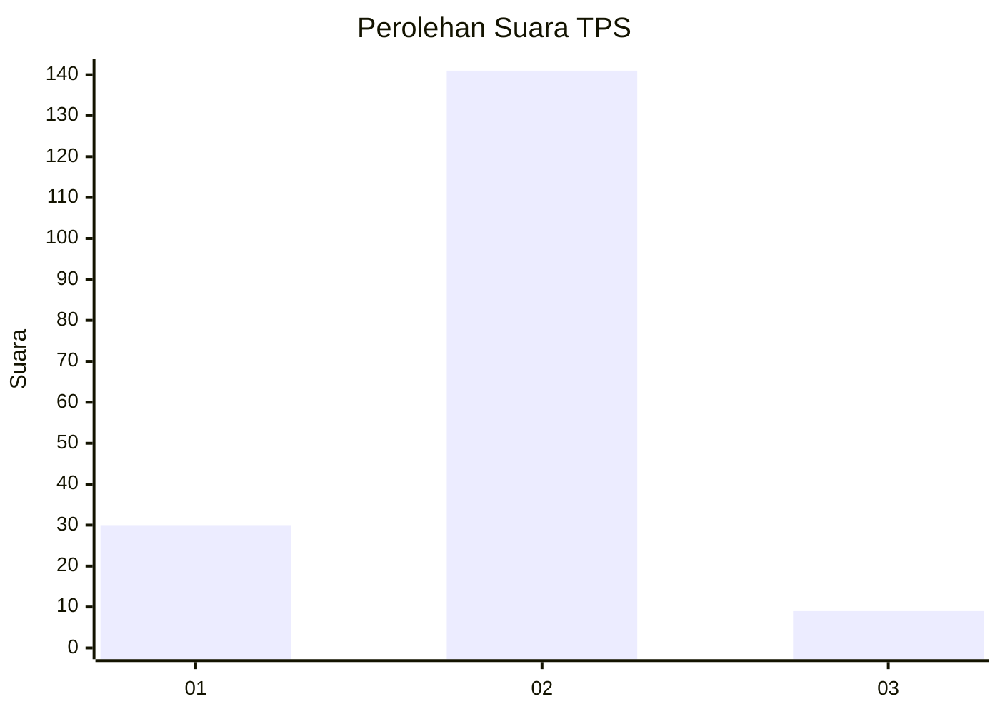
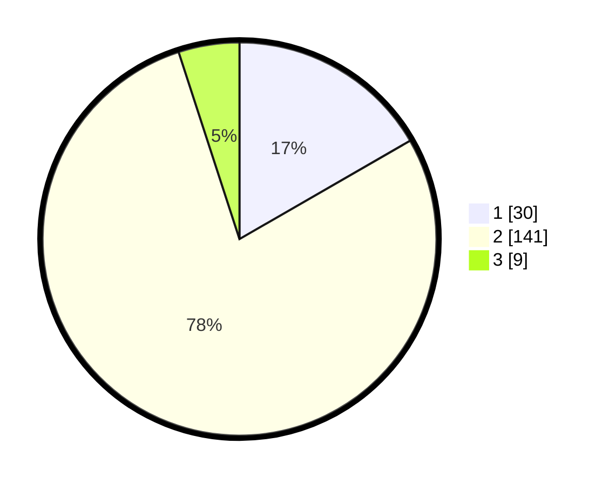

# Hasil

## Grafik

## Tabel

| No. | Nama Paslon    | Suara | Suara (raw) | Persentase |
|:--- |:-------------- | -----:| -----------:| ----------:|
| 1   | ANIES MUHAIMIN | 30    | [30][p-1]   | 16,67      |
| 2   | PRABOWO GIBRAN | 141   | [141][p-2]  | 78,33      |
| 3   | GANJAR MAHFUD  | 9     | [9][p-3]    | 5,00       |

[p-1]: https://github.com/gigit-pemilu/pemilu-2024/blob/main/pilpres/hitung-suara/sub/35-jawa-timur/sub/09-jember/sub/14-panti/sub/2001-pakis/sub/002-tps/sub/paslon-1.txt
[p-2]: https://github.com/gigit-pemilu/pemilu-2024/blob/main/pilpres/hitung-suara/sub/35-jawa-timur/sub/09-jember/sub/14-panti/sub/2001-pakis/sub/002-tps/sub/paslon-2.txt
[p-3]: https://github.com/gigit-pemilu/pemilu-2024/blob/main/pilpres/hitung-suara/sub/35-jawa-timur/sub/09-jember/sub/14-panti/sub/2001-pakis/sub/002-tps/sub/paslon-3.txt

## Foto C Plano

https://sirekap-obj-formc.kpu.go.id/4d92/pemilu/ppwp/35/09/14/20/01/3509142001002-20240215-125843--44b60872-b197-4404-ad7a-ab838f812ffa.jpg

https://sirekap-obj-formc.kpu.go.id/4d92/pemilu/ppwp/35/09/14/20/01/3509142001002-20240215-125901--3efdae2c-8427-497d-9f0c-7f861e2c1ac7.jpg

https://sirekap-obj-formc.kpu.go.id/4d92/pemilu/ppwp/35/09/14/20/01/3509142001002-20240215-125924--c580924f-205d-4d62-9ef5-1172c2ace79e.jpg

## Metadata

| Key        | Value               |
| ---------- | ------------------- |
| Time Stamp | 2024-02-24 22:31:28 |

