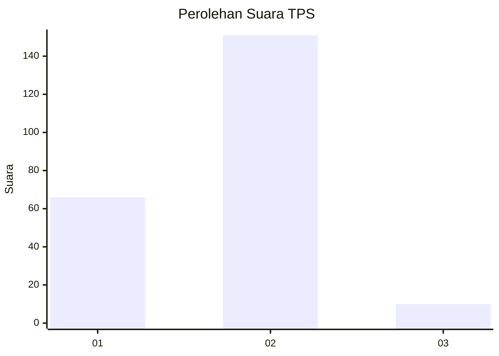
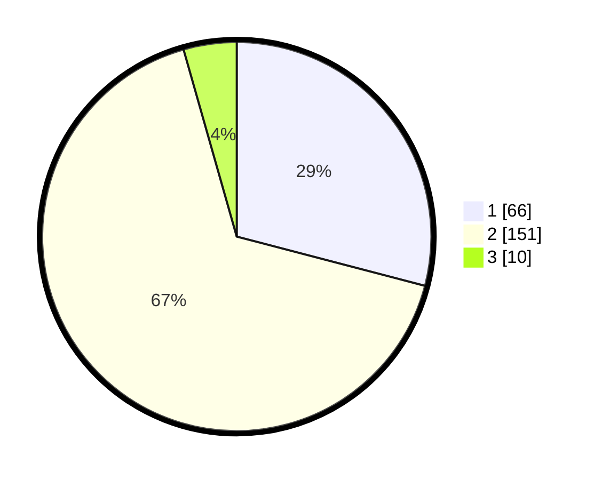

# Hasil

## Grafik

## Tabel

| No. | Nama Paslon    | Suara | Suara (raw) | Persentase |
|:--- |:-------------- | -----:| -----------:| ----------:|
| 1   | ANIES MUHAIMIN | 66    | [66][p-1]   | 29,07      |
| 2   | PRABOWO GIBRAN | 151   | [151][p-2]  | 66,52      |
| 3   | GANJAR MAHFUD  | 10    | [10][p-3]   | 4,41       |

[p-1]: https://github.com/gigit-pemilu/pemilu-2024/blob/main/pilpres/hitung-suara/sub/35-jawa-timur/sub/09-jember/sub/14-panti/sub/2001-pakis/sub/003-tps/sub/paslon-1.txt
[p-2]: https://github.com/gigit-pemilu/pemilu-2024/blob/main/pilpres/hitung-suara/sub/35-jawa-timur/sub/09-jember/sub/14-panti/sub/2001-pakis/sub/003-tps/sub/paslon-2.txt
[p-3]: https://github.com/gigit-pemilu/pemilu-2024/blob/main/pilpres/hitung-suara/sub/35-jawa-timur/sub/09-jember/sub/14-panti/sub/2001-pakis/sub/003-tps/sub/paslon-3.txt

## Foto C Plano

https://sirekap-obj-formc.kpu.go.id/5290/pemilu/ppwp/35/09/14/20/01/3509142001003-20240218-125958--639f947a-d218-4cfa-b812-b29e3daf7010.jpg

https://sirekap-obj-formc.kpu.go.id/5290/pemilu/ppwp/35/09/14/20/01/3509142001003-20240218-125955--fa10f0e0-a843-4141-becd-ffb1adb556c5.jpg

https://sirekap-obj-formc.kpu.go.id/5290/pemilu/ppwp/35/09/14/20/01/3509142001003-20240218-130105--1568eb48-7323-48d3-88d4-cfe9ba8dd018.jpg

## Metadata

| Key        | Value               |
| ---------- | ------------------- |
| Time Stamp | 2024-02-25 21:00:00 |

