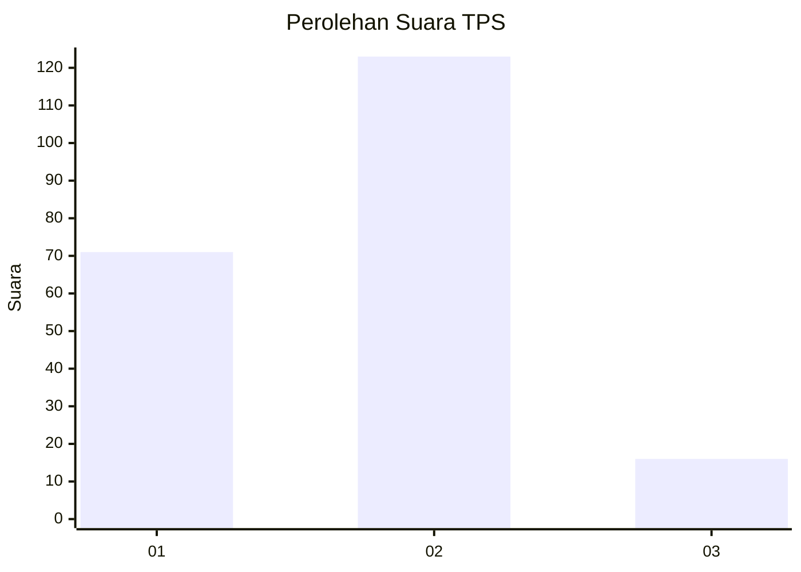
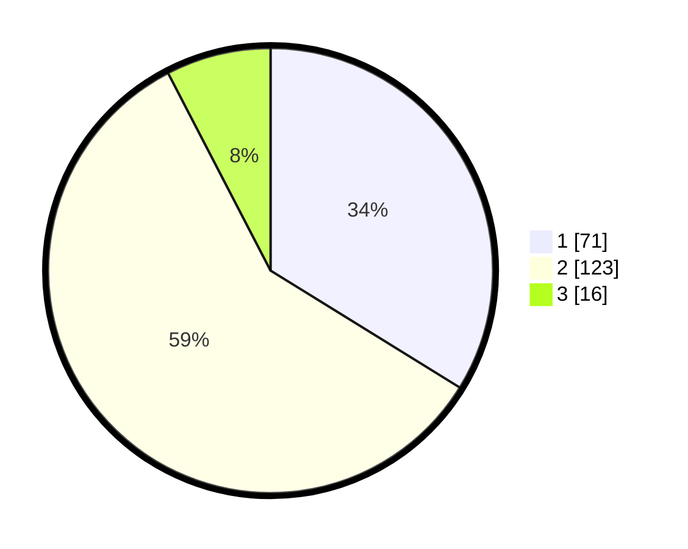

# Hasil

## Grafik

## Tabel

| No. | Nama Paslon    | Suara | Suara (raw) | Persentase |
|:--- |:-------------- | -----:| -----------:| ----------:|
| 1   | ANIES MUHAIMIN | 71    | [71][p-1]   | 33,81      |
| 2   | PRABOWO GIBRAN | 123   | [123][p-2]  | 58,57      |
| 3   | GANJAR MAHFUD  | 16    | [16][p-3]   | 7,62       |

[p-1]: https://github.com/gigit-pemilu/pemilu-2024-35-jawa-timur/blob/main/pilpres/hitung-suara/sub/35-jawa-timur/sub/09-jember/sub/14-panti/sub/2001-pakis/sub/005-tps/sub/paslon-1.txt
[p-2]: https://github.com/gigit-pemilu/pemilu-2024-35-jawa-timur/blob/main/pilpres/hitung-suara/sub/35-jawa-timur/sub/09-jember/sub/14-panti/sub/2001-pakis/sub/005-tps/sub/paslon-2.txt
[p-3]: https://github.com/gigit-pemilu/pemilu-2024-35-jawa-timur/blob/main/pilpres/hitung-suara/sub/35-jawa-timur/sub/09-jember/sub/14-panti/sub/2001-pakis/sub/005-tps/sub/paslon-3.txt

## Foto C Plano

https://sirekap-obj-formc.kpu.go.id/e76a/pemilu/ppwp/35/09/14/20/01/3509142001005-20240215-010206--b91adf1e-2df4-4985-b223-866172056a82.jpg

https://sirekap-obj-formc.kpu.go.id/e76a/pemilu/ppwp/35/09/14/20/01/3509142001005-20240215-010325--f5587e1e-a7f8-4b1b-a50e-1c3bfe2d317d.jpg

https://sirekap-obj-formc.kpu.go.id/e76a/pemilu/ppwp/35/09/14/20/01/3509142001005-20240215-010412--bcaa743d-63ab-48c4-8a97-62197d49f84c.jpg

## Metadata

| Key        | Value               |
| ---------- | ------------------- |
| Time Stamp | 2024-02-15 12:00:28 |

