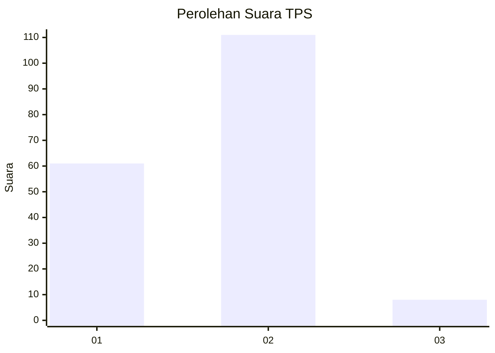
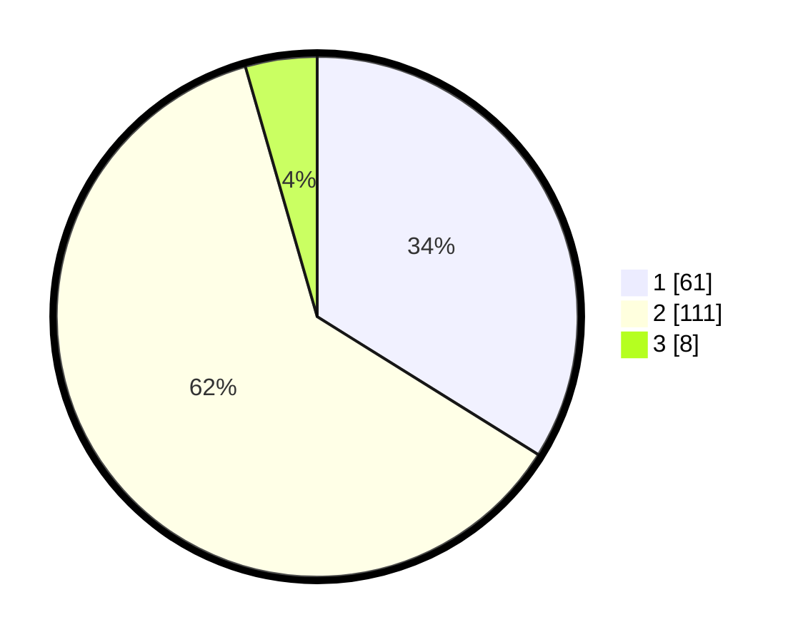

# Hasil

## Grafik

## Tabel

| No. | Nama Paslon    | Suara | Suara (raw) | Persentase |
|:--- |:-------------- | -----:| -----------:| ----------:|
| 1   | ANIES MUHAIMIN | 61    | [61][p-1]   | 33,89      |
| 2   | PRABOWO GIBRAN | 111   | [111][p-2]  | 61,67      |
| 3   | GANJAR MAHFUD  | 8     | [8][p-3]    | 4,44       |

[p-1]: https://github.com/gigit-pemilu/pemilu-2024/blob/main/pilpres/hitung-suara/sub/35-jawa-timur/sub/09-jember/sub/14-panti/sub/2001-pakis/sub/014-tps/sub/paslon-1.txt
[p-2]: https://github.com/gigit-pemilu/pemilu-2024/blob/main/pilpres/hitung-suara/sub/35-jawa-timur/sub/09-jember/sub/14-panti/sub/2001-pakis/sub/014-tps/sub/paslon-2.txt
[p-3]: https://github.com/gigit-pemilu/pemilu-2024/blob/main/pilpres/hitung-suara/sub/35-jawa-timur/sub/09-jember/sub/14-panti/sub/2001-pakis/sub/014-tps/sub/paslon-3.txt

## Foto C Plano

https://sirekap-obj-formc.kpu.go.id/2362/pemilu/ppwp/35/09/14/20/01/3509142001014-20240214-233452--92a72266-3e79-4c74-9922-388e7bd35baa.jpg

https://sirekap-obj-formc.kpu.go.id/2362/pemilu/ppwp/35/09/14/20/01/3509142001014-20240215-103825--7bee5f22-3e8d-4211-98c5-e923e8658ac7.jpg

https://sirekap-obj-formc.kpu.go.id/2362/pemilu/ppwp/35/09/14/20/01/3509142001014-20240215-103945--28de2d13-dc28-4d58-a307-ecb9864c7851.jpg

## Metadata

| Key        | Value               |
| ---------- | ------------------- |
| Time Stamp | 2024-02-15 15:30:25 |

