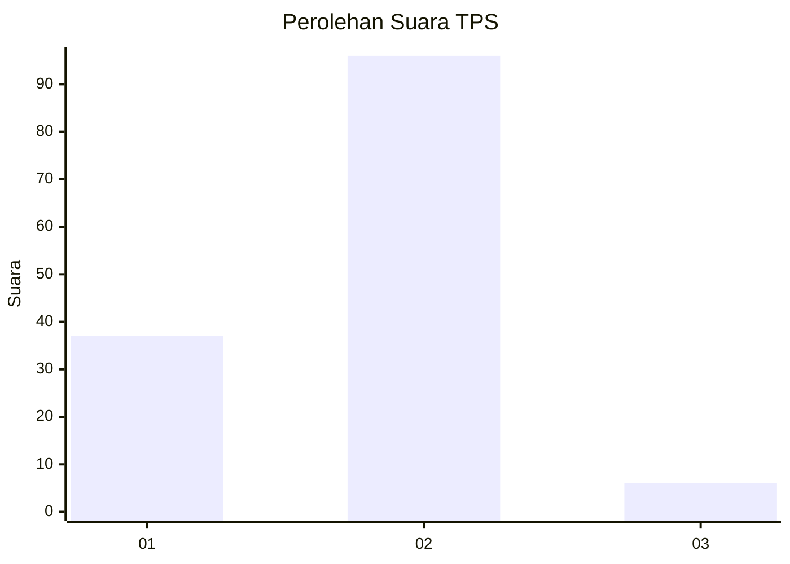
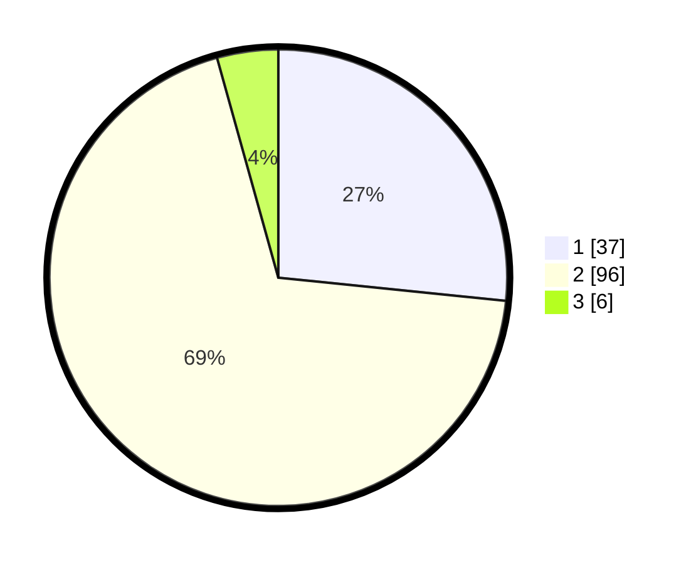

# Hasil

## Grafik

## Tabel

| No. | Nama Paslon    | Suara | Suara (raw) | Persentase |
|:--- |:-------------- | -----:| -----------:| ----------:|
| 1   | ANIES MUHAIMIN | 37    | [37][p-1]   | 26,62      |
| 2   | PRABOWO GIBRAN | 96    | [96][p-2]   | 69,06      |
| 3   | GANJAR MAHFUD  | 6     | [6][p-3]    | 4,32       |

[p-1]: https://github.com/gigit-pemilu/pemilu-2024-35-jawa-timur/blob/main/pilpres/hitung-suara/sub/35-jawa-timur/sub/09-jember/sub/14-panti/sub/2001-pakis/sub/021-tps/sub/paslon-1.txt
[p-2]: https://github.com/gigit-pemilu/pemilu-2024-35-jawa-timur/blob/main/pilpres/hitung-suara/sub/35-jawa-timur/sub/09-jember/sub/14-panti/sub/2001-pakis/sub/021-tps/sub/paslon-2.txt
[p-3]: https://github.com/gigit-pemilu/pemilu-2024-35-jawa-timur/blob/main/pilpres/hitung-suara/sub/35-jawa-timur/sub/09-jember/sub/14-panti/sub/2001-pakis/sub/021-tps/sub/paslon-3.txt

## Foto C Plano

https://sirekap-obj-formc.kpu.go.id/2047/pemilu/ppwp/35/09/14/20/01/3509142001021-20240214-220839--2fa7c65f-ab8c-42b0-81a9-2841c7592bea.jpg

https://sirekap-obj-formc.kpu.go.id/2047/pemilu/ppwp/35/09/14/20/01/3509142001021-20240214-221213--a552c40a-fa65-4895-a4e8-9dac0d650cbd.jpg

https://sirekap-obj-formc.kpu.go.id/2047/pemilu/ppwp/35/09/14/20/01/3509142001021-20240214-221408--97203a8a-2e78-4344-8d88-e68ddb751bd4.jpg

## Metadata

| Key        | Value               |
| ---------- | ------------------- |
| Time Stamp | 2024-02-24 22:31:28 |

