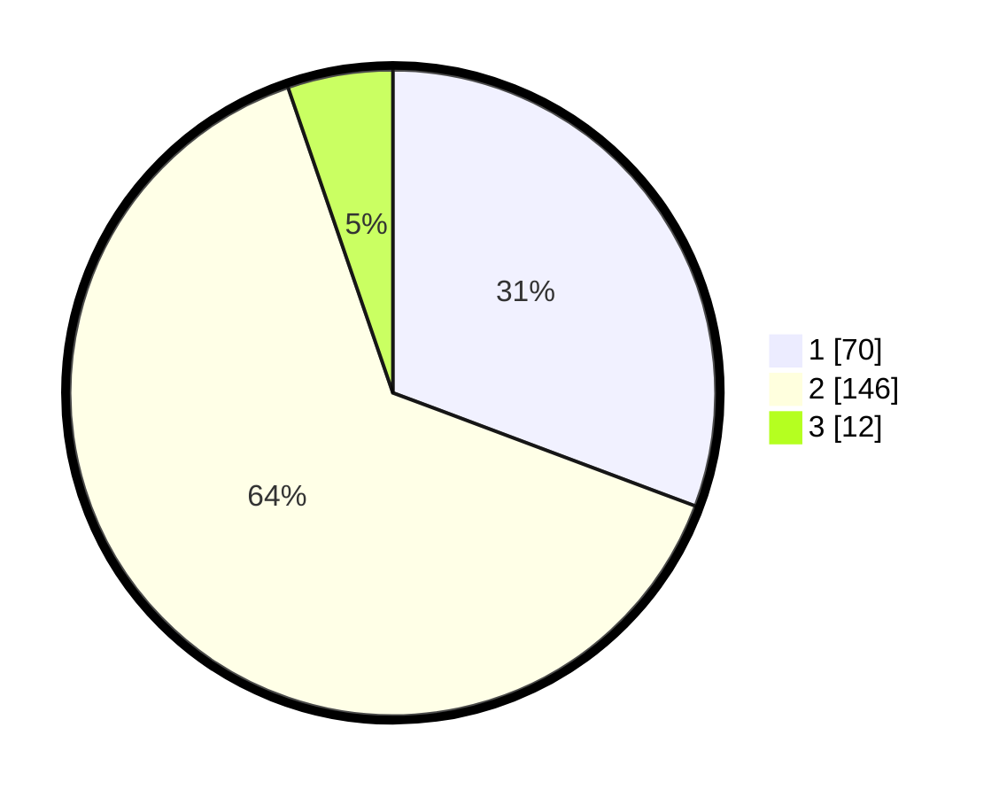

# Hasil

## Grafik

## Tabel

| No. | Nama Paslon    | Suara | Suara (raw) | Persentase |
|:--- |:-------------- | -----:| -----------:| ----------:|
| 1   | ANIES MUHAIMIN | 70    | [70][p-1]   | 30,70      |
| 2   | PRABOWO GIBRAN | 146   | [146][p-2]  | 64,04      |
| 3   | GANJAR MAHFUD  | 12    | [12][p-3]   | 5,26       |

[p-1]: https://github.com/gigit-pemilu/pemilu-2024/blob/main/pilpres/hitung-suara/sub/35-jawa-timur/sub/09-jember/sub/14-panti/sub/2002-kemuning-sari-lor/sub/005-tps/sub/paslon-1.txt
[p-2]: https://github.com/gigit-pemilu/pemilu-2024/blob/main/pilpres/hitung-suara/sub/35-jawa-timur/sub/09-jember/sub/14-panti/sub/2002-kemuning-sari-lor/sub/005-tps/sub/paslon-2.txt
[p-3]: https://github.com/gigit-pemilu/pemilu-2024/blob/main/pilpres/hitung-suara/sub/35-jawa-timur/sub/09-jember/sub/14-panti/sub/2002-kemuning-sari-lor/sub/005-tps/sub/paslon-3.txt

## Foto C Plano

https://sirekap-obj-formc.kpu.go.id/9c46/pemilu/ppwp/35/09/14/20/02/3509142002005-20240214-221131--bfd3fd26-d0d7-4b29-bef4-e8696f8fcc6a.jpg

https://sirekap-obj-formc.kpu.go.id/9c46/pemilu/ppwp/35/09/14/20/02/3509142002005-20240214-221311--ecb77552-5dda-4972-b7eb-0aac475c6d91.jpg

https://sirekap-obj-formc.kpu.go.id/9c46/pemilu/ppwp/35/09/14/20/02/3509142002005-20240214-221431--fc82d734-344f-4d17-929e-45e1c63b5297.jpg

## Metadata

| Key        | Value               |
| ---------- | ------------------- |
| Time Stamp | 2024-02-15 12:00:28 |

