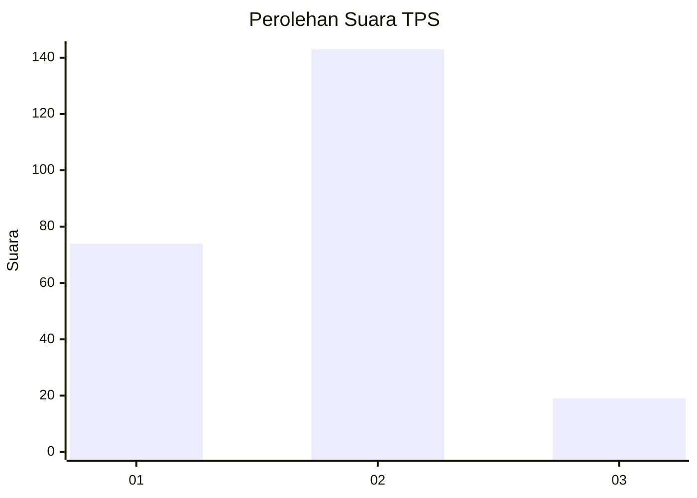
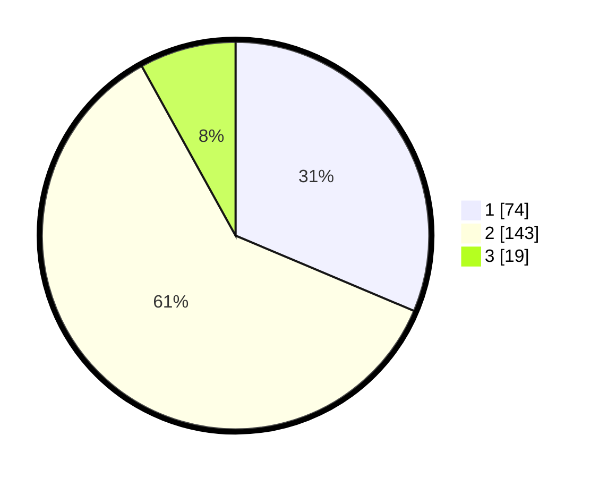

# Hasil

## Grafik

## Tabel

| No. | Nama Paslon    | Suara | Suara (raw) | Persentase |
|:--- |:-------------- | -----:| -----------:| ----------:|
| 1   | ANIES MUHAIMIN | 74    | [74][p-1]   | 31,36      |
| 2   | PRABOWO GIBRAN | 143   | [143][p-2]  | 60,59      |
| 3   | GANJAR MAHFUD  | 19    | [19][p-3]   | 8,05       |

[p-1]: https://github.com/gigit-pemilu/pemilu-2024-35-jawa-timur/blob/main/pilpres/hitung-suara/sub/35-jawa-timur/sub/09-jember/sub/14-panti/sub/2002-kemuning-sari-lor/sub/006-tps/sub/paslon-1.txt
[p-2]: https://github.com/gigit-pemilu/pemilu-2024-35-jawa-timur/blob/main/pilpres/hitung-suara/sub/35-jawa-timur/sub/09-jember/sub/14-panti/sub/2002-kemuning-sari-lor/sub/006-tps/sub/paslon-2.txt
[p-3]: https://github.com/gigit-pemilu/pemilu-2024-35-jawa-timur/blob/main/pilpres/hitung-suara/sub/35-jawa-timur/sub/09-jember/sub/14-panti/sub/2002-kemuning-sari-lor/sub/006-tps/sub/paslon-3.txt

## Foto C Plano

https://sirekap-obj-formc.kpu.go.id/464a/pemilu/ppwp/35/09/14/20/02/3509142002006-20240215-014842--9b2db17a-ae93-4c5f-9df2-9aebdf2fd989.jpg

https://sirekap-obj-formc.kpu.go.id/464a/pemilu/ppwp/35/09/14/20/02/3509142002006-20240215-015026--fccc5e62-ff3a-4e11-b95f-2a3bf1e20579.jpg

https://sirekap-obj-formc.kpu.go.id/464a/pemilu/ppwp/35/09/14/20/02/3509142002006-20240215-015242--62d78d17-02ad-40e8-bf47-6f73b9742796.jpg

## Metadata

| Key        | Value               |
| ---------- | ------------------- |
| Time Stamp | 2024-02-25 14:00:00 |

