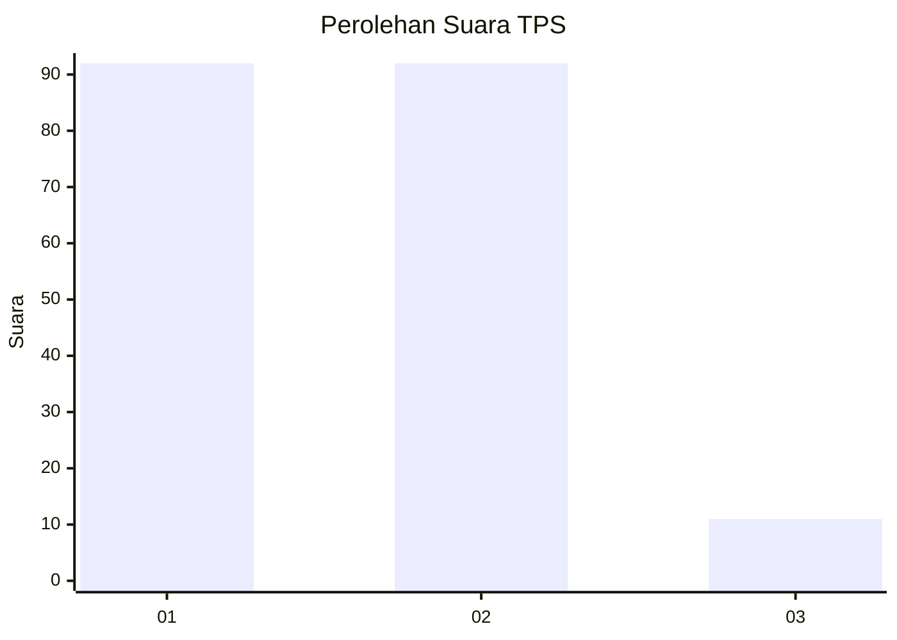
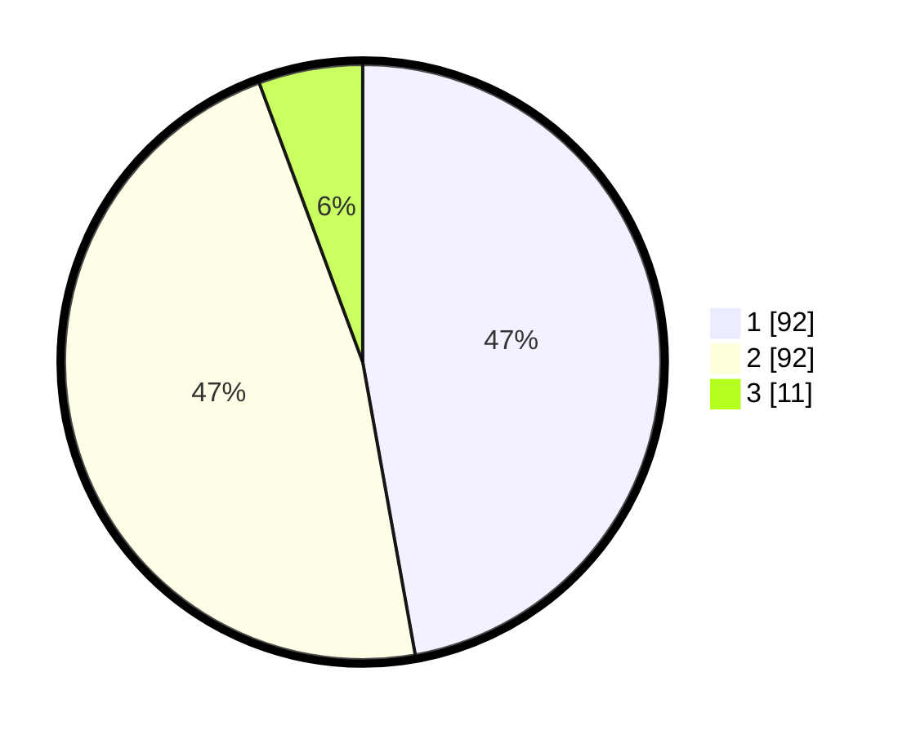

# Hasil

## Grafik

## Tabel

| No. | Nama Paslon    | Suara | Suara (raw) | Persentase |
|:--- |:-------------- | -----:| -----------:| ----------:|
| 1   | ANIES MUHAIMIN | 92    | [92][p-1]   | 47,18      |
| 2   | PRABOWO GIBRAN | 92    | [92][p-2]   | 47,18      |
| 3   | GANJAR MAHFUD  | 11    | [11][p-3]   | 5,64       |

[p-1]: https://github.com/gigit-pemilu/pemilu-2024-35-jawa-timur/blob/main/pilpres/hitung-suara/sub/35-jawa-timur/sub/09-jember/sub/14-panti/sub/2002-kemuning-sari-lor/sub/007-tps/sub/paslon-1.txt
[p-2]: https://github.com/gigit-pemilu/pemilu-2024-35-jawa-timur/blob/main/pilpres/hitung-suara/sub/35-jawa-timur/sub/09-jember/sub/14-panti/sub/2002-kemuning-sari-lor/sub/007-tps/sub/paslon-2.txt
[p-3]: https://github.com/gigit-pemilu/pemilu-2024-35-jawa-timur/blob/main/pilpres/hitung-suara/sub/35-jawa-timur/sub/09-jember/sub/14-panti/sub/2002-kemuning-sari-lor/sub/007-tps/sub/paslon-3.txt

## Foto C Plano

https://sirekap-obj-formc.kpu.go.id/9a01/pemilu/ppwp/35/09/14/20/02/3509142002007-20240214-213048--322acfcc-a9a1-49f2-a53c-746f08846ac8.jpg

https://sirekap-obj-formc.kpu.go.id/9a01/pemilu/ppwp/35/09/14/20/02/3509142002007-20240214-213455--1df28c44-fdef-4632-aa42-782582e2b4e6.jpg

https://sirekap-obj-formc.kpu.go.id/9a01/pemilu/ppwp/35/09/14/20/02/3509142002007-20240214-213558--81544ef8-b895-4862-b521-0c8486f0d7b6.jpg

## Metadata

| Key        | Value               |
| ---------- | ------------------- |
| Time Stamp | 2024-02-20 11:00:00 |

