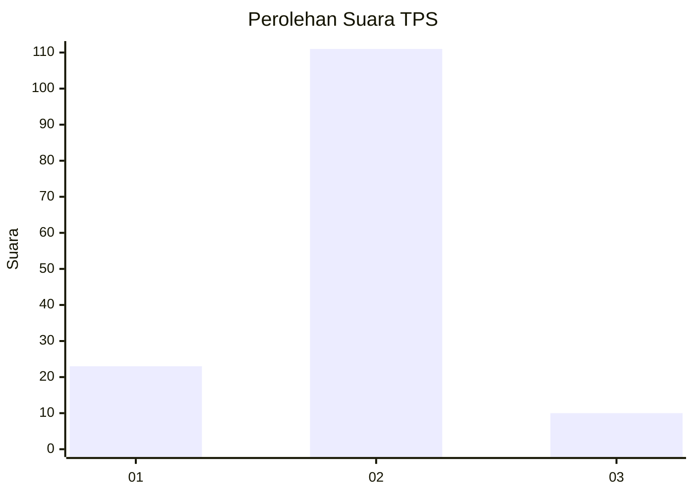
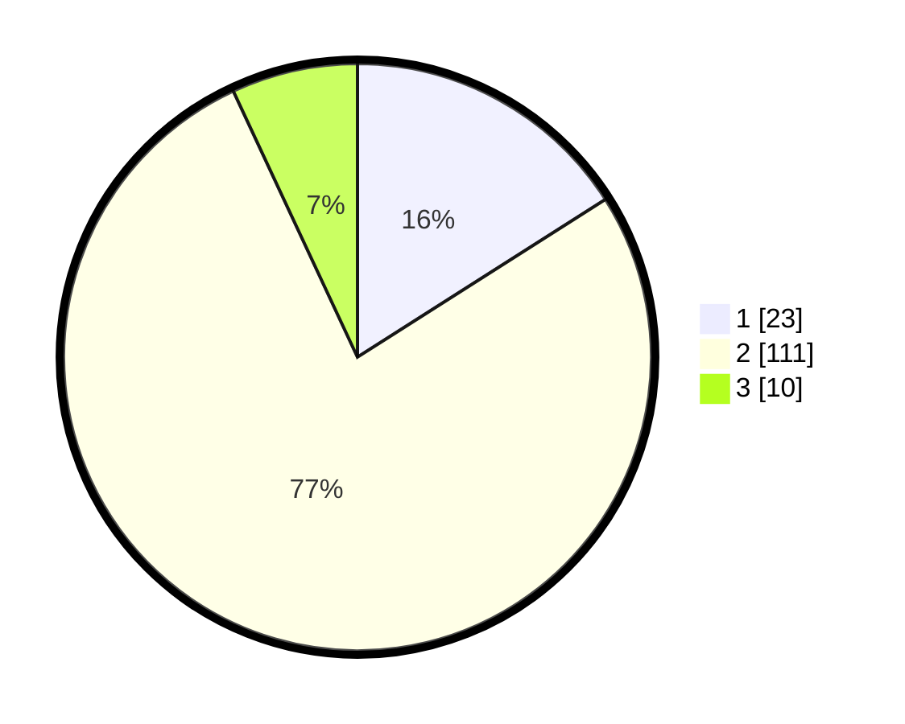

# Hasil

## Grafik

## Tabel

| No. | Nama Paslon    | Suara | Suara (raw) | Persentase |
|:--- |:-------------- | -----:| -----------:| ----------:|
| 1   | ANIES MUHAIMIN | 23    | [23][p-1]   | 15,97      |
| 2   | PRABOWO GIBRAN | 111   | [111][p-2]  | 77,08      |
| 3   | GANJAR MAHFUD  | 10    | [10][p-3]   | 6,94       |

[p-1]: https://github.com/gigit-pemilu/pemilu-2024-35-jawa-timur/blob/main/pilpres/hitung-suara/sub/35-jawa-timur/sub/09-jember/sub/14-panti/sub/2002-kemuning-sari-lor/sub/017-tps/sub/paslon-1.txt
[p-2]: https://github.com/gigit-pemilu/pemilu-2024-35-jawa-timur/blob/main/pilpres/hitung-suara/sub/35-jawa-timur/sub/09-jember/sub/14-panti/sub/2002-kemuning-sari-lor/sub/017-tps/sub/paslon-2.txt
[p-3]: https://github.com/gigit-pemilu/pemilu-2024-35-jawa-timur/blob/main/pilpres/hitung-suara/sub/35-jawa-timur/sub/09-jember/sub/14-panti/sub/2002-kemuning-sari-lor/sub/017-tps/sub/paslon-3.txt

## Foto C Plano

https://sirekap-obj-formc.kpu.go.id/3225/pemilu/ppwp/35/09/14/20/02/3509142002017-20240215-021420--69b311d2-2eb2-431a-b954-ab43d52b7f86.jpg

https://sirekap-obj-formc.kpu.go.id/3225/pemilu/ppwp/35/09/14/20/02/3509142002017-20240215-021559--1623d282-6fc7-45d8-ab9e-5c7694bacfad.jpg

https://sirekap-obj-formc.kpu.go.id/3225/pemilu/ppwp/35/09/14/20/02/3509142002017-20240215-021649--5aa97346-fa4c-4a3c-8c0f-8d31abf1faf9.jpg

## Metadata

| Key        | Value               |
| ---------- | ------------------- |
| Time Stamp | 2024-02-15 12:00:28 |

