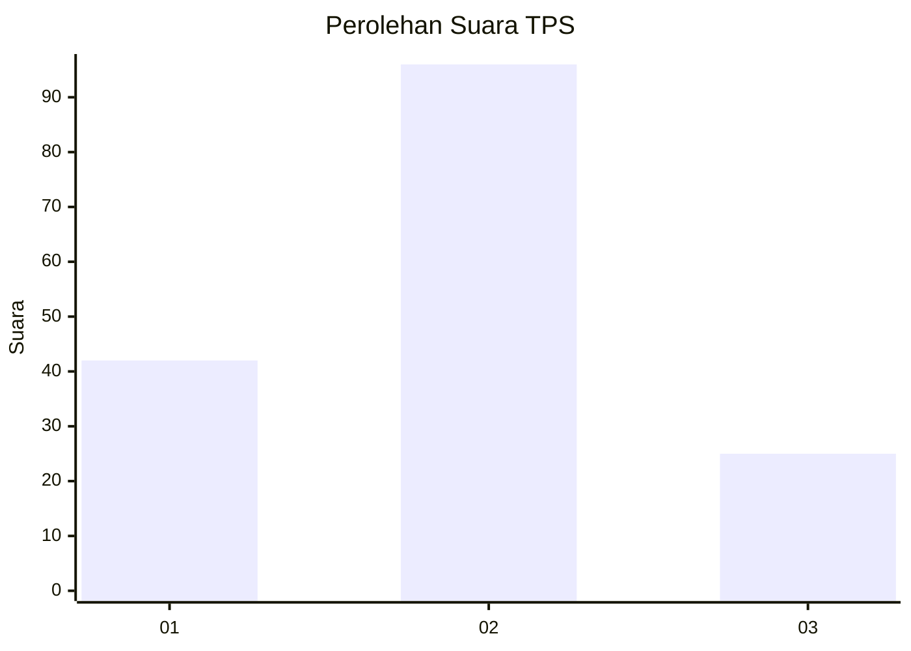
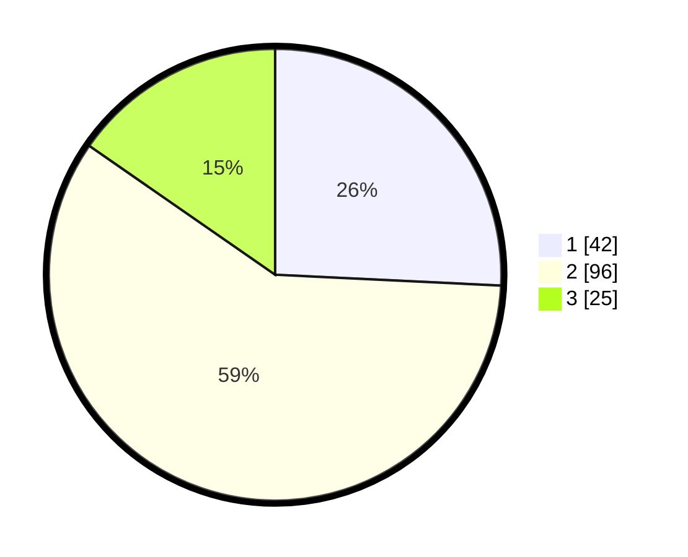

# Hasil

## Grafik

## Tabel

| No. | Nama Paslon    | Suara | Suara (raw) | Persentase |
|:--- |:-------------- | -----:| -----------:| ----------:|
| 1   | ANIES MUHAIMIN | 42    | [42][p-1]   | 25,77      |
| 2   | PRABOWO GIBRAN | 96    | [96][p-2]   | 58,90      |
| 3   | GANJAR MAHFUD  | 25    | [25][p-3]   | 15,34      |

[p-1]: https://github.com/gigit-pemilu/pemilu-2024/blob/main/pilpres/hitung-suara/sub/35-jawa-timur/sub/09-jember/sub/14-panti/sub/2002-kemuning-sari-lor/sub/021-tps/sub/paslon-1.txt
[p-2]: https://github.com/gigit-pemilu/pemilu-2024/blob/main/pilpres/hitung-suara/sub/35-jawa-timur/sub/09-jember/sub/14-panti/sub/2002-kemuning-sari-lor/sub/021-tps/sub/paslon-2.txt
[p-3]: https://github.com/gigit-pemilu/pemilu-2024/blob/main/pilpres/hitung-suara/sub/35-jawa-timur/sub/09-jember/sub/14-panti/sub/2002-kemuning-sari-lor/sub/021-tps/sub/paslon-3.txt

## Foto C Plano

https://sirekap-obj-formc.kpu.go.id/b022/pemilu/ppwp/35/09/14/20/02/3509142002021-20240215-054434--ed6d692f-b278-4871-965d-4eca4d414143.jpg

https://sirekap-obj-formc.kpu.go.id/b022/pemilu/ppwp/35/09/14/20/02/3509142002021-20240215-011831--c68609a7-6d58-4031-9012-67af824742f7.jpg

https://sirekap-obj-formc.kpu.go.id/b022/pemilu/ppwp/35/09/14/20/02/3509142002021-20240215-060102--134491f1-fe2e-4d69-b5b6-a8ca2f45b465.jpg

## Metadata

| Key        | Value               |
| ---------- | ------------------- |
| Time Stamp | 2024-02-24 22:31:28 |

