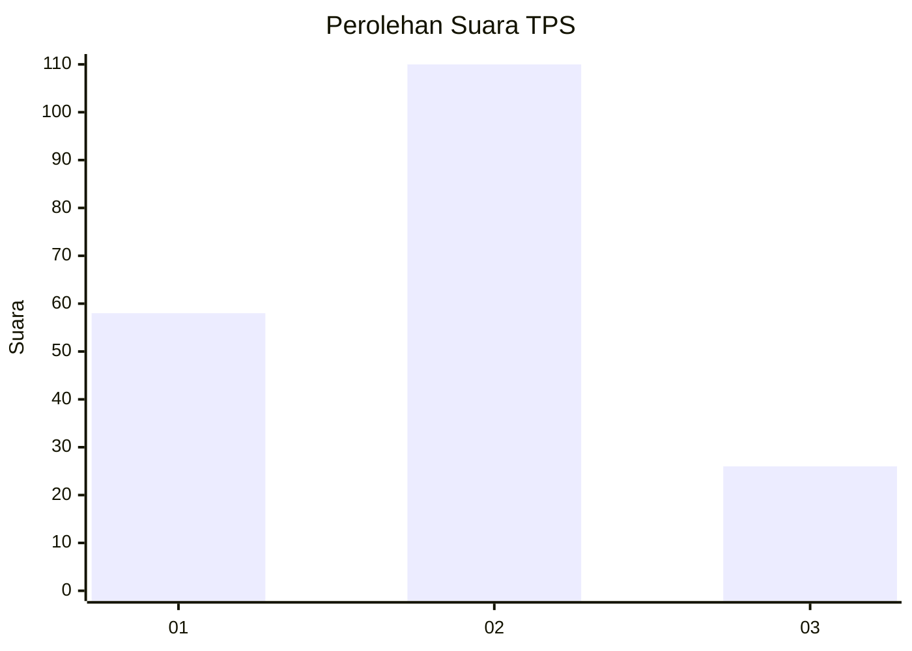
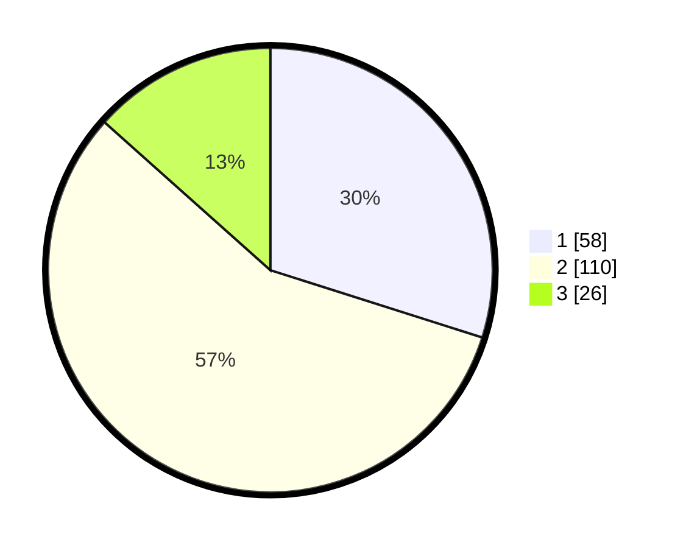

# Hasil

## Grafik

## Tabel

| No. | Nama Paslon    | Suara | Suara (raw) | Persentase |
|:--- |:-------------- | -----:| -----------:| ----------:|
| 1   | ANIES MUHAIMIN | 58    | [58][p-1]   | 29,90      |
| 2   | PRABOWO GIBRAN | 110   | [110][p-2]  | 56,70      |
| 3   | GANJAR MAHFUD  | 26    | [26][p-3]   | 13,40      |

[p-1]: https://github.com/gigit-pemilu/pemilu-2024/blob/main/pilpres/hitung-suara/sub/35-jawa-timur/sub/09-jember/sub/14-panti/sub/2003-panti/sub/001-tps/sub/paslon-1.txt
[p-2]: https://github.com/gigit-pemilu/pemilu-2024/blob/main/pilpres/hitung-suara/sub/35-jawa-timur/sub/09-jember/sub/14-panti/sub/2003-panti/sub/001-tps/sub/paslon-2.txt
[p-3]: https://github.com/gigit-pemilu/pemilu-2024/blob/main/pilpres/hitung-suara/sub/35-jawa-timur/sub/09-jember/sub/14-panti/sub/2003-panti/sub/001-tps/sub/paslon-3.txt

## Foto C Plano

https://sirekap-obj-formc.kpu.go.id/6185/pemilu/ppwp/35/09/14/20/03/3509142003001-20240215-042658--3638733c-12b5-4c28-95ec-cb9f011b8eee.jpg

https://sirekap-obj-formc.kpu.go.id/6185/pemilu/ppwp/35/09/14/20/03/3509142003001-20240215-004111--2e4d856f-51ef-4a72-be82-cf7137a4ca35.jpg

https://sirekap-obj-formc.kpu.go.id/6185/pemilu/ppwp/35/09/14/20/03/3509142003001-20240215-004302--0909721c-e39f-4d53-afd5-1a45d0c22bef.jpg

## Metadata

| Key        | Value               |
| ---------- | ------------------- |
| Time Stamp | 2024-02-25 12:00:00 |

