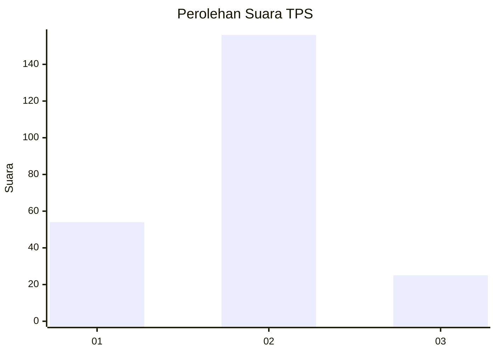
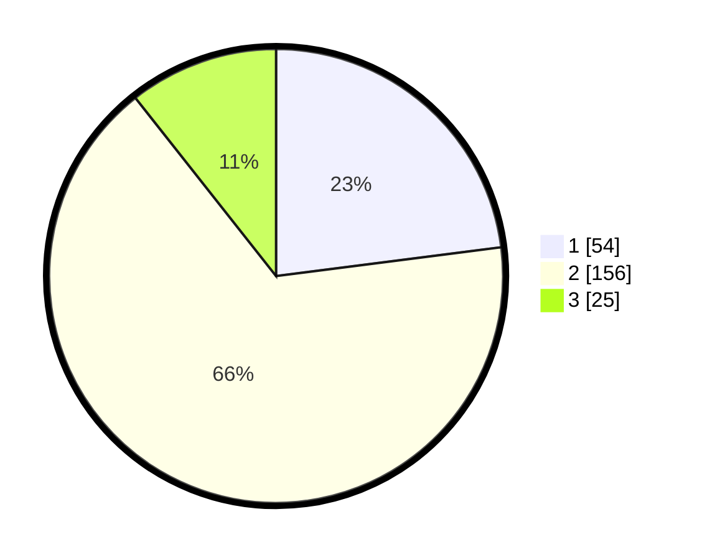

# Hasil

## Grafik

## Tabel

| No. | Nama Paslon    | Suara | Suara (raw) | Persentase |
|:--- |:-------------- | -----:| -----------:| ----------:|
| 1   | ANIES MUHAIMIN | 54    | [54][p-1]   | 22,98      |
| 2   | PRABOWO GIBRAN | 156   | [156][p-2]  | 66,38      |
| 3   | GANJAR MAHFUD  | 25    | [25][p-3]   | 10,64      |

[p-1]: https://github.com/gigit-pemilu/pemilu-2024/blob/main/pilpres/hitung-suara/sub/35-jawa-timur/sub/09-jember/sub/14-panti/sub/2003-panti/sub/010-tps/sub/paslon-1.txt
[p-2]: https://github.com/gigit-pemilu/pemilu-2024/blob/main/pilpres/hitung-suara/sub/35-jawa-timur/sub/09-jember/sub/14-panti/sub/2003-panti/sub/010-tps/sub/paslon-2.txt
[p-3]: https://github.com/gigit-pemilu/pemilu-2024/blob/main/pilpres/hitung-suara/sub/35-jawa-timur/sub/09-jember/sub/14-panti/sub/2003-panti/sub/010-tps/sub/paslon-3.txt

## Foto C Plano

https://sirekap-obj-formc.kpu.go.id/8e7d/pemilu/ppwp/35/09/14/20/03/3509142003010-20240214-225727--f7b4975b-0acc-46e5-a6ae-d2881f04bbb1.jpg

https://sirekap-obj-formc.kpu.go.id/8e7d/pemilu/ppwp/35/09/14/20/03/3509142003010-20240214-225851--a468f9e9-0ce2-4a1b-a71b-dde72ecbdc0a.jpg

https://sirekap-obj-formc.kpu.go.id/8e7d/pemilu/ppwp/35/09/14/20/03/3509142003010-20240214-230000--324d75de-3cf6-4abf-b24e-2034c0ecea6f.jpg

## Metadata

| Key        | Value               |
| ---------- | ------------------- |
| Time Stamp | 2024-02-15 15:00:29 |

