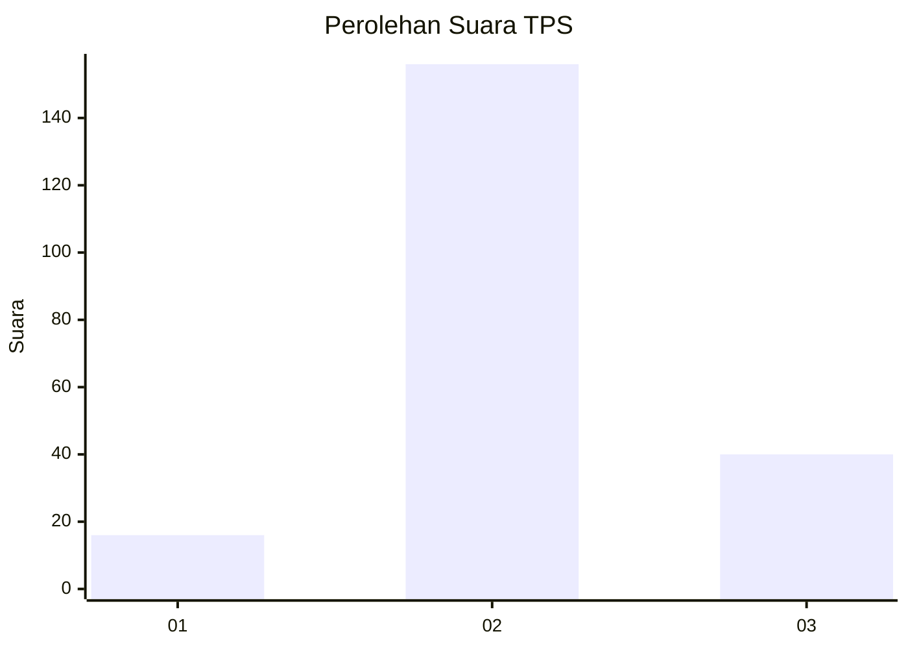
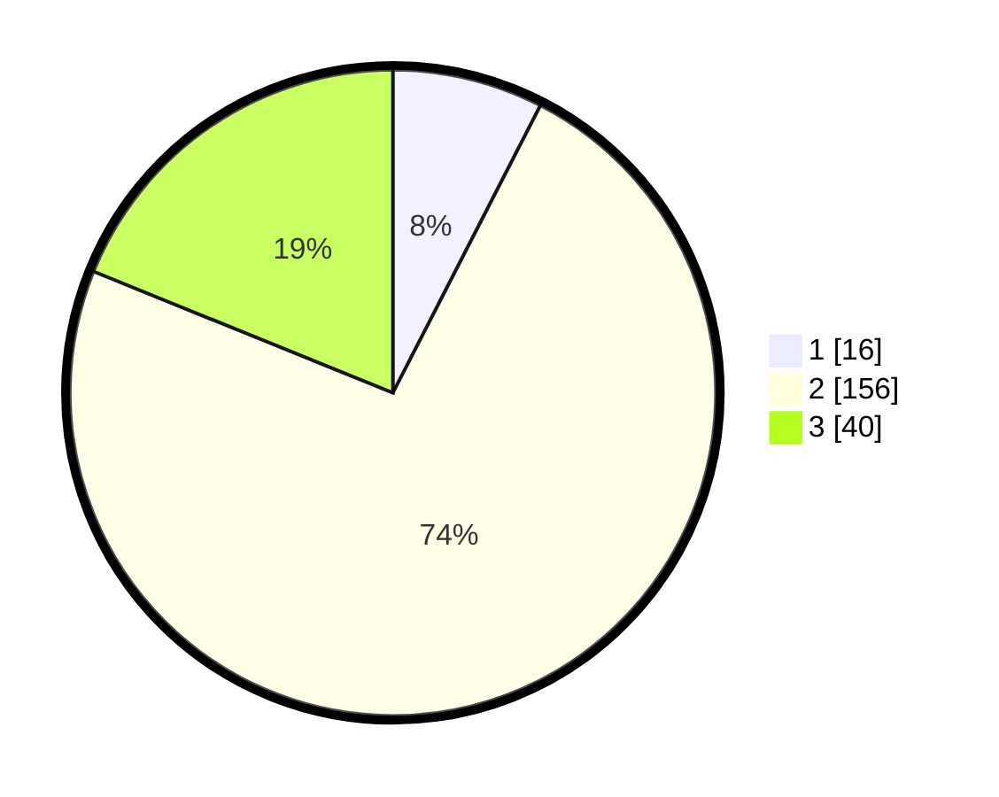

# Hasil

## Grafik

## Tabel

| No. | Nama Paslon    | Suara | Suara (raw) | Persentase |
|:--- |:-------------- | -----:| -----------:| ----------:|
| 1   | ANIES MUHAIMIN | 16    | [16][p-1]   | 7,55       |
| 2   | PRABOWO GIBRAN | 156   | [156][p-2]  | 73,58      |
| 3   | GANJAR MAHFUD  | 40    | [40][p-3]   | 18,87      |

[p-1]: https://github.com/gigit-pemilu/pemilu-2024/blob/main/pilpres/hitung-suara/sub/35-jawa-timur/sub/09-jember/sub/14-panti/sub/2003-panti/sub/016-tps/sub/paslon-1.txt
[p-2]: https://github.com/gigit-pemilu/pemilu-2024/blob/main/pilpres/hitung-suara/sub/35-jawa-timur/sub/09-jember/sub/14-panti/sub/2003-panti/sub/016-tps/sub/paslon-2.txt
[p-3]: https://github.com/gigit-pemilu/pemilu-2024/blob/main/pilpres/hitung-suara/sub/35-jawa-timur/sub/09-jember/sub/14-panti/sub/2003-panti/sub/016-tps/sub/paslon-3.txt

## Foto C Plano

https://sirekap-obj-formc.kpu.go.id/1bd7/pemilu/ppwp/35/09/14/20/03/3509142003016-20240216-130115--2a8ada05-5af3-4e01-9a2c-9454d4209fd6.jpg

https://sirekap-obj-formc.kpu.go.id/1bd7/pemilu/ppwp/35/09/14/20/03/3509142003016-20240216-125649--42ba78dc-b8cf-4c04-acf9-96f12ca62d36.jpg

https://sirekap-obj-formc.kpu.go.id/1bd7/pemilu/ppwp/35/09/14/20/03/3509142003016-20240216-125726--babc7f97-428b-4d26-9cdd-023310637c08.jpg

## Metadata

| Key        | Value               |
| ---------- | ------------------- |
| Time Stamp | 2024-02-17 16:00:02 |

## DATA PEMILIH TETAP

Jumlah pemilih dalam DPT: **0**.
 * L: **207**.
 * P: **0**.

## DATA PENGGUNA HAK PILIH

Jumlah pengguna hak pilih dalam DPT: **803**.
 * L: **7**.
 * P: **41**.

Jumlah pengguna hak pilih dalam DPTb: **0**.
 * L: **830**.
 * P: **26**.

Jumlah pengguna hak pilih dalam DPK: **214**.
 * L: **220**.
 * P: **300**.

Jumlah pengguna hak pilih: **0**.
 * L: **2**.
 * P: **0**.

## JUMLAH SUARA SAH DAN TIDAK SAH

JUMLAH SELURUH SUARA SAH: **212**.

JUMLAH SUARA TIDAK SAH: **2**.

JUMLAH SELURUH SUARA SAH DAN SUARA TIDAK SAH: **214**.

