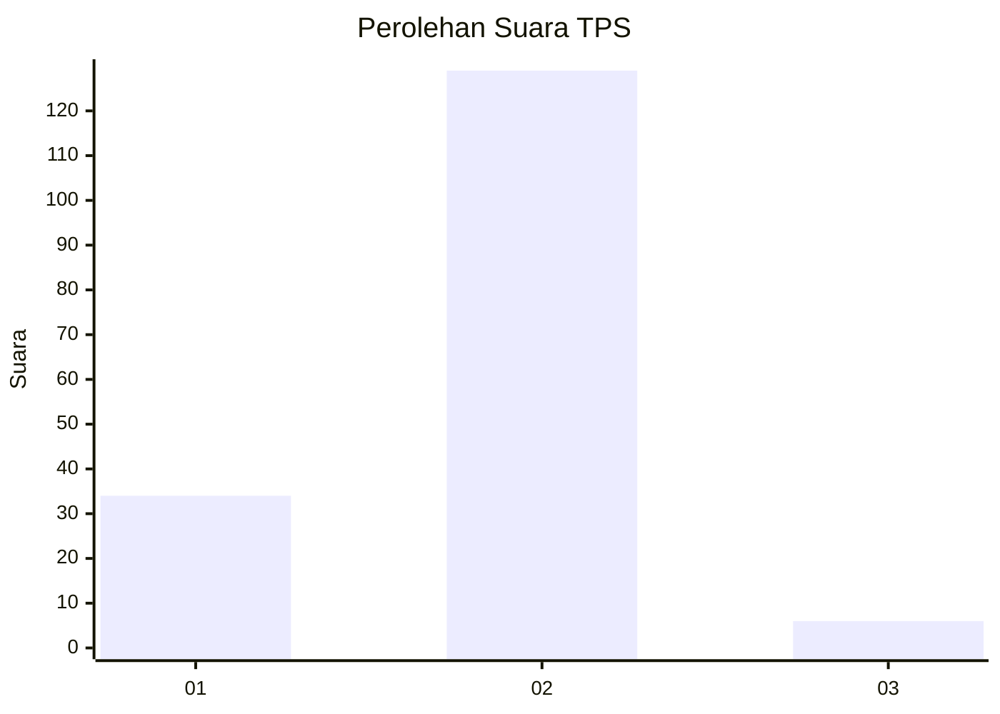
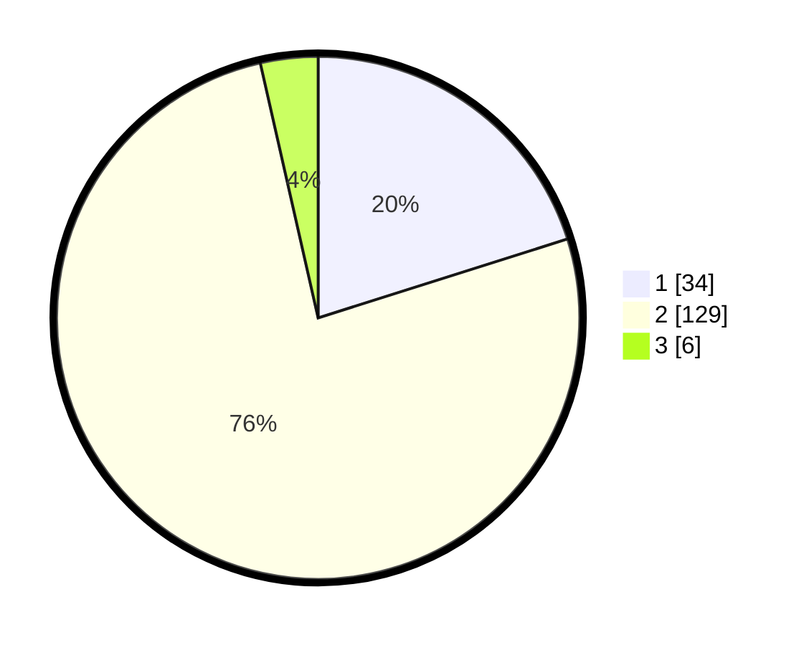

# Hasil

## Grafik

## Tabel

| No. | Nama Paslon    | Suara | Suara (raw) | Persentase |
|:--- |:-------------- | -----:| -----------:| ----------:|
| 1   | ANIES MUHAIMIN | 34    | [34][p-1]   | 20,12      |
| 2   | PRABOWO GIBRAN | 129   | [129][p-2]  | 76,33      |
| 3   | GANJAR MAHFUD  | 6     | [6][p-3]    | 3,55       |

[p-1]: https://github.com/gigit-pemilu/pemilu-2024/blob/main/pilpres/hitung-suara/sub/35-jawa-timur/sub/09-jember/sub/14-panti/sub/2004-glagahwero/sub/005-tps/sub/paslon-1.txt
[p-2]: https://github.com/gigit-pemilu/pemilu-2024/blob/main/pilpres/hitung-suara/sub/35-jawa-timur/sub/09-jember/sub/14-panti/sub/2004-glagahwero/sub/005-tps/sub/paslon-2.txt
[p-3]: https://github.com/gigit-pemilu/pemilu-2024/blob/main/pilpres/hitung-suara/sub/35-jawa-timur/sub/09-jember/sub/14-panti/sub/2004-glagahwero/sub/005-tps/sub/paslon-3.txt

## Foto C Plano

https://sirekap-obj-formc.kpu.go.id/09fe/pemilu/ppwp/35/09/14/20/04/3509142004005-20240215-012354--11502d5a-4be0-47a3-9790-0317e20ef6b6.jpg

https://sirekap-obj-formc.kpu.go.id/09fe/pemilu/ppwp/35/09/14/20/04/3509142004005-20240214-193115--e76b2616-99d7-4988-8c48-0dada83d847f.jpg

https://sirekap-obj-formc.kpu.go.id/09fe/pemilu/ppwp/35/09/14/20/04/3509142004005-20240214-193118--d8a51507-ec80-4646-9d9e-c1c454efba17.jpg

## Metadata

| Key        | Value               |
| ---------- | ------------------- |
| Time Stamp | 2024-02-15 07:00:44 |

