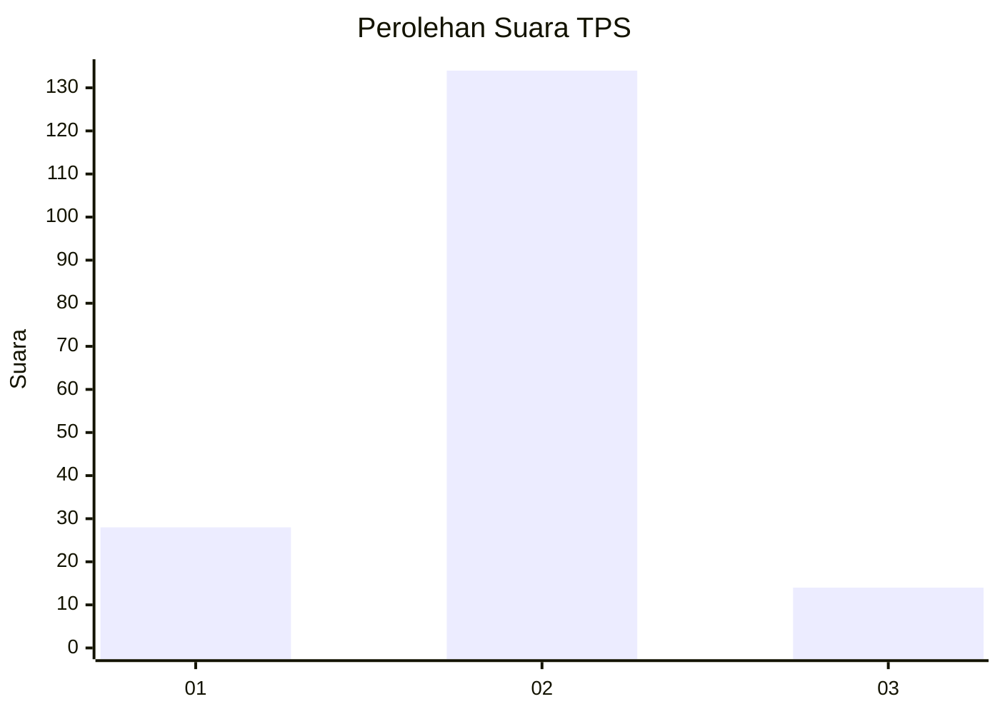
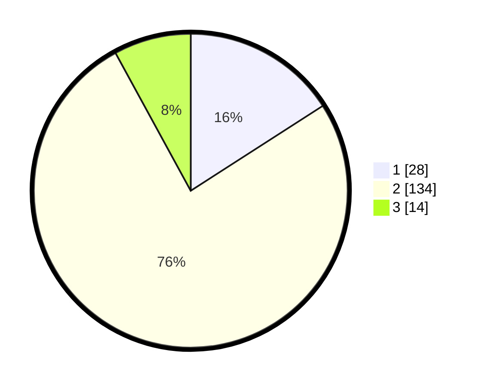

# Hasil

## Grafik

## Tabel

| No. | Nama Paslon    | Suara | Suara (raw) | Persentase |
|:--- |:-------------- | -----:| -----------:| ----------:|
| 1   | ANIES MUHAIMIN | 28    | [28][p-1]   | 15,91      |
| 2   | PRABOWO GIBRAN | 134   | [134][p-2]  | 76,14      |
| 3   | GANJAR MAHFUD  | 14    | [14][p-3]   | 7,95       |

[p-1]: https://github.com/gigit-pemilu/pemilu-2024-35-jawa-timur/blob/main/pilpres/hitung-suara/sub/35-jawa-timur/sub/09-jember/sub/14-panti/sub/2004-glagahwero/sub/006-tps/sub/paslon-1.txt
[p-2]: https://github.com/gigit-pemilu/pemilu-2024-35-jawa-timur/blob/main/pilpres/hitung-suara/sub/35-jawa-timur/sub/09-jember/sub/14-panti/sub/2004-glagahwero/sub/006-tps/sub/paslon-2.txt
[p-3]: https://github.com/gigit-pemilu/pemilu-2024-35-jawa-timur/blob/main/pilpres/hitung-suara/sub/35-jawa-timur/sub/09-jember/sub/14-panti/sub/2004-glagahwero/sub/006-tps/sub/paslon-3.txt

## Foto C Plano

https://sirekap-obj-formc.kpu.go.id/5479/pemilu/ppwp/35/09/14/20/04/3509142004006-20240214-205425--26095a0e-f743-4114-b3f3-a36797b6839a.jpg

https://sirekap-obj-formc.kpu.go.id/5479/pemilu/ppwp/35/09/14/20/04/3509142004006-20240214-221947--7cd25be9-33cd-4d85-84eb-93916526b5fa.jpg

https://sirekap-obj-formc.kpu.go.id/5479/pemilu/ppwp/35/09/14/20/04/3509142004006-20240214-202730--36644bd5-68be-47de-bf58-3d5615ab7af0.jpg

## Metadata

| Key        | Value               |
| ---------- | ------------------- |
| Time Stamp | 2024-02-15 23:29:50 |

