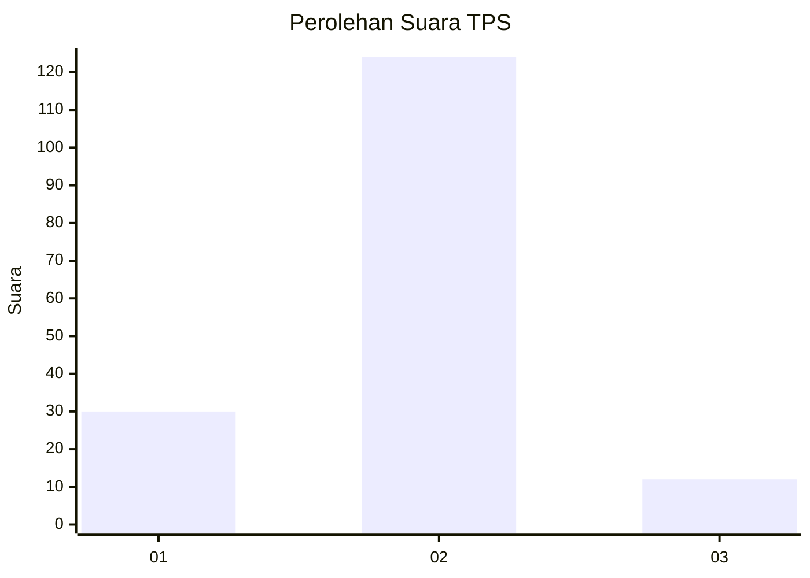
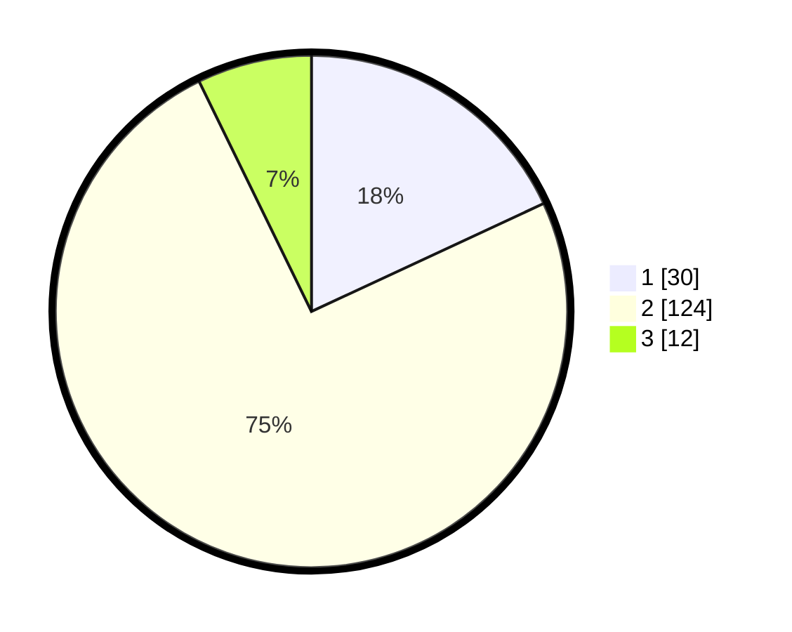

# Hasil

## Grafik

## Tabel

| No. | Nama Paslon    | Suara | Suara (raw) | Persentase |
|:--- |:-------------- | -----:| -----------:| ----------:|
| 1   | ANIES MUHAIMIN | 30    | [30][p-1]   | 18,07      |
| 2   | PRABOWO GIBRAN | 124   | [124][p-2]  | 74,70      |
| 3   | GANJAR MAHFUD  | 12    | [12][p-3]   | 7,23       |

[p-1]: https://github.com/gigit-pemilu/pemilu-2024/blob/main/pilpres/hitung-suara/sub/35-jawa-timur/sub/09-jember/sub/14-panti/sub/2004-glagahwero/sub/012-tps/sub/paslon-1.txt
[p-2]: https://github.com/gigit-pemilu/pemilu-2024/blob/main/pilpres/hitung-suara/sub/35-jawa-timur/sub/09-jember/sub/14-panti/sub/2004-glagahwero/sub/012-tps/sub/paslon-2.txt
[p-3]: https://github.com/gigit-pemilu/pemilu-2024/blob/main/pilpres/hitung-suara/sub/35-jawa-timur/sub/09-jember/sub/14-panti/sub/2004-glagahwero/sub/012-tps/sub/paslon-3.txt

## Foto C Plano

https://sirekap-obj-formc.kpu.go.id/4505/pemilu/ppwp/35/09/14/20/04/3509142004012-20240214-231634--cf9d7110-9640-4668-a51d-3aa68fcd841d.jpg

https://sirekap-obj-formc.kpu.go.id/4505/pemilu/ppwp/35/09/14/20/04/3509142004012-20240214-231821--ab487db7-b39b-4b2f-85cc-f5a55ad75fe4.jpg

https://sirekap-obj-formc.kpu.go.id/4505/pemilu/ppwp/35/09/14/20/04/3509142004012-20240214-231930--7d77005a-0497-4dee-83e1-5e19571123aa.jpg

## Metadata

| Key        | Value               |
| ---------- | ------------------- |
| Time Stamp | 2024-02-15 15:00:29 |

