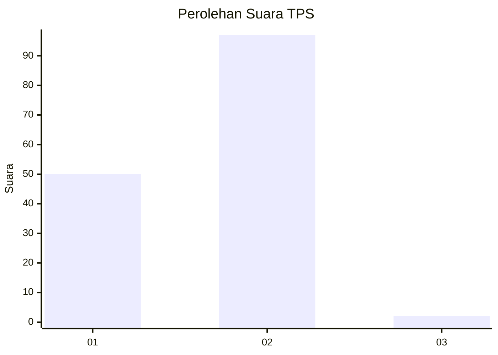
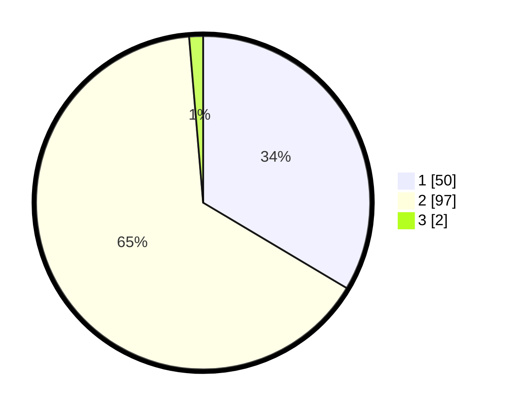

# Hasil

## Grafik

## Tabel

| No. | Nama Paslon    | Suara | Suara (raw) | Persentase |
|:--- |:-------------- | -----:| -----------:| ----------:|
| 1   | ANIES MUHAIMIN | 50    | [50][p-1]   | 33,56      |
| 2   | PRABOWO GIBRAN | 97    | [97][p-2]   | 65,10      |
| 3   | GANJAR MAHFUD  | 2     | [2][p-3]    | 1,34       |

[p-1]: https://github.com/gigit-pemilu/pemilu-2024-35-jawa-timur/blob/main/pilpres/hitung-suara/sub/35-jawa-timur/sub/09-jember/sub/14-panti/sub/2005-suci/sub/018-tps/sub/paslon-1.txt
[p-2]: https://github.com/gigit-pemilu/pemilu-2024-35-jawa-timur/blob/main/pilpres/hitung-suara/sub/35-jawa-timur/sub/09-jember/sub/14-panti/sub/2005-suci/sub/018-tps/sub/paslon-2.txt
[p-3]: https://github.com/gigit-pemilu/pemilu-2024-35-jawa-timur/blob/main/pilpres/hitung-suara/sub/35-jawa-timur/sub/09-jember/sub/14-panti/sub/2005-suci/sub/018-tps/sub/paslon-3.txt

## Foto C Plano

https://sirekap-obj-formc.kpu.go.id/9dcb/pemilu/ppwp/35/09/14/20/05/3509142005018-20240214-224907--bc8ffa09-393b-4925-b7ed-cc66b5288e7b.jpg

https://sirekap-obj-formc.kpu.go.id/9dcb/pemilu/ppwp/35/09/14/20/05/3509142005018-20240214-225035--3e4139d5-c023-4377-9b5b-2e4a1ad4903b.jpg

https://sirekap-obj-formc.kpu.go.id/9dcb/pemilu/ppwp/35/09/14/20/05/3509142005018-20240215-010932--110e35a4-1674-4d51-82dd-8b15e3e0ddb8.jpg

## Metadata

| Key        | Value               |
| ---------- | ------------------- |
| Time Stamp | 2024-02-24 22:31:28 |

