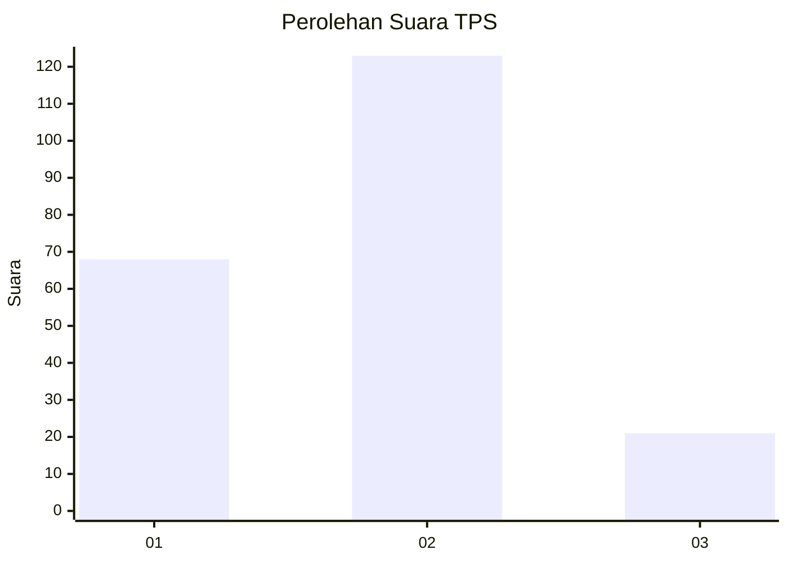
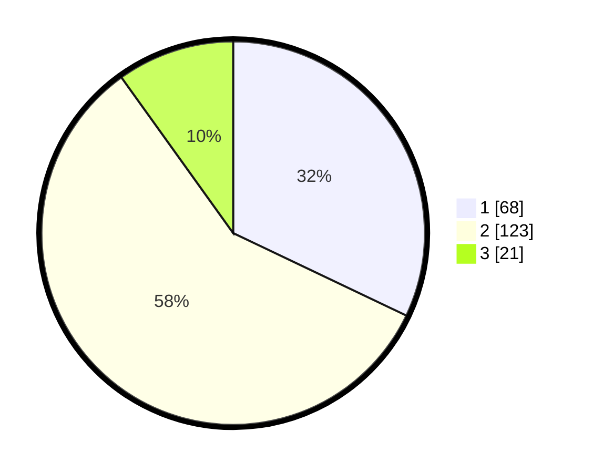

# Hasil

## Grafik

## Tabel

| No. | Nama Paslon    | Suara | Suara (raw) | Persentase |
|:--- |:-------------- | -----:| -----------:| ----------:|
| 1   | ANIES MUHAIMIN | 68    | [68][p-1]   | 32,08      |
| 2   | PRABOWO GIBRAN | 123   | [123][p-2]  | 58,02      |
| 3   | GANJAR MAHFUD  | 21    | [21][p-3]   | 9,91       |

[p-1]: https://github.com/gigit-pemilu/pemilu-2024-35-jawa-timur/blob/main/pilpres/hitung-suara/sub/35-jawa-timur/sub/09-jember/sub/14-panti/sub/2006-kemiri/sub/006-tps/sub/paslon-1.txt
[p-2]: https://github.com/gigit-pemilu/pemilu-2024-35-jawa-timur/blob/main/pilpres/hitung-suara/sub/35-jawa-timur/sub/09-jember/sub/14-panti/sub/2006-kemiri/sub/006-tps/sub/paslon-2.txt
[p-3]: https://github.com/gigit-pemilu/pemilu-2024-35-jawa-timur/blob/main/pilpres/hitung-suara/sub/35-jawa-timur/sub/09-jember/sub/14-panti/sub/2006-kemiri/sub/006-tps/sub/paslon-3.txt

## Foto C Plano

https://sirekap-obj-formc.kpu.go.id/f209/pemilu/ppwp/35/09/14/20/06/3509142006006-20240214-230331--5fb4cb98-bce1-4cb5-bbb7-6c29ef34cc47.jpg

https://sirekap-obj-formc.kpu.go.id/f209/pemilu/ppwp/35/09/14/20/06/3509142006006-20240214-230711--31a51414-00b3-47db-bf2d-e57f544fc9ed.jpg

https://sirekap-obj-formc.kpu.go.id/f209/pemilu/ppwp/35/09/14/20/06/3509142006006-20240214-231000--6e3e90b0-4796-43a9-bdc4-ae2596b01c3c.jpg

## Metadata

| Key        | Value               |
| ---------- | ------------------- |
| Time Stamp | 2024-02-24 22:31:28 |

