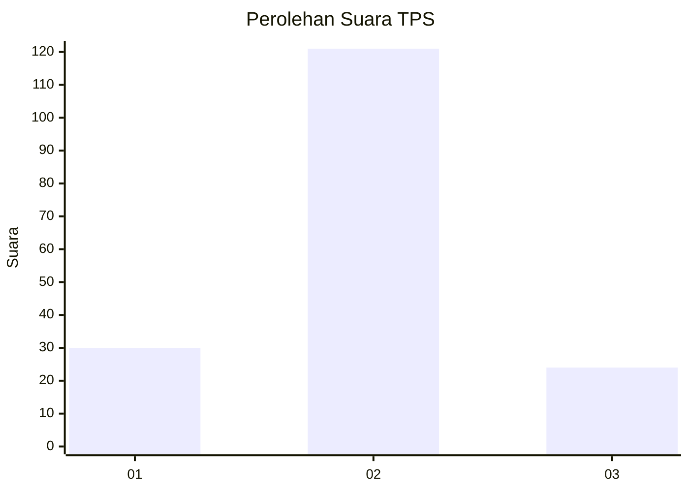
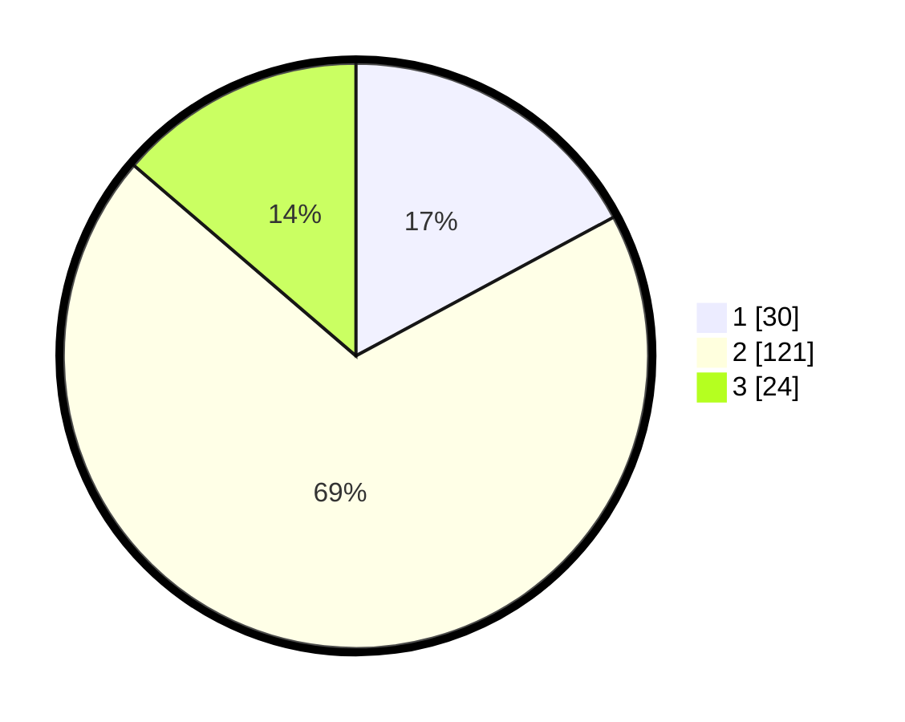

# Hasil

## Grafik

## Tabel

| No. | Nama Paslon    | Suara | Suara (raw) | Persentase |
|:--- |:-------------- | -----:| -----------:| ----------:|
| 1   | ANIES MUHAIMIN | 30    | [30][p-1]   | 17,14      |
| 2   | PRABOWO GIBRAN | 121   | [121][p-2]  | 69,14      |
| 3   | GANJAR MAHFUD  | 24    | [24][p-3]   | 13,71      |

[p-1]: https://github.com/gigit-pemilu/pemilu-2024/blob/main/pilpres/hitung-suara/sub/35-jawa-timur/sub/09-jember/sub/14-panti/sub/2006-kemiri/sub/019-tps/sub/paslon-1.txt
[p-2]: https://github.com/gigit-pemilu/pemilu-2024/blob/main/pilpres/hitung-suara/sub/35-jawa-timur/sub/09-jember/sub/14-panti/sub/2006-kemiri/sub/019-tps/sub/paslon-2.txt
[p-3]: https://github.com/gigit-pemilu/pemilu-2024/blob/main/pilpres/hitung-suara/sub/35-jawa-timur/sub/09-jember/sub/14-panti/sub/2006-kemiri/sub/019-tps/sub/paslon-3.txt

## Foto C Plano

https://sirekap-obj-formc.kpu.go.id/c46b/pemilu/ppwp/35/09/14/20/06/3509142006019-20240214-211521--81ef4fa2-d0f0-40a1-b014-1d330923e1f3.jpg

https://sirekap-obj-formc.kpu.go.id/c46b/pemilu/ppwp/35/09/14/20/06/3509142006019-20240214-211600--8c2f86a0-b853-4ccf-b7e7-bfb12e8e0154.jpg

https://sirekap-obj-formc.kpu.go.id/c46b/pemilu/ppwp/35/09/14/20/06/3509142006019-20240214-211645--57cd11cf-1485-4953-8543-5c1848e46de0.jpg

## Metadata

| Key        | Value               |
| ---------- | ------------------- |
| Time Stamp | 2024-02-24 22:31:28 |

