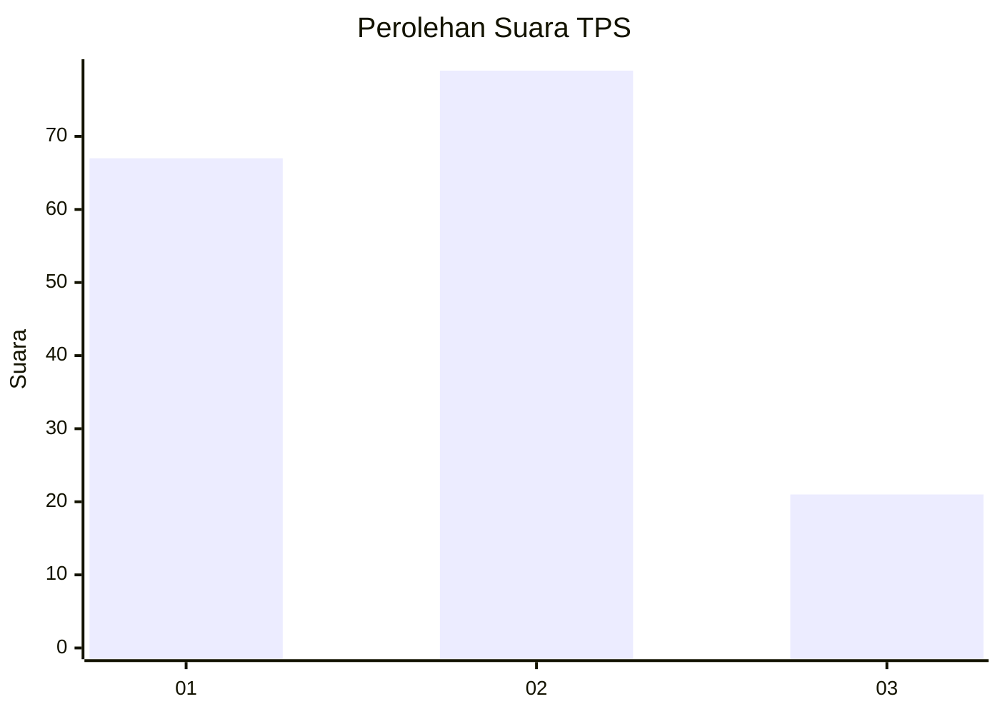
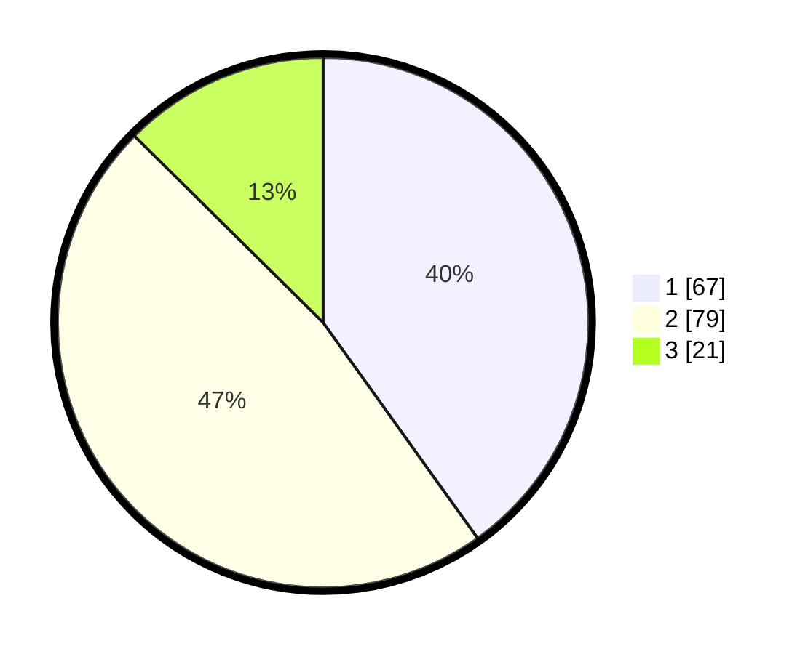

# Hasil

## Grafik

## Tabel

| No. | Nama Paslon    | Suara | Suara (raw) | Persentase |
|:--- |:-------------- | -----:| -----------:| ----------:|
| 1   | ANIES MUHAIMIN | 67    | [67][p-1]   | 40,12      |
| 2   | PRABOWO GIBRAN | 79    | [79][p-2]   | 47,31      |
| 3   | GANJAR MAHFUD  | 21    | [21][p-3]   | 12,57      |

[p-1]: https://github.com/gigit-pemilu/pemilu-2024-35-jawa-timur/blob/main/pilpres/hitung-suara/sub/35-jawa-timur/sub/09-jember/sub/14-panti/sub/2006-kemiri/sub/021-tps/sub/paslon-1.txt
[p-2]: https://github.com/gigit-pemilu/pemilu-2024-35-jawa-timur/blob/main/pilpres/hitung-suara/sub/35-jawa-timur/sub/09-jember/sub/14-panti/sub/2006-kemiri/sub/021-tps/sub/paslon-2.txt
[p-3]: https://github.com/gigit-pemilu/pemilu-2024-35-jawa-timur/blob/main/pilpres/hitung-suara/sub/35-jawa-timur/sub/09-jember/sub/14-panti/sub/2006-kemiri/sub/021-tps/sub/paslon-3.txt

## Foto C Plano

https://sirekap-obj-formc.kpu.go.id/404e/pemilu/ppwp/35/09/14/20/06/3509142006021-20240215-005845--c79a80cb-28cc-4453-9d26-fb2d8a517030.jpg

https://sirekap-obj-formc.kpu.go.id/404e/pemilu/ppwp/35/09/14/20/06/3509142006021-20240215-005947--ea3a0417-ff61-4515-9805-2c49294f2dea.jpg

https://sirekap-obj-formc.kpu.go.id/404e/pemilu/ppwp/35/09/14/20/06/3509142006021-20240215-010102--6f36db16-cb84-411e-915d-3759125fb690.jpg

## Metadata

| Key        | Value               |
| ---------- | ------------------- |
| Time Stamp | 2024-02-25 21:00:00 |

