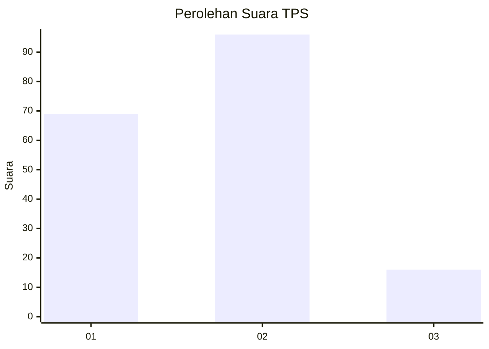

# Hasil

## Grafik

## Tabel

| No. | Nama Paslon    | Suara | Suara (raw) | Persentase |
|:--- |:-------------- | -----:| -----------:| ----------:|
| 1   | ANIES MUHAIMIN | 69    | [69][p-1]   | 38,12      |
| 2   | PRABOWO GIBRAN | 96    | [96][p-2]   | 53,04      |
| 3   | GANJAR MAHFUD  | 16    | [16][p-3]   | 8,84       |

[p-1]: https://github.com/gigit-pemilu/pemilu-2024-35-jawa-timur/blob/main/pilpres/hitung-suara/sub/35-jawa-timur/sub/09-jember/sub/14-panti/sub/2006-kemiri/sub/027-tps/sub/paslon-1.txt
[p-2]: https://github.com/gigit-pemilu/pemilu-2024-35-jawa-timur/blob/main/pilpres/hitung-suara/sub/35-jawa-timur/sub/09-jember/sub/14-panti/sub/2006-kemiri/sub/027-tps/sub/paslon-2.txt
[p-3]: https://github.com/gigit-pemilu/pemilu-2024-35-jawa-timur/blob/main/pilpres/hitung-suara/sub/35-jawa-timur/sub/09-jember/sub/14-panti/sub/2006-kemiri/sub/027-tps/sub/paslon-3.txt

## Foto C Plano

https://sirekap-obj-formc.kpu.go.id/ad15/pemilu/ppwp/35/09/14/20/06/3509142006027-20240214-203640--25492056-b66c-4dec-9147-b905392a8353.jpg

https://sirekap-obj-formc.kpu.go.id/ad15/pemilu/ppwp/35/09/14/20/06/3509142006027-20240214-204930--1d94ce80-128e-4b50-b858-812472370dcb.jpg

https://sirekap-obj-formc.kpu.go.id/ad15/pemilu/ppwp/35/09/14/20/06/3509142006027-20240214-205031--8b6ed3ce-8016-4936-85b9-ac6222b3c3fc.jpg

## Metadata

| Key        | Value               |
| ---------- | ------------------- |
| Time Stamp | 2024-02-24 22:31:28 |

