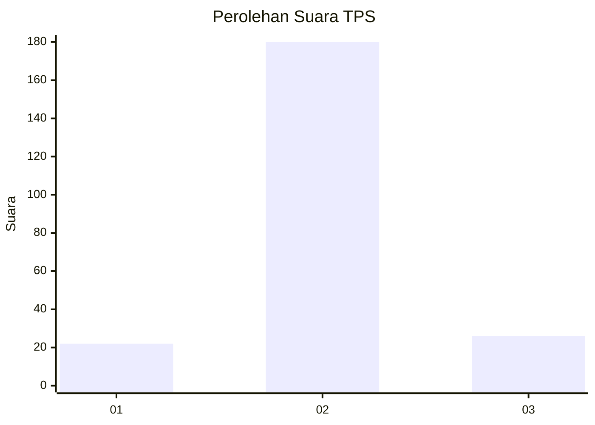
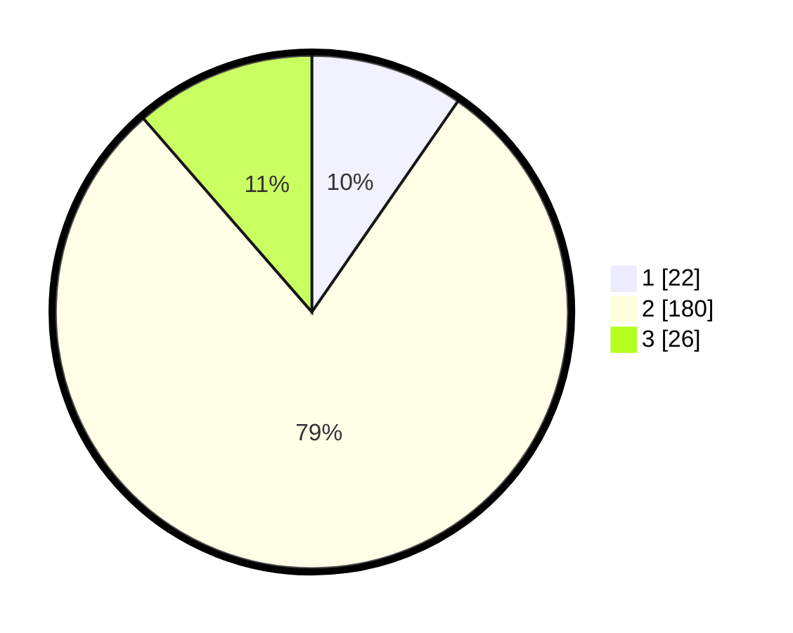

# Hasil

## Grafik

## Tabel

| No. | Nama Paslon    | Suara | Suara (raw) | Persentase |
|:--- |:-------------- | -----:| -----------:| ----------:|
| 1   | ANIES MUHAIMIN | 22    | [22][p-1]   | 9,65       |
| 2   | PRABOWO GIBRAN | 180   | [180][p-2]  | 78,95      |
| 3   | GANJAR MAHFUD  | 26    | [26][p-3]   | 11,40      |

[p-1]: https://github.com/gigit-pemilu/pemilu-2024/blob/main/pilpres/hitung-suara/sub/35-jawa-timur/sub/09-jember/sub/14-panti/sub/2007-serut/sub/002-tps/sub/paslon-1.txt
[p-2]: https://github.com/gigit-pemilu/pemilu-2024/blob/main/pilpres/hitung-suara/sub/35-jawa-timur/sub/09-jember/sub/14-panti/sub/2007-serut/sub/002-tps/sub/paslon-2.txt
[p-3]: https://github.com/gigit-pemilu/pemilu-2024/blob/main/pilpres/hitung-suara/sub/35-jawa-timur/sub/09-jember/sub/14-panti/sub/2007-serut/sub/002-tps/sub/paslon-3.txt

## Foto C Plano

https://sirekap-obj-formc.kpu.go.id/97a0/pemilu/ppwp/35/09/14/20/07/3509142007002-20240215-093855--0d4d90f4-cee4-48fe-a39a-f7571020db6c.jpg

https://sirekap-obj-formc.kpu.go.id/97a0/pemilu/ppwp/35/09/14/20/07/3509142007002-20240215-094018--69875409-cd6d-4451-95ce-fbbbd812d69a.jpg

https://sirekap-obj-formc.kpu.go.id/97a0/pemilu/ppwp/35/09/14/20/07/3509142007002-20240215-094128--916f1a0b-abe0-441f-8637-0a1cd15de4f7.jpg

## Metadata

| Key        | Value               |
| ---------- | ------------------- |
| Time Stamp | 2024-02-19 06:16:00 |

