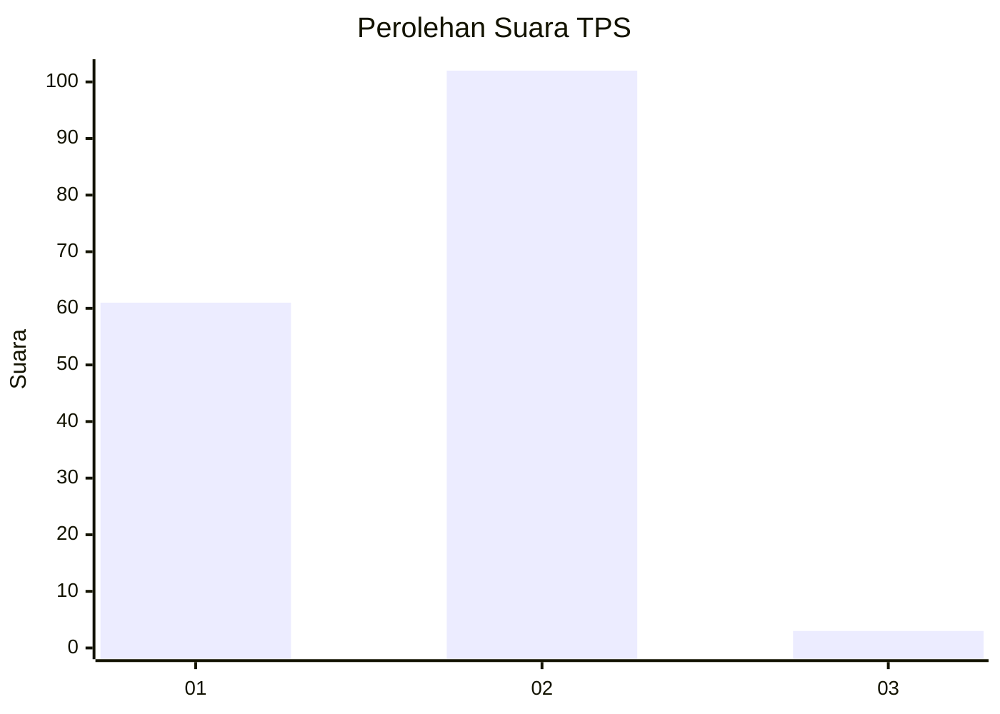
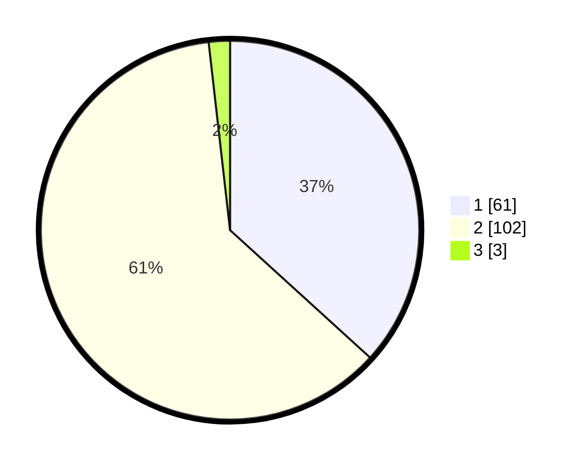

# Hasil

## Grafik

## Tabel

| No. | Nama Paslon    | Suara | Suara (raw) | Persentase |
|:--- |:-------------- | -----:| -----------:| ----------:|
| 1   | ANIES MUHAIMIN | 61    | [61][p-1]   | 36,75      |
| 2   | PRABOWO GIBRAN | 102   | [102][p-2]  | 61,45      |
| 3   | GANJAR MAHFUD  | 3     | [3][p-3]    | 1,81       |

[p-1]: https://github.com/gigit-pemilu/pemilu-2024/blob/main/pilpres/hitung-suara/sub/35-jawa-timur/sub/09-jember/sub/14-panti/sub/2007-serut/sub/017-tps/sub/paslon-1.txt
[p-2]: https://github.com/gigit-pemilu/pemilu-2024/blob/main/pilpres/hitung-suara/sub/35-jawa-timur/sub/09-jember/sub/14-panti/sub/2007-serut/sub/017-tps/sub/paslon-2.txt
[p-3]: https://github.com/gigit-pemilu/pemilu-2024/blob/main/pilpres/hitung-suara/sub/35-jawa-timur/sub/09-jember/sub/14-panti/sub/2007-serut/sub/017-tps/sub/paslon-3.txt

## Foto C Plano

https://sirekap-obj-formc.kpu.go.id/0cef/pemilu/ppwp/35/09/14/20/07/3509142007017-20240215-045007--eea2fa28-a0d1-41d9-ba80-fb16cce1ef93.jpg

https://sirekap-obj-formc.kpu.go.id/0cef/pemilu/ppwp/35/09/14/20/07/3509142007017-20240215-051113--d2f0f64b-53fe-4926-a18f-fbcf149fe531.jpg

https://sirekap-obj-formc.kpu.go.id/0cef/pemilu/ppwp/35/09/14/20/07/3509142007017-20240215-051146--bc373c8c-8be2-4d0f-94e3-0b42d4b7cf50.jpg

## Metadata

| Key        | Value               |
| ---------- | ------------------- |
| Time Stamp | 2024-02-15 15:30:25 |

