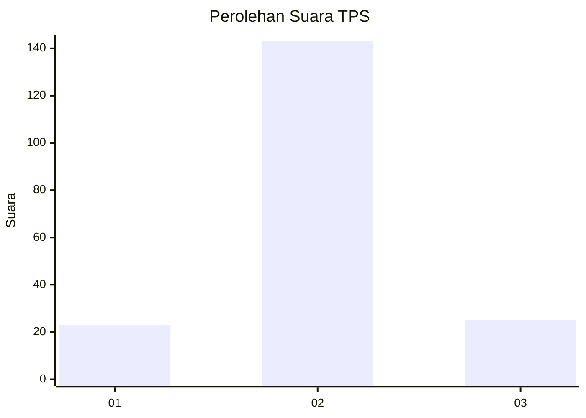
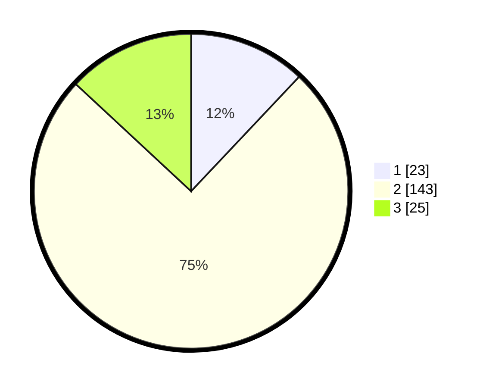

# Hasil

## Grafik

## Tabel

| No. | Nama Paslon    | Suara | Suara (raw) | Persentase |
|:--- |:-------------- | -----:| -----------:| ----------:|
| 1   | ANIES MUHAIMIN | 23    | [23][p-1]   | 12,04      |
| 2   | PRABOWO GIBRAN | 143   | [143][p-2]  | 74,87      |
| 3   | GANJAR MAHFUD  | 25    | [25][p-3]   | 13,09      |

[p-1]: https://github.com/gigit-pemilu/pemilu-2024-35-jawa-timur/blob/main/pilpres/hitung-suara/sub/35-jawa-timur/sub/09-jember/sub/14-panti/sub/2007-serut/sub/024-tps/sub/paslon-1.txt
[p-2]: https://github.com/gigit-pemilu/pemilu-2024-35-jawa-timur/blob/main/pilpres/hitung-suara/sub/35-jawa-timur/sub/09-jember/sub/14-panti/sub/2007-serut/sub/024-tps/sub/paslon-2.txt
[p-3]: https://github.com/gigit-pemilu/pemilu-2024-35-jawa-timur/blob/main/pilpres/hitung-suara/sub/35-jawa-timur/sub/09-jember/sub/14-panti/sub/2007-serut/sub/024-tps/sub/paslon-3.txt

## Foto C Plano

https://sirekap-obj-formc.kpu.go.id/d2f8/pemilu/ppwp/35/09/14/20/07/3509142007024-20240215-033258--2f8029dc-9abb-4380-8fd0-d717ca938a8a.jpg

https://sirekap-obj-formc.kpu.go.id/d2f8/pemilu/ppwp/35/09/14/20/07/3509142007024-20240215-033333--a035b911-46a8-4fdb-971c-324a0e4a7af7.jpg

https://sirekap-obj-formc.kpu.go.id/d2f8/pemilu/ppwp/35/09/14/20/07/3509142007024-20240217-164435--7c6eb06f-fb6f-45ed-8ca5-42f179f9ffe5.jpg

## Metadata

| Key        | Value               |
| ---------- | ------------------- |
| Time Stamp | 2024-02-19 06:16:00 |

