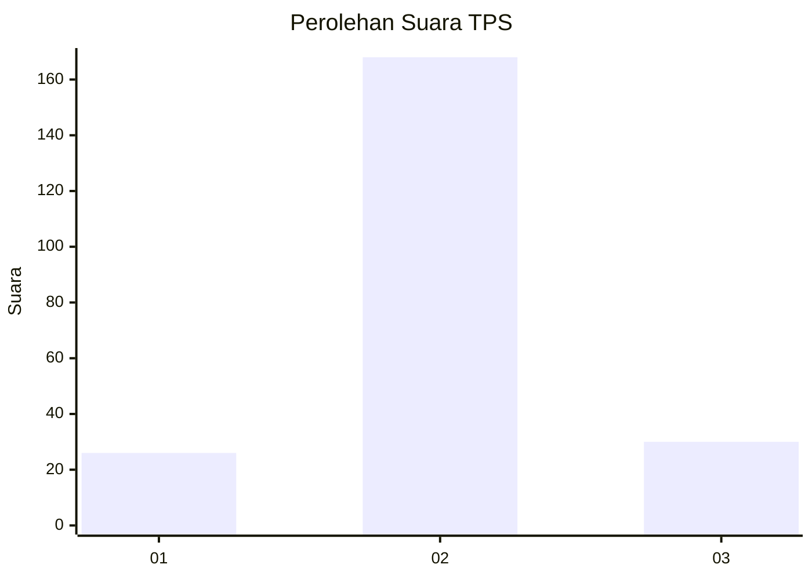
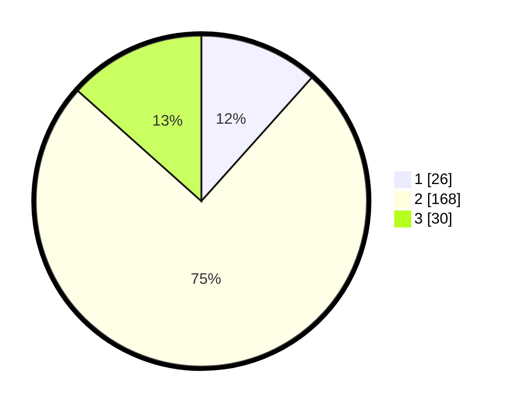

# Hasil

## Grafik

## Tabel

| No. | Nama Paslon    | Suara | Suara (raw) | Persentase |
|:--- |:-------------- | -----:| -----------:| ----------:|
| 1   | ANIES MUHAIMIN | 26    | [26][p-1]   | 11,61      |
| 2   | PRABOWO GIBRAN | 168   | [168][p-2]  | 75,00      |
| 3   | GANJAR MAHFUD  | 30    | [30][p-3]   | 13,39      |

[p-1]: https://github.com/gigit-pemilu/pemilu-2024/blob/main/pilpres/hitung-suara/sub/35-jawa-timur/sub/09-jember/sub/15-sukorambi/sub/2001-jubung/sub/002-tps/sub/paslon-1.txt
[p-2]: https://github.com/gigit-pemilu/pemilu-2024/blob/main/pilpres/hitung-suara/sub/35-jawa-timur/sub/09-jember/sub/15-sukorambi/sub/2001-jubung/sub/002-tps/sub/paslon-2.txt
[p-3]: https://github.com/gigit-pemilu/pemilu-2024/blob/main/pilpres/hitung-suara/sub/35-jawa-timur/sub/09-jember/sub/15-sukorambi/sub/2001-jubung/sub/002-tps/sub/paslon-3.txt

## Foto C Plano

https://sirekap-obj-formc.kpu.go.id/1be1/pemilu/ppwp/35/09/15/20/01/3509152001002-20240214-233133--4c900414-7b38-4532-9c6c-721c374ae858.jpg

https://sirekap-obj-formc.kpu.go.id/1be1/pemilu/ppwp/35/09/15/20/01/3509152001002-20240214-193401--a93cb5a4-a94b-4a71-b707-a0fada6d0c90.jpg

https://sirekap-obj-formc.kpu.go.id/1be1/pemilu/ppwp/35/09/15/20/01/3509152001002-20240214-193405--6398f281-1ed6-44b2-b007-f04794e92169.jpg

## Metadata

| Key        | Value               |
| ---------- | ------------------- |
| Time Stamp | 2024-02-15 21:30:27 |

