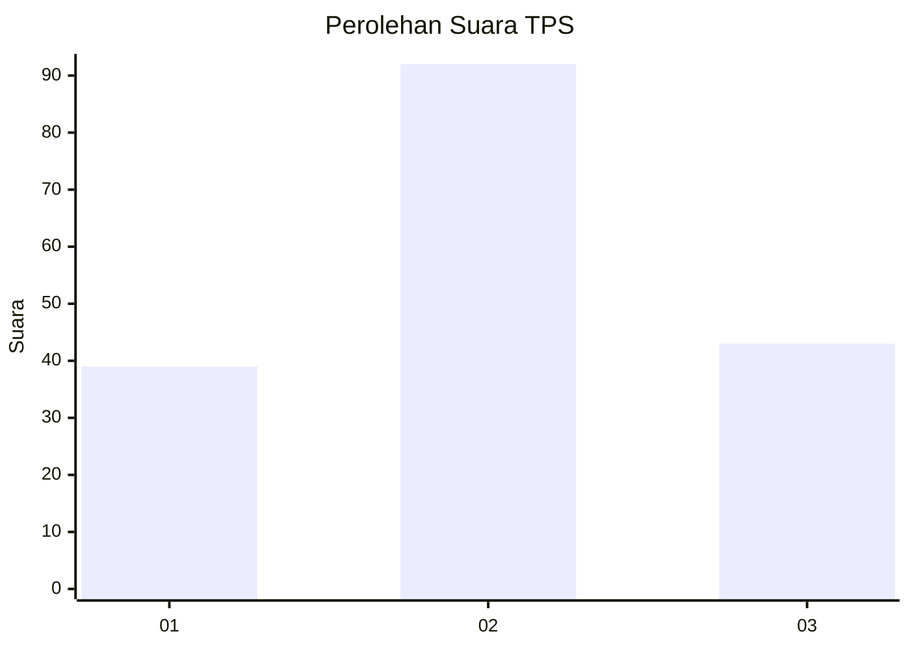
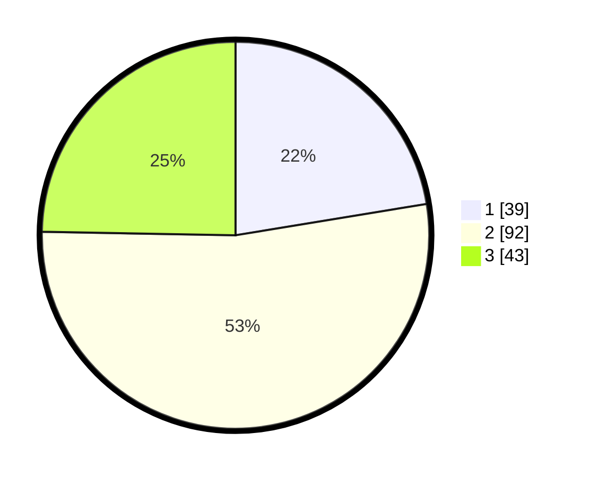

# Hasil

## Grafik

## Tabel

| No. | Nama Paslon    | Suara | Suara (raw) | Persentase |
|:--- |:-------------- | -----:| -----------:| ----------:|
| 1   | ANIES MUHAIMIN | 39    | [39][p-1]   | 22,41      |
| 2   | PRABOWO GIBRAN | 92    | [92][p-2]   | 52,87      |
| 3   | GANJAR MAHFUD  | 43    | [43][p-3]   | 24,71      |

[p-1]: https://github.com/gigit-pemilu/pemilu-2024-35-jawa-timur/blob/main/pilpres/hitung-suara/sub/35-jawa-timur/sub/09-jember/sub/15-sukorambi/sub/2001-jubung/sub/003-tps/sub/paslon-1.txt
[p-2]: https://github.com/gigit-pemilu/pemilu-2024-35-jawa-timur/blob/main/pilpres/hitung-suara/sub/35-jawa-timur/sub/09-jember/sub/15-sukorambi/sub/2001-jubung/sub/003-tps/sub/paslon-2.txt
[p-3]: https://github.com/gigit-pemilu/pemilu-2024-35-jawa-timur/blob/main/pilpres/hitung-suara/sub/35-jawa-timur/sub/09-jember/sub/15-sukorambi/sub/2001-jubung/sub/003-tps/sub/paslon-3.txt

## Foto C Plano

https://sirekap-obj-formc.kpu.go.id/430a/pemilu/ppwp/35/09/15/20/01/3509152001003-20240214-223417--91a4efcb-2491-4ab5-a445-6c4fdbcd3cc7.jpg

https://sirekap-obj-formc.kpu.go.id/430a/pemilu/ppwp/35/09/15/20/01/3509152001003-20240214-223043--84288c3b-1997-4ed7-94db-241244d7a257.jpg

https://sirekap-obj-formc.kpu.go.id/430a/pemilu/ppwp/35/09/15/20/01/3509152001003-20240214-223158--5fd16050-ad71-452e-aaef-e7cc2c51d069.jpg

## Metadata

| Key        | Value               |
| ---------- | ------------------- |
| Time Stamp | 2024-02-15 17:30:25 |

