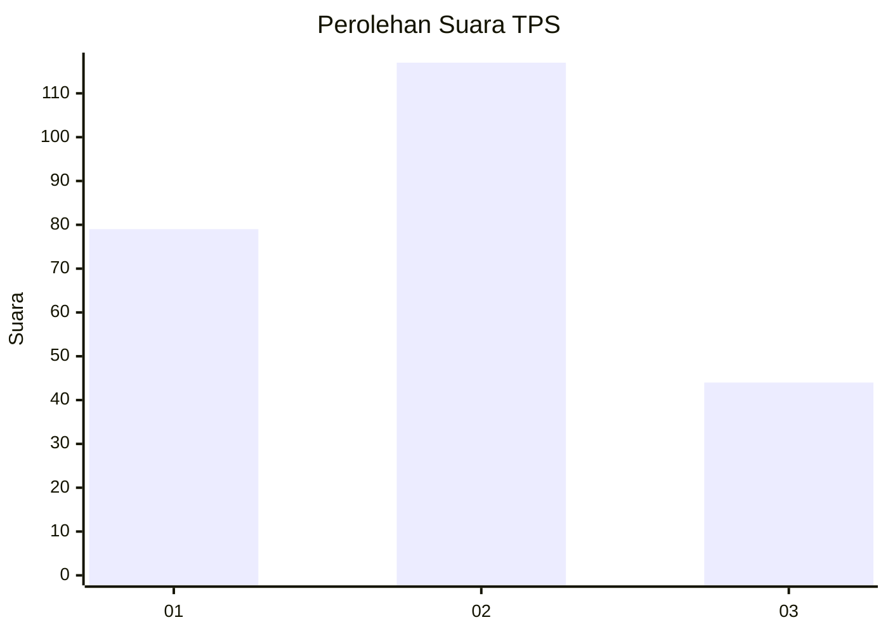
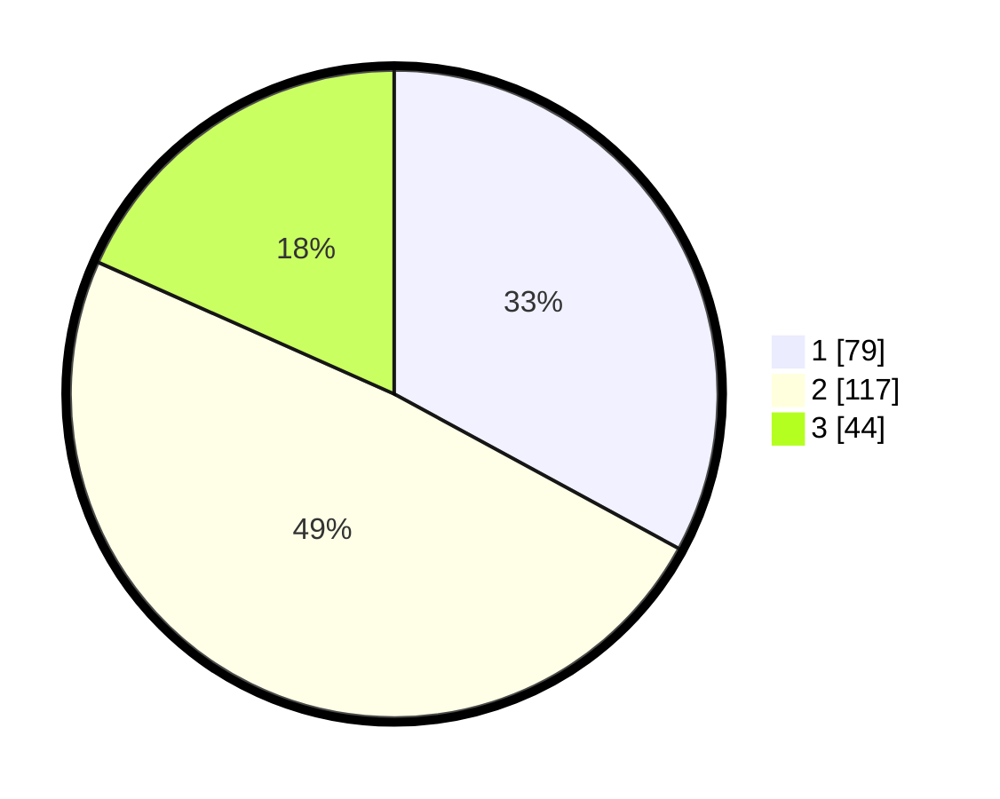

# Hasil

## Grafik

## Tabel

| No. | Nama Paslon    | Suara | Suara (raw) | Persentase |
|:--- |:-------------- | -----:| -----------:| ----------:|
| 1   | ANIES MUHAIMIN | 79    | [79][p-1]   | 32,92      |
| 2   | PRABOWO GIBRAN | 117   | [117][p-2]  | 48,75      |
| 3   | GANJAR MAHFUD  | 44    | [44][p-3]   | 18,33      |

[p-1]: https://github.com/gigit-pemilu/pemilu-2024-35-jawa-timur/blob/main/pilpres/hitung-suara/sub/35-jawa-timur/sub/09-jember/sub/15-sukorambi/sub/2001-jubung/sub/004-tps/sub/paslon-1.txt
[p-2]: https://github.com/gigit-pemilu/pemilu-2024-35-jawa-timur/blob/main/pilpres/hitung-suara/sub/35-jawa-timur/sub/09-jember/sub/15-sukorambi/sub/2001-jubung/sub/004-tps/sub/paslon-2.txt
[p-3]: https://github.com/gigit-pemilu/pemilu-2024-35-jawa-timur/blob/main/pilpres/hitung-suara/sub/35-jawa-timur/sub/09-jember/sub/15-sukorambi/sub/2001-jubung/sub/004-tps/sub/paslon-3.txt

## Foto C Plano

https://sirekap-obj-formc.kpu.go.id/cf05/pemilu/ppwp/35/09/15/20/01/3509152001004-20240214-230132--2b8f2438-0ed4-43b8-81ff-77a1e83ec7b2.jpg

https://sirekap-obj-formc.kpu.go.id/cf05/pemilu/ppwp/35/09/15/20/01/3509152001004-20240214-230215--100b36bf-b897-48f1-8e88-4d428f135bfe.jpg

https://sirekap-obj-formc.kpu.go.id/cf05/pemilu/ppwp/35/09/15/20/01/3509152001004-20240214-230246--e5b03246-090f-4238-a070-0ae06bfe74aa.jpg

## Metadata

| Key        | Value               |
| ---------- | ------------------- |
| Time Stamp | 2024-02-15 19:30:26 |

