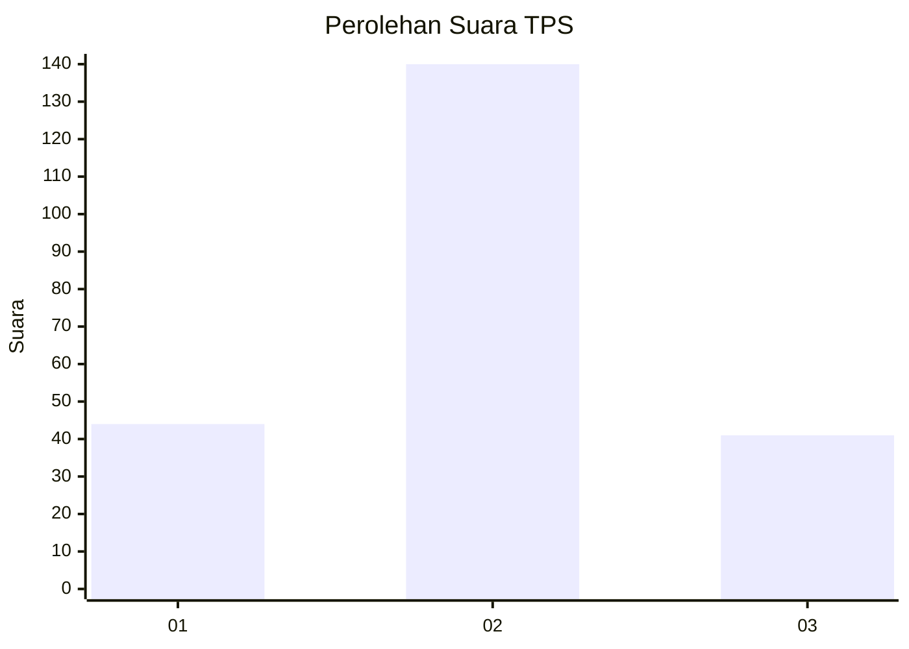
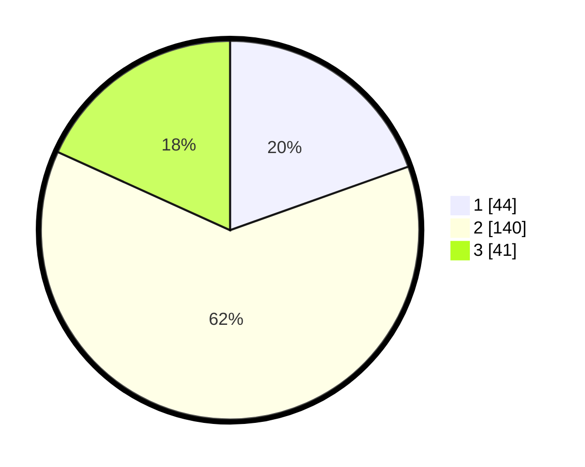

# Hasil

## Grafik

## Tabel

| No. | Nama Paslon    | Suara | Suara (raw) | Persentase |
|:--- |:-------------- | -----:| -----------:| ----------:|
| 1   | ANIES MUHAIMIN | 44    | [44][p-1]   | 19,56      |
| 2   | PRABOWO GIBRAN | 140   | [140][p-2]  | 62,22      |
| 3   | GANJAR MAHFUD  | 41    | [41][p-3]   | 18,22      |

[p-1]: https://github.com/gigit-pemilu/pemilu-2024/blob/main/pilpres/hitung-suara/sub/35-jawa-timur/sub/09-jember/sub/15-sukorambi/sub/2001-jubung/sub/005-tps/sub/paslon-1.txt
[p-2]: https://github.com/gigit-pemilu/pemilu-2024/blob/main/pilpres/hitung-suara/sub/35-jawa-timur/sub/09-jember/sub/15-sukorambi/sub/2001-jubung/sub/005-tps/sub/paslon-2.txt
[p-3]: https://github.com/gigit-pemilu/pemilu-2024/blob/main/pilpres/hitung-suara/sub/35-jawa-timur/sub/09-jember/sub/15-sukorambi/sub/2001-jubung/sub/005-tps/sub/paslon-3.txt

## Foto C Plano

https://sirekap-obj-formc.kpu.go.id/f33f/pemilu/ppwp/35/09/15/20/01/3509152001005-20240214-221543--758a432f-3406-4079-bbd8-0b4bcf79c572.jpg

https://sirekap-obj-formc.kpu.go.id/f33f/pemilu/ppwp/35/09/15/20/01/3509152001005-20240214-221847--1916a8e7-2483-4615-8830-55f3ba5576cd.jpg

https://sirekap-obj-formc.kpu.go.id/f33f/pemilu/ppwp/35/09/15/20/01/3509152001005-20240214-222000--c9f061c3-8a55-4f83-8088-e0031094bcc7.jpg

## Metadata

| Key        | Value               |
| ---------- | ------------------- |
| Time Stamp | 2024-02-15 19:30:26 |

