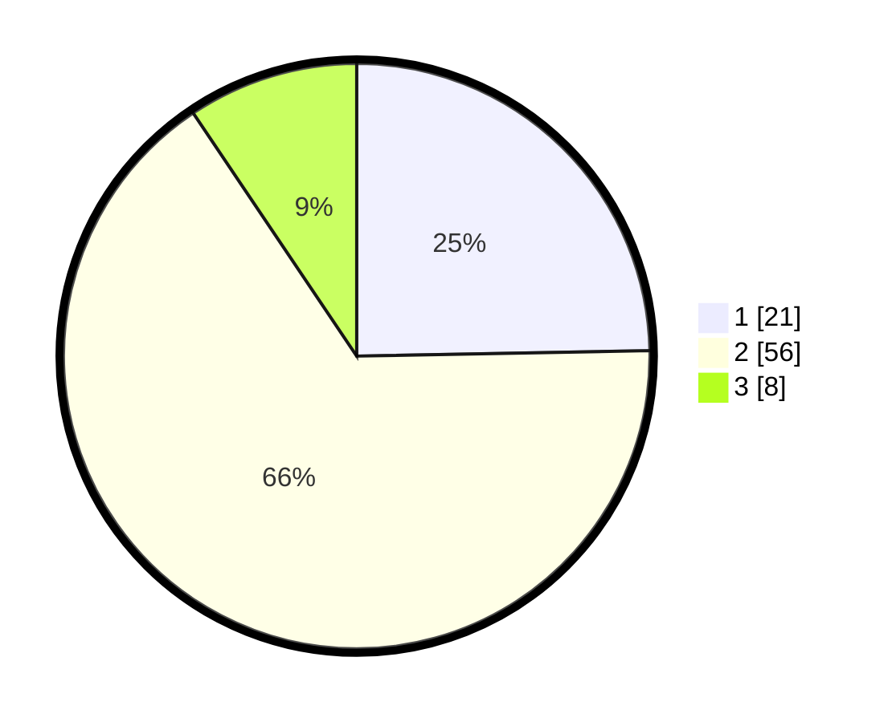

# Hasil

## Grafik

## Tabel

| No. | Nama Paslon    | Suara | Suara (raw) | Persentase |
|:--- |:-------------- | -----:| -----------:| ----------:|
| 1   | ANIES MUHAIMIN | 21    | [21][p-1]   | 24,71      |
| 2   | PRABOWO GIBRAN | 56    | [56][p-2]   | 65,88      |
| 3   | GANJAR MAHFUD  | 8     | [8][p-3]    | 9,41       |

[p-1]: https://github.com/gigit-pemilu/pemilu-2024/blob/main/pilpres/hitung-suara/sub/35-jawa-timur/sub/09-jember/sub/15-sukorambi/sub/2001-jubung/sub/017-tps/sub/paslon-1.txt
[p-2]: https://github.com/gigit-pemilu/pemilu-2024/blob/main/pilpres/hitung-suara/sub/35-jawa-timur/sub/09-jember/sub/15-sukorambi/sub/2001-jubung/sub/017-tps/sub/paslon-2.txt
[p-3]: https://github.com/gigit-pemilu/pemilu-2024/blob/main/pilpres/hitung-suara/sub/35-jawa-timur/sub/09-jember/sub/15-sukorambi/sub/2001-jubung/sub/017-tps/sub/paslon-3.txt

## Foto C Plano

https://sirekap-obj-formc.kpu.go.id/a828/pemilu/ppwp/35/09/15/20/01/3509152001017-20240214-204528--f27338b0-0fa0-42b6-a9d4-1269f0284829.jpg

https://sirekap-obj-formc.kpu.go.id/a828/pemilu/ppwp/35/09/15/20/01/3509152001017-20240214-204536--2cbaf21f-63c2-43f9-bfbd-0c0048e1d654.jpg

https://sirekap-obj-formc.kpu.go.id/a828/pemilu/ppwp/35/09/15/20/01/3509152001017-20240214-204540--8ca26672-92af-4652-89f1-f5de6e344bf9.jpg

## Metadata

| Key        | Value               |
| ---------- | ------------------- |
| Time Stamp | 2024-02-15 18:00:26 |

