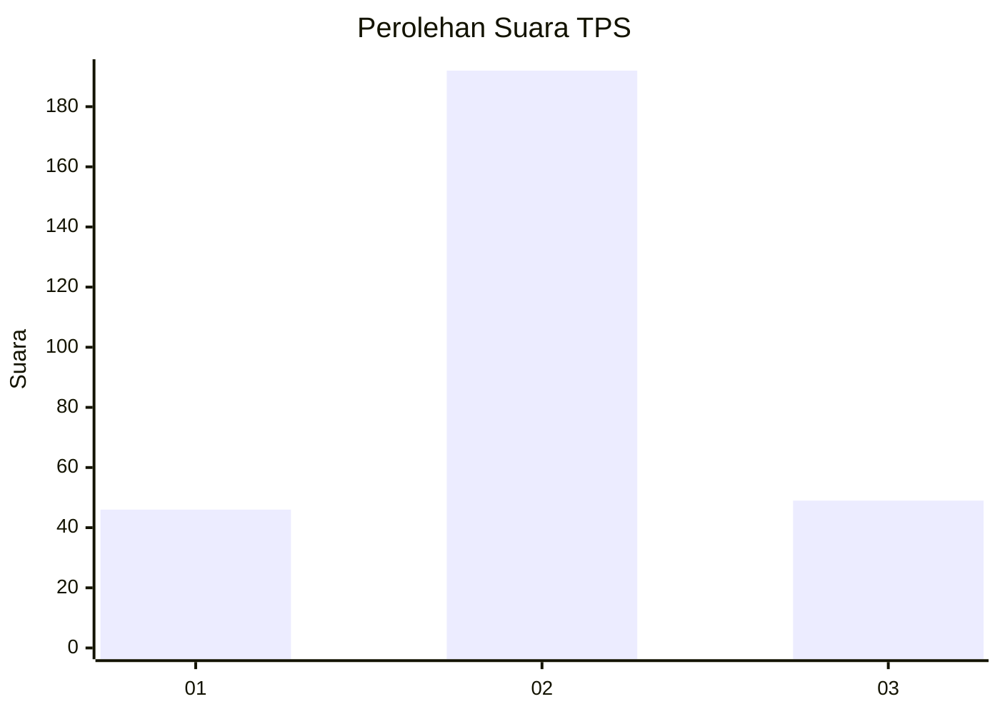
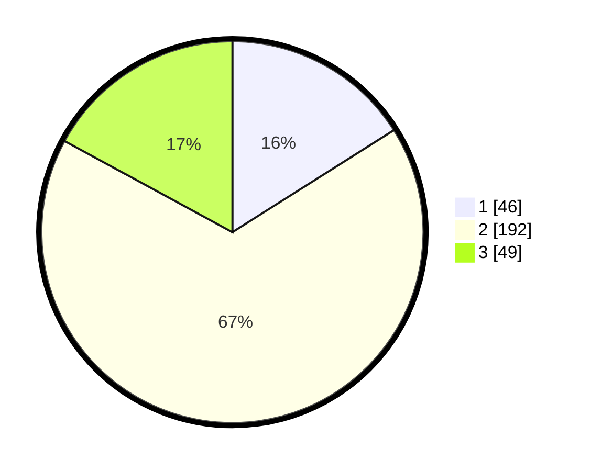

# Hasil

## Grafik

## Tabel

| No. | Nama Paslon    | Suara | Suara (raw) | Persentase |
|:--- |:-------------- | -----:| -----------:| ----------:|
| 1   | ANIES MUHAIMIN | 46    | [46][p-1]   | 16,03      |
| 2   | PRABOWO GIBRAN | 192   | [192][p-2]  | 66,90      |
| 3   | GANJAR MAHFUD  | 49    | [49][p-3]   | 17,07      |

[p-1]: https://github.com/gigit-pemilu/pemilu-2024/blob/main/pilpres/hitung-suara/sub/35-jawa-timur/sub/09-jember/sub/15-sukorambi/sub/2001-jubung/sub/018-tps/sub/paslon-1.txt
[p-2]: https://github.com/gigit-pemilu/pemilu-2024/blob/main/pilpres/hitung-suara/sub/35-jawa-timur/sub/09-jember/sub/15-sukorambi/sub/2001-jubung/sub/018-tps/sub/paslon-2.txt
[p-3]: https://github.com/gigit-pemilu/pemilu-2024/blob/main/pilpres/hitung-suara/sub/35-jawa-timur/sub/09-jember/sub/15-sukorambi/sub/2001-jubung/sub/018-tps/sub/paslon-3.txt

## Foto C Plano

https://sirekap-obj-formc.kpu.go.id/184c/pemilu/ppwp/35/09/15/20/01/3509152001018-20240214-210255--6b074408-9832-4d13-86ea-0994626e43ac.jpg

https://sirekap-obj-formc.kpu.go.id/184c/pemilu/ppwp/35/09/15/20/01/3509152001018-20240214-210437--c2bfff9e-94f0-4299-8453-718b65dd36ed.jpg

https://sirekap-obj-formc.kpu.go.id/184c/pemilu/ppwp/35/09/15/20/01/3509152001018-20240214-210548--65900502-9f5b-48a3-ace4-9afcddf71a2c.jpg

## Metadata

| Key        | Value               |
| ---------- | ------------------- |
| Time Stamp | 2024-02-15 19:30:26 |

