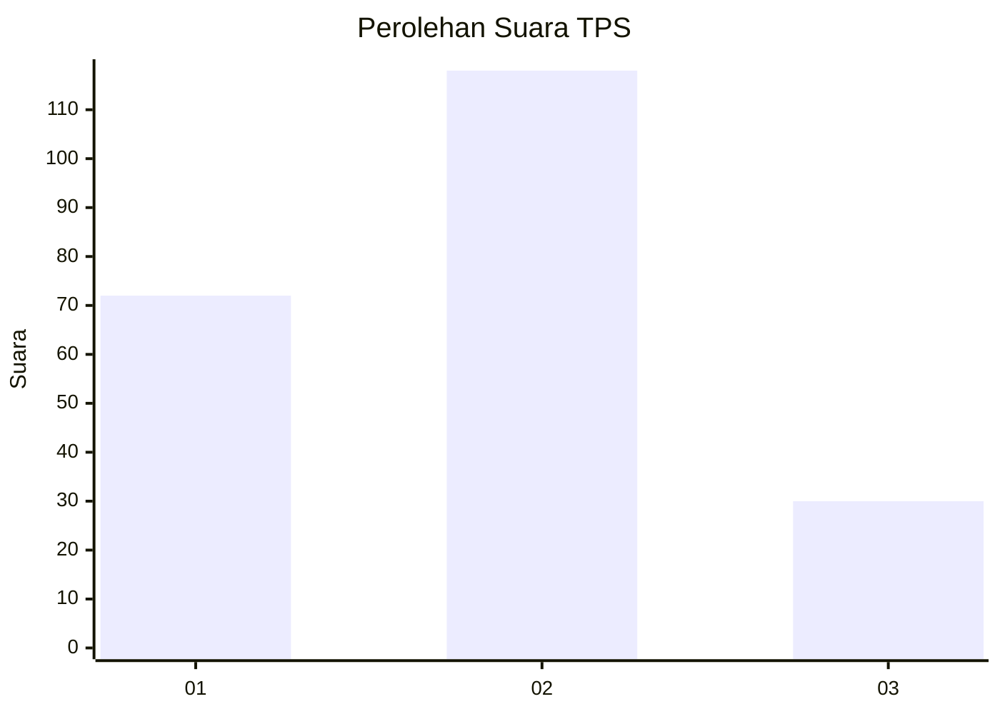
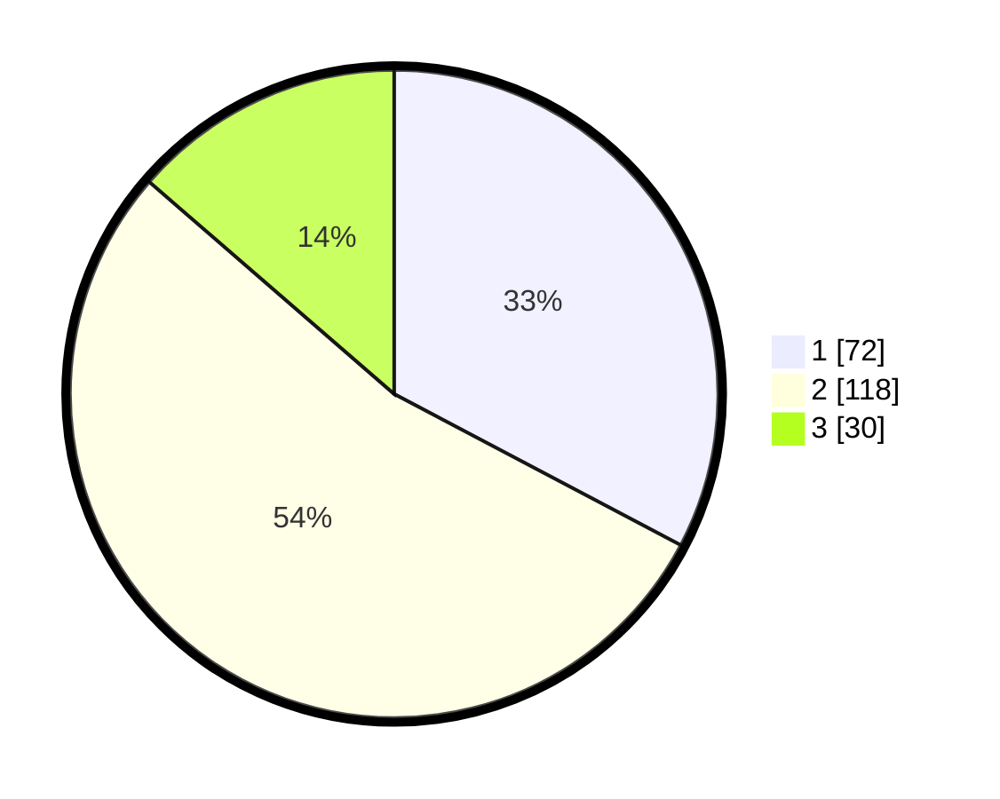

# Hasil

## Grafik

## Tabel

| No. | Nama Paslon    | Suara | Suara (raw) | Persentase |
|:--- |:-------------- | -----:| -----------:| ----------:|
| 1   | ANIES MUHAIMIN | 72    | [72][p-1]   | 32,73      |
| 2   | PRABOWO GIBRAN | 118   | [118][p-2]  | 53,64      |
| 3   | GANJAR MAHFUD  | 30    | [30][p-3]   | 13,64      |

[p-1]: https://github.com/gigit-pemilu/pemilu-2024-35-jawa-timur/blob/main/pilpres/hitung-suara/sub/35-jawa-timur/sub/09-jember/sub/15-sukorambi/sub/2002-dukuhmencek/sub/005-tps/sub/paslon-1.txt
[p-2]: https://github.com/gigit-pemilu/pemilu-2024-35-jawa-timur/blob/main/pilpres/hitung-suara/sub/35-jawa-timur/sub/09-jember/sub/15-sukorambi/sub/2002-dukuhmencek/sub/005-tps/sub/paslon-2.txt
[p-3]: https://github.com/gigit-pemilu/pemilu-2024-35-jawa-timur/blob/main/pilpres/hitung-suara/sub/35-jawa-timur/sub/09-jember/sub/15-sukorambi/sub/2002-dukuhmencek/sub/005-tps/sub/paslon-3.txt

## Foto C Plano

https://sirekap-obj-formc.kpu.go.id/28df/pemilu/ppwp/35/09/15/20/02/3509152002005-20240216-174749--d1361283-297c-4b2e-bdfa-e06a37fe78db.jpg

https://sirekap-obj-formc.kpu.go.id/28df/pemilu/ppwp/35/09/15/20/02/3509152002005-20240216-174827--de1aaf9f-900a-4c46-a873-d5c6a3e19aa8.jpg

https://sirekap-obj-formc.kpu.go.id/28df/pemilu/ppwp/35/09/15/20/02/3509152002005-20240216-174839--8a27f02a-d3cf-4716-91c2-36a6116dcec0.jpg

## Metadata

| Key        | Value               |
| ---------- | ------------------- |
| Time Stamp | 2024-02-25 13:00:00 |

