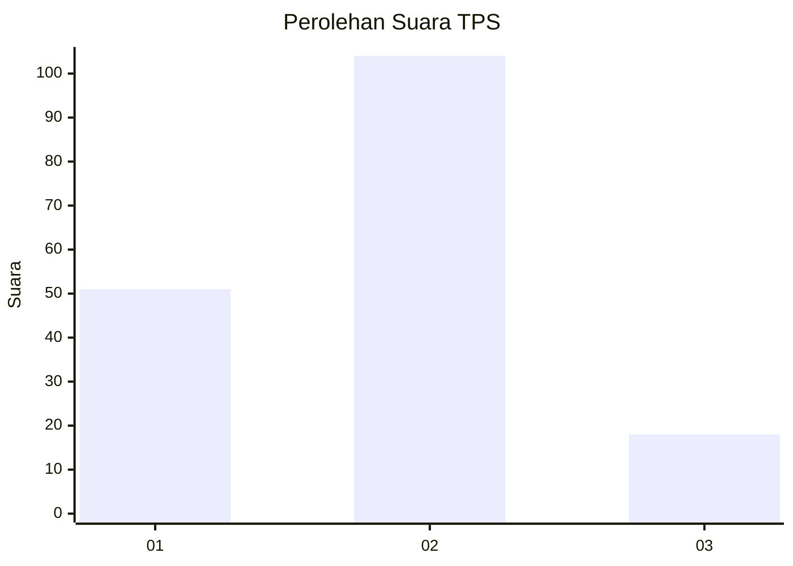
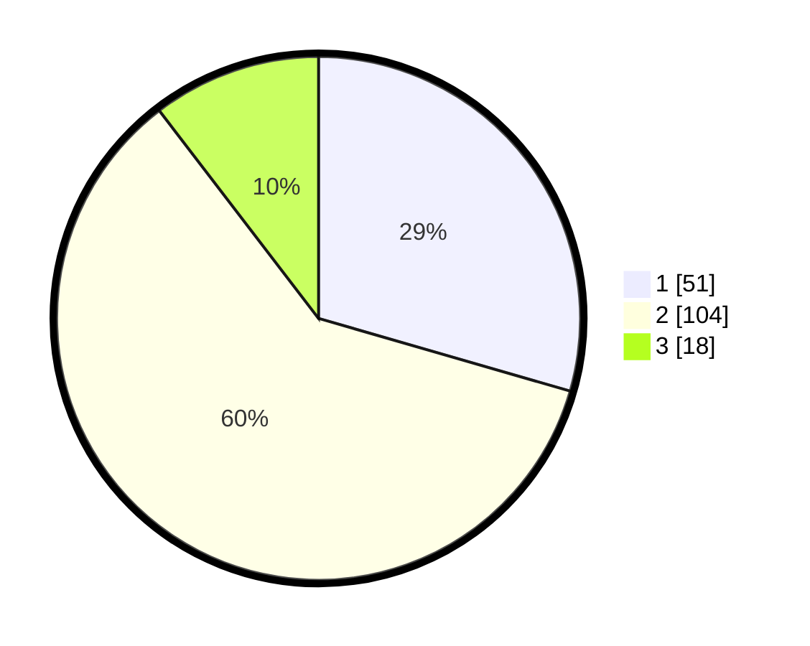

# Hasil

## Grafik

## Tabel

| No. | Nama Paslon    | Suara | Suara (raw) | Persentase |
|:--- |:-------------- | -----:| -----------:| ----------:|
| 1   | ANIES MUHAIMIN | 51    | [51][p-1]   | 29,48      |
| 2   | PRABOWO GIBRAN | 104   | [104][p-2]  | 60,12      |
| 3   | GANJAR MAHFUD  | 18    | [18][p-3]   | 10,40      |

[p-1]: https://github.com/gigit-pemilu/pemilu-2024/blob/main/pilpres/hitung-suara/sub/35-jawa-timur/sub/09-jember/sub/15-sukorambi/sub/2002-dukuhmencek/sub/008-tps/sub/paslon-1.txt
[p-2]: https://github.com/gigit-pemilu/pemilu-2024/blob/main/pilpres/hitung-suara/sub/35-jawa-timur/sub/09-jember/sub/15-sukorambi/sub/2002-dukuhmencek/sub/008-tps/sub/paslon-2.txt
[p-3]: https://github.com/gigit-pemilu/pemilu-2024/blob/main/pilpres/hitung-suara/sub/35-jawa-timur/sub/09-jember/sub/15-sukorambi/sub/2002-dukuhmencek/sub/008-tps/sub/paslon-3.txt

## Foto C Plano

https://sirekap-obj-formc.kpu.go.id/c87b/pemilu/ppwp/35/09/15/20/02/3509152002008-20240214-155847--a7553881-838f-4fc5-a1f8-f0ba49c1e51a.jpg

https://sirekap-obj-formc.kpu.go.id/c87b/pemilu/ppwp/35/09/15/20/02/3509152002008-20240214-155834--6bae39a7-9916-4a0d-b0a2-629829379282.jpg

https://sirekap-obj-formc.kpu.go.id/c87b/pemilu/ppwp/35/09/15/20/02/3509152002008-20240214-160101--e77fdaf9-fcd7-4f5b-893b-161ff2ee5686.jpg

## Metadata

| Key        | Value               |
| ---------- | ------------------- |
| Time Stamp | 2024-02-15 18:00:26 |

