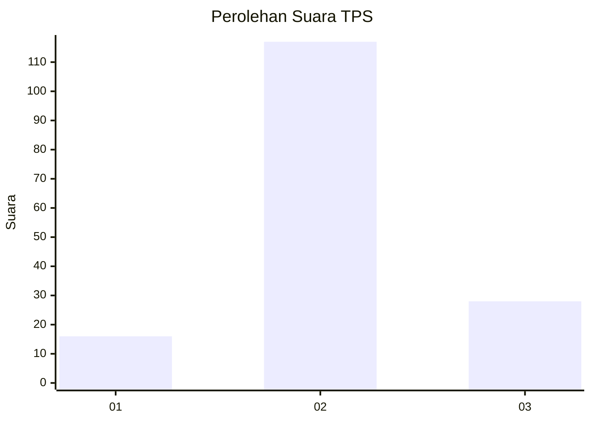
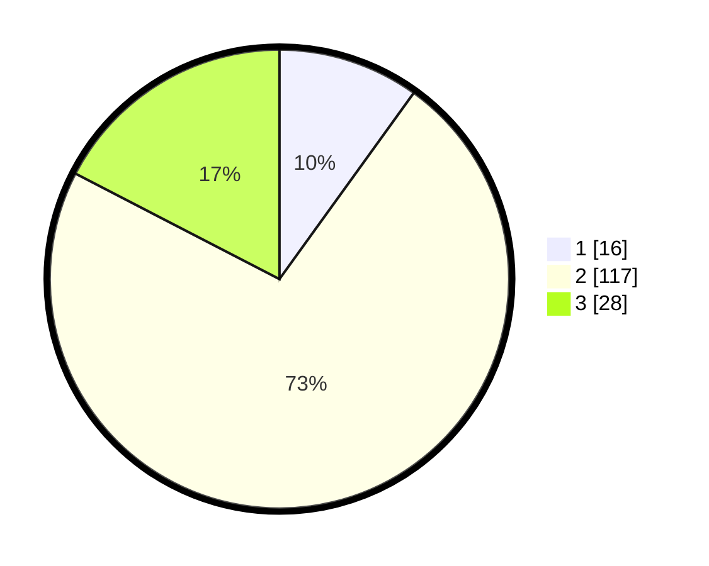

# Hasil

## Grafik

## Tabel

| No. | Nama Paslon    | Suara | Suara (raw) | Persentase |
|:--- |:-------------- | -----:| -----------:| ----------:|
| 1   | ANIES MUHAIMIN | 16    | [16][p-1]   | 9,94       |
| 2   | PRABOWO GIBRAN | 117   | [117][p-2]  | 72,67      |
| 3   | GANJAR MAHFUD  | 28    | [28][p-3]   | 17,39      |

[p-1]: https://github.com/gigit-pemilu/pemilu-2024-35-jawa-timur/blob/main/pilpres/hitung-suara/sub/35-jawa-timur/sub/09-jember/sub/15-sukorambi/sub/2002-dukuhmencek/sub/019-tps/sub/paslon-1.txt
[p-2]: https://github.com/gigit-pemilu/pemilu-2024-35-jawa-timur/blob/main/pilpres/hitung-suara/sub/35-jawa-timur/sub/09-jember/sub/15-sukorambi/sub/2002-dukuhmencek/sub/019-tps/sub/paslon-2.txt
[p-3]: https://github.com/gigit-pemilu/pemilu-2024-35-jawa-timur/blob/main/pilpres/hitung-suara/sub/35-jawa-timur/sub/09-jember/sub/15-sukorambi/sub/2002-dukuhmencek/sub/019-tps/sub/paslon-3.txt

## Foto C Plano

https://sirekap-obj-formc.kpu.go.id/6139/pemilu/ppwp/35/09/15/20/02/3509152002019-20240214-155840--5088443e-b659-48e6-a272-62bb69a4e15a.jpg

https://sirekap-obj-formc.kpu.go.id/6139/pemilu/ppwp/35/09/15/20/02/3509152002019-20240214-141902--816905d0-be43-4ab8-8978-a562fa017430.jpg

https://sirekap-obj-formc.kpu.go.id/6139/pemilu/ppwp/35/09/15/20/02/3509152002019-20240214-141935--e1e82693-f200-46f9-81b4-412112d7c096.jpg

## Metadata

| Key        | Value               |
| ---------- | ------------------- |
| Time Stamp | 2024-02-15 19:30:26 |

