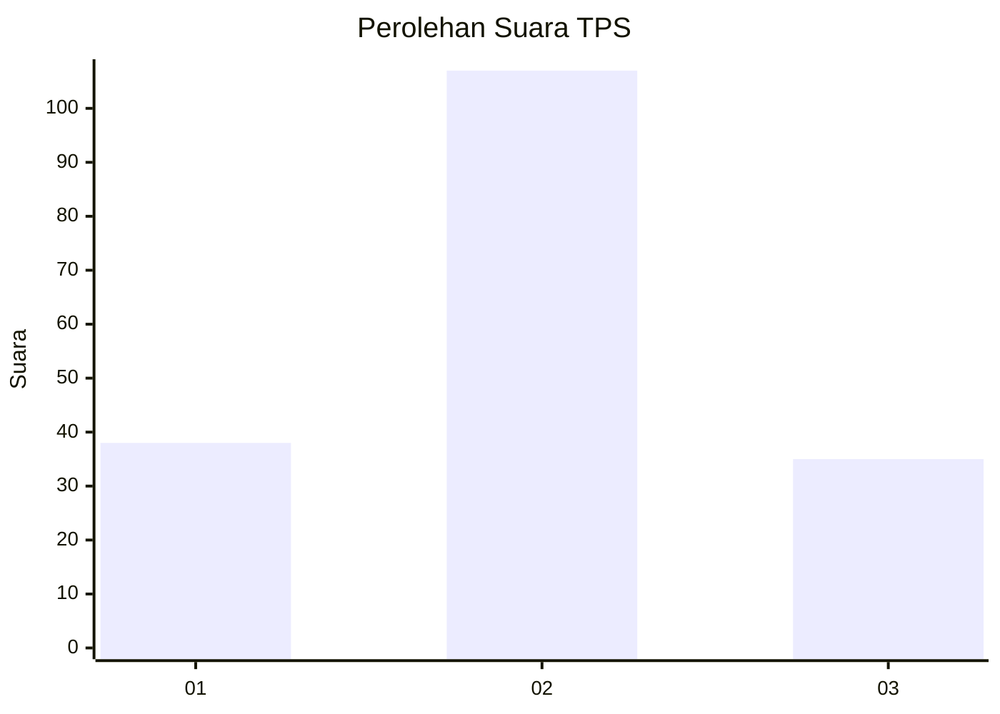
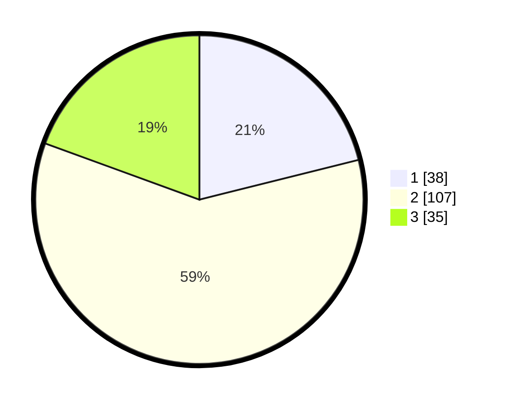

# Hasil

## Grafik

## Tabel

| No. | Nama Paslon    | Suara | Suara (raw) | Persentase |
|:--- |:-------------- | -----:| -----------:| ----------:|
| 1   | ANIES MUHAIMIN | 38    | [38][p-1]   | 21,11      |
| 2   | PRABOWO GIBRAN | 107   | [107][p-2]  | 59,44      |
| 3   | GANJAR MAHFUD  | 35    | [35][p-3]   | 19,44      |

[p-1]: https://github.com/gigit-pemilu/pemilu-2024-35-jawa-timur/blob/main/pilpres/hitung-suara/sub/35-jawa-timur/sub/09-jember/sub/15-sukorambi/sub/2002-dukuhmencek/sub/021-tps/sub/paslon-1.txt
[p-2]: https://github.com/gigit-pemilu/pemilu-2024-35-jawa-timur/blob/main/pilpres/hitung-suara/sub/35-jawa-timur/sub/09-jember/sub/15-sukorambi/sub/2002-dukuhmencek/sub/021-tps/sub/paslon-2.txt
[p-3]: https://github.com/gigit-pemilu/pemilu-2024-35-jawa-timur/blob/main/pilpres/hitung-suara/sub/35-jawa-timur/sub/09-jember/sub/15-sukorambi/sub/2002-dukuhmencek/sub/021-tps/sub/paslon-3.txt

## Foto C Plano

https://sirekap-obj-formc.kpu.go.id/e5dc/pemilu/ppwp/35/09/15/20/02/3509152002021-20240215-013019--b1d9910c-abe9-4a2d-938f-236e3f94f6f6.jpg

https://sirekap-obj-formc.kpu.go.id/e5dc/pemilu/ppwp/35/09/15/20/02/3509152002021-20240215-013110--833742d4-0c1b-436e-b6c4-2fd2d35b6118.jpg

https://sirekap-obj-formc.kpu.go.id/e5dc/pemilu/ppwp/35/09/15/20/02/3509152002021-20240215-013225--78ab1700-460a-4015-a2cb-2b022a5512de.jpg

## Metadata

| Key        | Value               |
| ---------- | ------------------- |
| Time Stamp | 2024-02-15 15:00:29 |

