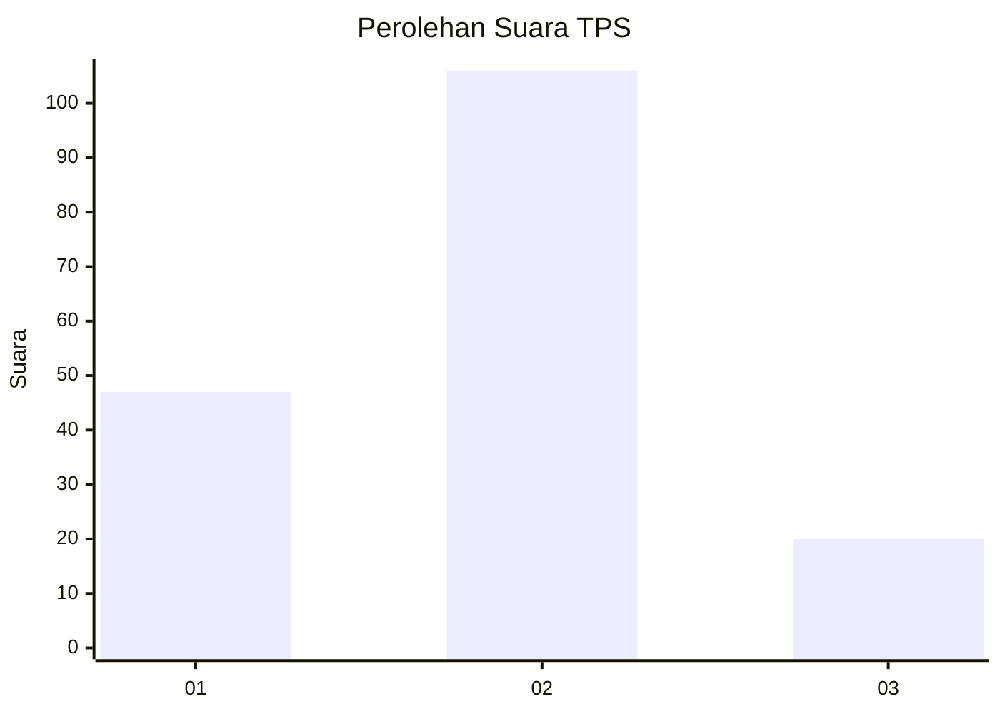
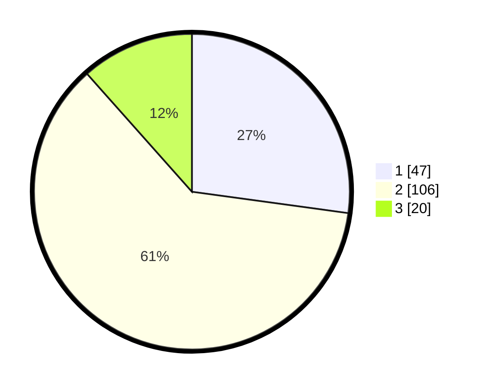

# Hasil

## Grafik

## Tabel

| No. | Nama Paslon    | Suara | Suara (raw) | Persentase |
|:--- |:-------------- | -----:| -----------:| ----------:|
| 1   | ANIES MUHAIMIN | 47    | [47][p-1]   | 27,17      |
| 2   | PRABOWO GIBRAN | 106   | [106][p-2]  | 61,27      |
| 3   | GANJAR MAHFUD  | 20    | [20][p-3]   | 11,56      |

[p-1]: https://github.com/gigit-pemilu/pemilu-2024-35-jawa-timur/blob/main/pilpres/hitung-suara/sub/35-jawa-timur/sub/09-jember/sub/15-sukorambi/sub/2003-sukorambi/sub/019-tps/sub/paslon-1.txt
[p-2]: https://github.com/gigit-pemilu/pemilu-2024-35-jawa-timur/blob/main/pilpres/hitung-suara/sub/35-jawa-timur/sub/09-jember/sub/15-sukorambi/sub/2003-sukorambi/sub/019-tps/sub/paslon-2.txt
[p-3]: https://github.com/gigit-pemilu/pemilu-2024-35-jawa-timur/blob/main/pilpres/hitung-suara/sub/35-jawa-timur/sub/09-jember/sub/15-sukorambi/sub/2003-sukorambi/sub/019-tps/sub/paslon-3.txt

## Foto C Plano

https://sirekap-obj-formc.kpu.go.id/c1ee/pemilu/ppwp/35/09/15/20/03/3509152003019-20240214-155910--11c741de-009f-44f9-9305-da92857a1937.jpg

https://sirekap-obj-formc.kpu.go.id/c1ee/pemilu/ppwp/35/09/15/20/03/3509152003019-20240214-155808--1c8039ae-7f71-47a5-be4f-d428d46c06ef.jpg

https://sirekap-obj-formc.kpu.go.id/c1ee/pemilu/ppwp/35/09/15/20/03/3509152003019-20240214-160058--f1a1a168-678a-4445-b92c-3534bc0215ab.jpg

## Metadata

| Key        | Value               |
| ---------- | ------------------- |
| Time Stamp | 2024-02-15 19:30:26 |

