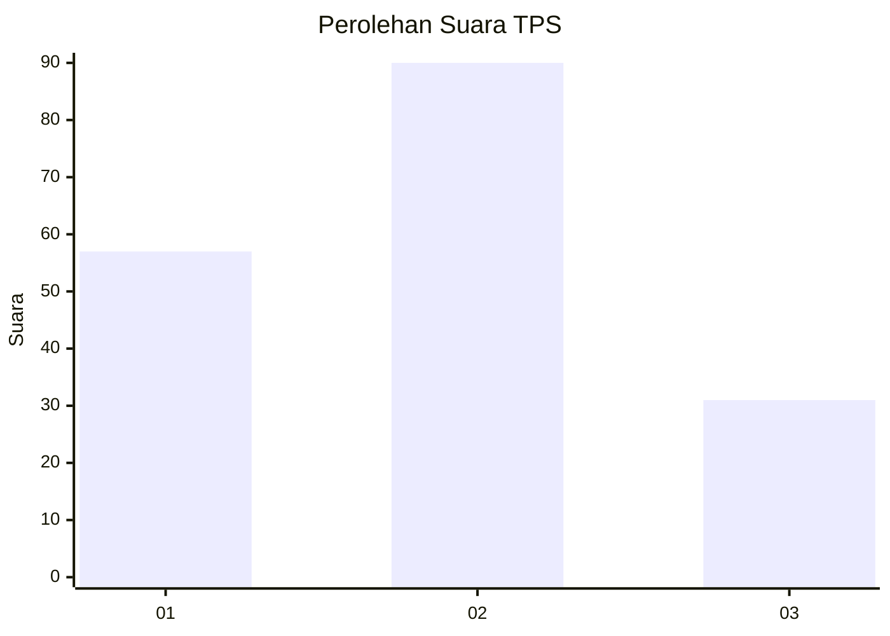
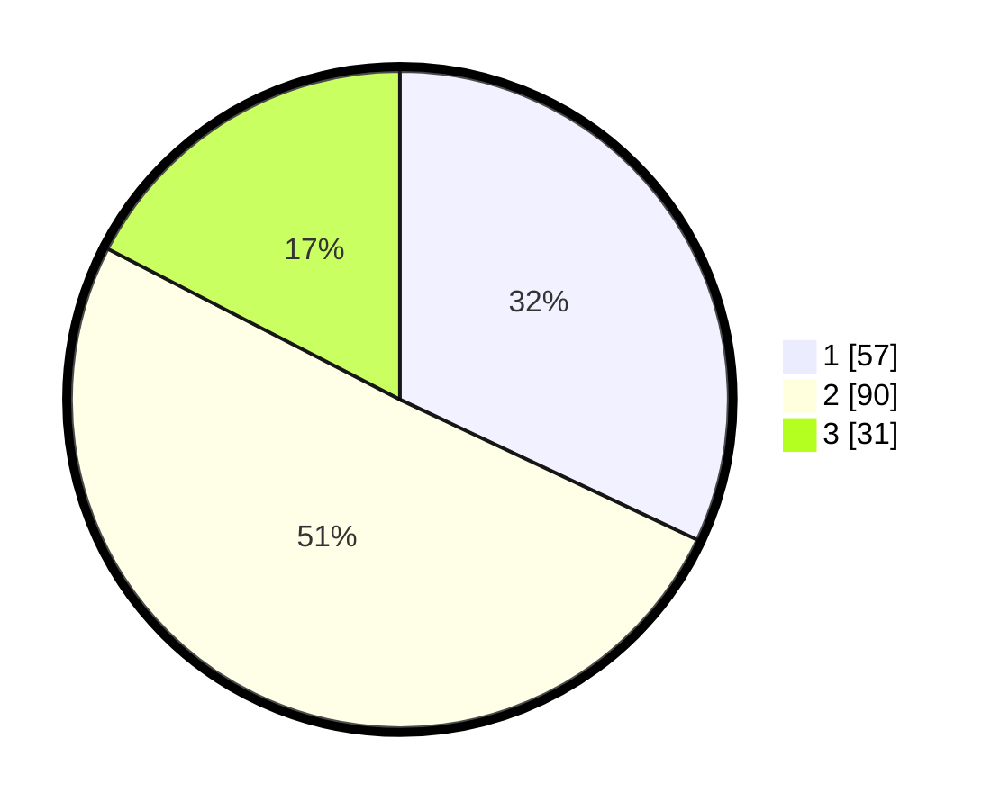

# Hasil

## Grafik

## Tabel

| No. | Nama Paslon    | Suara | Suara (raw) | Persentase |
|:--- |:-------------- | -----:| -----------:| ----------:|
| 1   | ANIES MUHAIMIN | 57    | [57][p-1]   | 32,02      |
| 2   | PRABOWO GIBRAN | 90    | [90][p-2]   | 50,56      |
| 3   | GANJAR MAHFUD  | 31    | [31][p-3]   | 17,42      |

[p-1]: https://github.com/gigit-pemilu/pemilu-2024/blob/main/pilpres/hitung-suara/sub/35-jawa-timur/sub/09-jember/sub/15-sukorambi/sub/2004-karangpring/sub/003-tps/sub/paslon-1.txt
[p-2]: https://github.com/gigit-pemilu/pemilu-2024/blob/main/pilpres/hitung-suara/sub/35-jawa-timur/sub/09-jember/sub/15-sukorambi/sub/2004-karangpring/sub/003-tps/sub/paslon-2.txt
[p-3]: https://github.com/gigit-pemilu/pemilu-2024/blob/main/pilpres/hitung-suara/sub/35-jawa-timur/sub/09-jember/sub/15-sukorambi/sub/2004-karangpring/sub/003-tps/sub/paslon-3.txt

## Foto C Plano

https://sirekap-obj-formc.kpu.go.id/042a/pemilu/ppwp/35/09/15/20/04/3509152004003-20240215-121711--0e8204ea-286c-4bb8-bda9-f2499d059307.jpg

https://sirekap-obj-formc.kpu.go.id/042a/pemilu/ppwp/35/09/15/20/04/3509152004003-20240215-121719--40cab64d-fe37-4316-8ff1-1be9f78eae03.jpg

https://sirekap-obj-formc.kpu.go.id/042a/pemilu/ppwp/35/09/15/20/04/3509152004003-20240215-121725--7759b03d-aa60-4426-95ac-ead20e183376.jpg

## Metadata

| Key        | Value               |
| ---------- | ------------------- |
| Time Stamp | 2024-02-15 19:30:26 |

